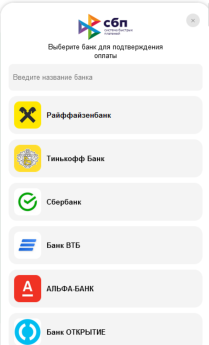
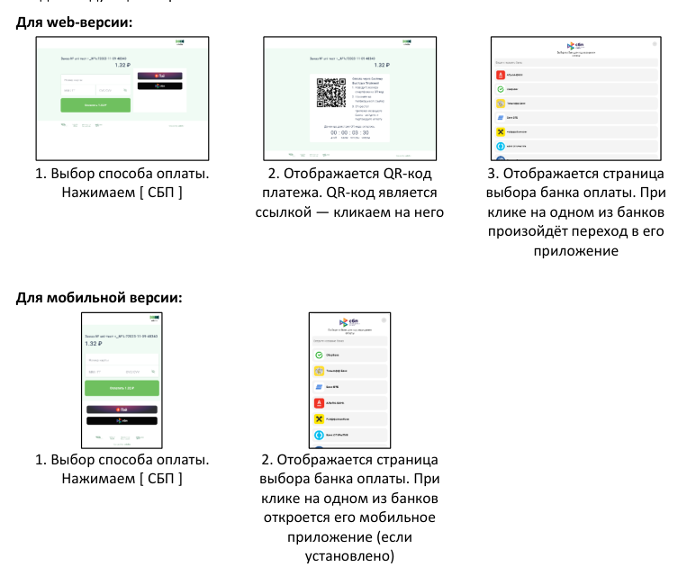
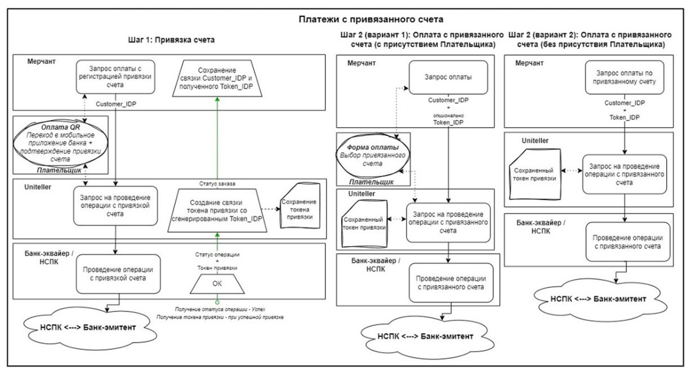
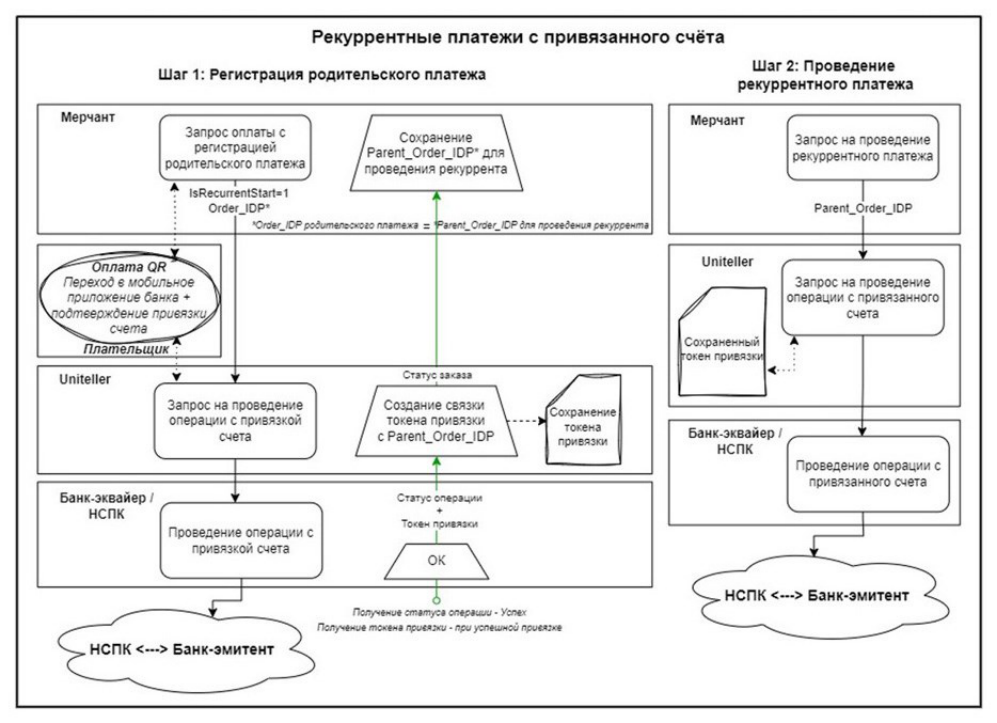
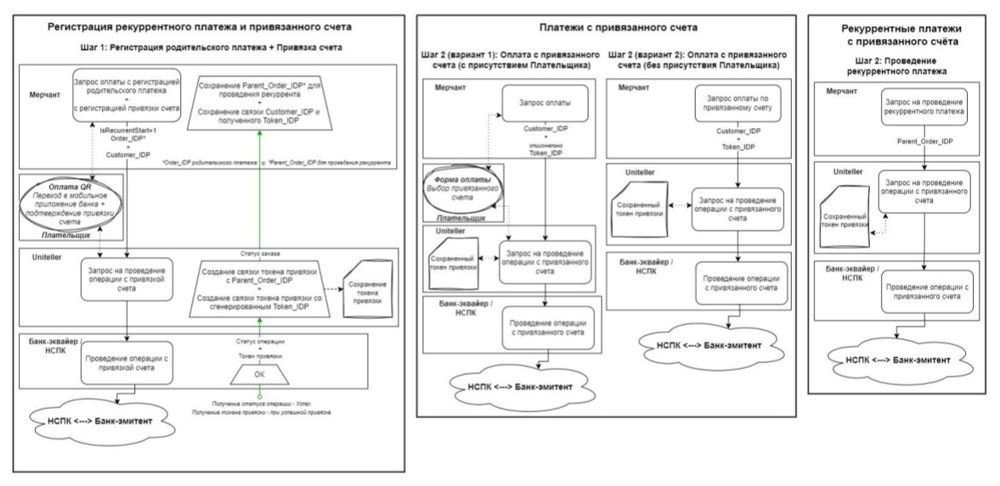

> Источник: [оплата_сбп_-_программный_интерфейс_-_v._04_rev._4.pdf](pdf/%D0%BE%D0%BF%D0%BB%D0%B0%D1%82%D0%B0_%D1%81%D0%B1%D0%BF_-_%D0%BF%D1%80%D0%BE%D0%B3%D1%80%D0%B0%D0%BC%D0%BC%D0%BD%D1%8B%D0%B9_%D0%B8%D0%BD%D1%82%D0%B5%D1%80%D1%84%D0%B5%D0%B9%D1%81_-_v._04_rev._4.pdf). Полная конвертация с сохранением порядка страниц. Номера страниц и повторяющиеся колонтитулы сохранены в HTML-комментариях. Примечания конвертации добавлены отдельно от текста источника. Физические переносы в коде сохранены; они могут требовать ручного соединения перед использованием примера.
>
> [Результаты сверки и места для ручной проверки](CONVERSION_REVIEW.md#sbp-v04-rev4).

<a id="page-1"></a>

<!-- Страница PDF: 1 -->


# Оплата СБП Программный интерфейс

Всего листов: 26

Версия: 04 rev. 4
Дата изменения: 2025.06.10

Москва, 2025

<a id="page-2"></a>

<!-- Страница PDF: 2 -->
<!-- Колонтитулы PDF:
Оплата СБП. Программный интерфейс
2
-->

## Содержание:

1\. Общая информация ......................................................................................................................... 3

2\. Получение результатов авторизации ............................................................................................... 3

3\. Уведомление сервера интернет-магазина о статусе оплаты ........................................................... 3

4\. Запрос формы оплаты при использовании СБП .............................................................................. 4

5\. Запрос формы оплаты из приложения Android/iOS через WebView ............................................... 5

6\. Виджет выбора банка оплаты ......................................................................................................... 6

7\. API-запрос оплаты СБП .................................................................................................................... 8

7\.1. Запрос ................................................................................................................................................ 8

7\.2. Ответ ................................................................................................................................................ 11

8\. Запрос отмены платежа СБП .......................................................................................................... 12

9\. Привязка счёта для оплаты ............................................................................................................ 12

9\.1. Общая информация о привязке счёта .......................................................................................... 12

9\.2. Методы работы с привязками счетов СБП ................................................................................... 14

9\.3. API-запрос оплаты по привязанному счёту .................................................................................. 15

9\.4. Запрос списка привязанных счетов ............................................................................................... 17

9\.5. Изменение статуса привязанного счёта ....................................................................................... 20

9\.6. Привязка счёта по случайной сумме ............................................................................................ 21
9.6.1 Запрос формы привязки счета по случайной сумме ........................................................... 21
9.6.2 API-запрос привязки счета по случайной сумме .................................................................. 22
Приложение А. Общие схемы работы с привязками счетов СБП ....................................................... 24
Привязка при использовании только одного из методов (Customer_IDP) ............................................ 24
Привязка при использовании только одного из методов (IsRecurrentStart) ........................................ 25
Привязка при использовании двух методов (Customer_IDP + IsRecurrentStart) ................................... 26

<a id="page-3"></a>

<!-- Страница PDF: 3 -->
<!-- Колонтитулы PDF:
Оплата СБП. Программный интерфейс
3
-->

## 1. Общая информация

В документе описаны программные интерфейсы для работы с Системой быстрых платежей
Банка России (СБП) в платёжной системе Uniteller.
Все программные интерфейсы представляют собой расширенные версии аналогичных
интерфейсов, описанных в документе «Технический порядок. Интернет-эквайринг».

## 2. Получение результатов авторизации

Запрос получения результатов авторизации используется для получения состояния оплаты СБП.
По завершении оплаты клиентом заказ примет статус Paid.
К возможным значениям поля PaymentType ответа — тип оплаты – добавился пункт:

• 13 – оплата через СБП.

К возможным значениям поля S_FIELDS добавился пункт:

• QrcId — идентификатор QR-кода, выданный НСПК.

• Token_IDP — идентификатор сохранённого токена СБП (идентификатор привязанного в
СБП счёта, будет пустым, если Плательщик не привязывал счёт).

Возвраты в СБП работают асинхронно, и состояние возврата можно контролировать через
данный запрос. По завершении полного возврата заказ примет статус Canceled.

## 3. Уведомление сервера интернет-магазина о статусе оплаты

Уведомление сервера интернет-магазина о статусе оплаты является расширенной версией
запроса, описанного в «Уведомление сервера интернет-магазина о статусе оплаты» актуального
Технического порядка.

В значениях параметра CallbackFields добавилось:

− AcquirerID — идентификатор банка-эквайера в системе Uniteller.

− PaymentType — тип оплаты, к возможным значениям добавился пункт:

• 13 – оплата через СБП.

− QrcId — идентификатор QR-кода, выданный НСПК (значение параметра qrcId API
НСПК).

− OpkcID — идентификатор запроса на возврат, назначенный НСПК (значение параметра
opkcRefundRequestId API НСПК).

− Token_IDP — идентификатор сохранённого токена СБП (идентификатор привязанного
в СБП счёта, будет пустым, если Плательщик не привязывал счёт).

<a id="page-4"></a>

<!-- Страница PDF: 4 -->
<!-- Колонтитулы PDF:
Оплата СБП. Программный интерфейс
4
-->

## 4. Запрос формы оплаты при использовании СБП

Запрос формы оплаты при использовании СБП является расширенной версией запроса,
описанного в пункте «Форма оплаты на сайте интернет-магазина Мерчанта и её параметры»
актуального Технического порядка.
В табл. 1 приведены специфические параметры запроса платёжной формы, актуальные для
СБП.

Табл. 1 — Дополнительные параметры запроса формы оплаты при использовании СБП

| № | Параметр | Описание |
| --- | --- | --- |
| 1 | PaymentTypeLimits | JSON-объект формата<br>{тип_платежа1:[ сумма_заказа, сумма_заказа ]…}<br>Разрешенные типы платежей:<br>• 1 – банковские карты;<br>• 13 – Оплата СБП (C2B);<br>• 16 – Оплата СБП (B2B).<br>Параметр PaymentTypeLimits сделан универсальным, и в будущем<br>позволит указывать соотношение оплат СБП и картой. Сейчас<br>возможна только полная оплаты СБП или картой.<br>Если передаётся, то участвует в расчёте Signature по формуле:<br>[Пример из ячейки](#example-4-1)<br>Внимание! слагаемые с OrderLifetime, PhoneVerified, PaymentTypeLimits<br>должны быть в указанной последовательности. Если OrderLifetime<br>и/или PhoneVerified не передаётся, то слагаемого с ним(и) нет |
| 2 | Token_IDP | Идентификатор в системе Uniteller привязанного в СБП счёта.<br>Используется совместно с PaymentTypeLimits=13 для оплаты только по<br>указанному привязанному счёту СБП.<br>Целое число до 11 цифр |
| 3 | Comment | Комментарий к платежу<br>(при использовании кириллицы использовать кодировку UTF-8)<br>В этом поле может передаваться «Назначение платежа» и/или<br>«Назначение привязки счёта» при оплате в СБП. Эти значения также<br>могут быть заданы (менеджером Uniteller) в ЛК Uniteller, в настройках<br>UPID СБП. В этом случае там же, в ЛК, задаются правила приоритета<br>значений из разных источников при передаче в банк |

> **Примечание конвертации:** примеры из ячеек этой таблицы вынесены ниже без изменения текста; в ячейках стоят ссылки на них.

<a id="example-4-1"></a>

```text
Signature = uppercase(md5(md5(Shop_IDP) + '&' +
md5(Order_IDP) + '&' + md5(Subtotal_P) + '&' +
md5(MeanType) +'&' + md5(EMoneyType) + '&' + md5(Lifetime) +
'&' + md5(Customer_IDP) + '&' + md5(Card_IDP) + '&' +
md5(IData) +'&' + md5(PT_Code) + '&' + md5(OrderLifetime) +
'&' + md5(PhoneVerified) + '&' + md5(PaymentTypeLimits) + '&'
+ md5(password)))
```

<a id="page-5"></a>

<!-- Страница PDF: 5 -->
<!-- Колонтитулы PDF:
Оплата СБП. Программный интерфейс
5
-->

Новый параметр PaymentTypeLimits запроса формы оплаты позволяет мерчанту задавать
разрешенный тип оплаты (только СБП, только банковская карта).
Также могут быть востребованы параметры BackUrl, DeepLink (их описания даны в п. 7.1 (API-
запрос оплаты СБП) на стр. 8).

## 5. Запрос формы оплаты из приложения Android/iOS через WebView

Для работы со страницами оплаты Uniteller в приложениях Android/iOS через компоненты
WebView необходимо обеспечить обработку открытия ссылок (deeplink) вида:
bank\*\*\*://\*\*\*

Пример для iOS (см. также

```text
https://developer.apple.com/documentation/webkit/wkwebview
```

):

```text
import UIKit
import WebKit
class ViewController: UIViewController, WKNavigationDelegate {
    var webView: WKWebView!
    var dialogMessage: UIAlertController!
     override func loadView() {
        webView = WKWebView()
        webView.navigationDelegate = self
        view = webView
        dialogMessage = UIAlertController(title: "Ошибка", message: "Приложение данного
банка у вас не установлено.", preferredStyle: .alert)
        dialogMessage.addAction(UIAlertAction(title: "Ок", style: .default, handler:
nil))
    }
    func webView(_ webView: WKWebView, decidePolicyFor navigationAction:
WKNavigationAction, decisionHandler: @escaping (WKNavigationActionPolicy) -> Void) {
        if (navigationAction.navigationType == .linkActivated) {
            if let url = navigationAction.request.url {
                UIApplication.shared.open(url, options: options) { result in
                    if (!result) {
                        self.present(self.dialogMessage, animated: true, completion:
nil)
                    }
                }
            }
        }
        decisionHandler(.allow)
    }
    override func viewDidLoad() {
        super.viewDidLoad()
        let url = URL (string: "<ваш url>")!
```

<a id="page-6"></a>

<!-- Страница PDF: 6 -->
<!-- Колонтитулы PDF:
Оплата СБП. Программный интерфейс
6
-->

```text
        let request = URLRequest(url: url)
        webView.load(request)
    }
}
```

Пример для Android (см. также:

```csv
https://developer.android.com/develop/ui/views/layout/webapps/webview?hl=ru#custom-urls):
// The URL scheme must be non-hierarchical, meaning no trailing slashes.
private static final String APP_SCHEME = "example-app:";
@Override
public boolean shouldOverrideUrlLoading(WebView view, String url) {
    if (url.startsWith(APP_SCHEME)) {
        urlData = URLDecoder.decode(url.substring(APP_SCHEME.length()), "UTF-8");
        respondToData(urlData);
        return true;
    }
    return false;
}
```

## 6. Виджет выбора банка оплаты

Для повышения удобства оплаты через СБП НСПК разработала виджет выбора банка оплаты,
который встраивается на страницах процесса оплаты через Web или с мобильных устройств (Android,
iOS).
Страница выбора банка оплаты показана на рис. 1.

> **Примечание конвертации (стр. 6 PDF):** графика сохранена изображением. Текст внутри растровых элементов не извлекается из текстового слоя PDF; подписи и связи на схеме требуют ручной проверки по изображению.



Рис. 1 — Страница выбора банка при оплате через СБП

<a id="page-7"></a>

<!-- Страница PDF: 7 -->
<!-- Колонтитулы PDF:
Оплата СБП. Программный интерфейс
7
-->

Каждая строка (кнопка) с названием банка содержит уникальную ссылку, сгенерированную
НСПК, при нажатии на которую на устройстве Пользователя откроется приложение этого банка (если
оно установлено).
В платёжной системе Uniteller реализована поддержка этого виджета, его использование
можно включить или выключить в Личном кабинете Uniteller в настройках точки продажи Мерчанта,
подключённой к СБП (настройки осуществляет сотрудник Uniteller).

Если для торговой точки поддержка виджета выбора банка включена, то в ответе на запрос
оплаты СБП, в параметре Payload (см. табл. 3 на стр. 11), возвращается URL на страницу выбора банка
оплаты (пример:

```text
https://wpay.uniteller.ru/pay/sbp/choice/
```

).
Если использование виджета выключена, то в Payload передаётся URL, полученный от НСПК,
для генерации QR-кода (пример:

```text
https://qr.nspk.ru/BD10007JDC23F9RL8D7BVPD6IV4V29IS?type=02&bank=100000000006&sum=1
32&cur=RUB&crc=9471).
```

При включении использования виджета выбора банка последовательность оплаты СБП
выглядит следующим образом:

> **Примечание конвертации (стр. 7 PDF):** графика сохранена изображением. Текст внутри растровых элементов не извлекается из текстового слоя PDF; подписи и связи на схеме требуют ручной проверки по изображению.



Для web-версии:

1\. Выбор способа оплаты. 2. Отображается QR-код 3. Отображается страница
Нажимаем [ СБП ] платежа. QR-код является выбора банка оплаты. При
ссылкой — кликаем на него клике на одном из банков
произойдёт переход в его
приложение

Для мобильной версии:

1\. Выбор способа оплаты. 2. Отображается страница
Нажимаем [ СБП ] выбора банка оплаты. При
клике на одном из банков
откроется его мобильное
приложение (если
установлено)

Если клиент использует собственный виджет выбора банка оплаты, то для получения списка
банков СБП для оплаты необходимо руководствоваться официальными рекомендациями НСПК:

```text
https://widget.cbrpay.ru/v1
```

<a id="page-8"></a>

<!-- Страница PDF: 8 -->
<!-- Колонтитулы PDF:
Оплата СБП. Программный интерфейс
8
-->

## 7. API-запрос оплаты СБП

### 7.1. Запрос

Запрос «Запрос оплаты СБП» выполняется по методу POST на адрес:

```text
https://api.uniteller.ru/sbp/1/getqr
```

Табл. 2 — Перечень полей запроса «Запрос оплаты СБП»

| № | Поле | Описание<br>поля | Обязательное<br>поле | Примечание |
| --- | --- | --- | --- | --- |
| 1 | ShopID | Идентификато<br>р точки<br>продажи в<br>системе<br>Uniteller | Да | Текст, содержащий либо латинские<br>буквы и цифры в количестве от 1 до<br>64, либо две группы латинских букв<br>и цифр, разделённых «-» (первая<br>группа от 1 до 15 символов, вторая<br>группа от 1 до 11 символов), к<br>регистру нечувствителен.<br>В Личном кабинете этот параметр<br>называется Uniteller Point ID и его<br>значение доступно на странице<br>«Точки продажи компании» (пункт<br>меню «Точки продажи») в столбце<br>Uniteller Point ID. |
| 2 | OrderID | Номер заказа в<br>системе<br>расчётов<br>интернет-<br>магазина,<br>соответствующ<br>ий данному<br>платежу | Да | Может быть любой непустой<br>строкой максимальной длиной 127<br>символов, не может содержать<br>только пробелы.<br>Значение OrderID должно быть<br>уникальным для всех оплаченных<br>заказов (заказов, по которым успешно<br>прошла оплата) в рамках одного<br>магазина. Пока по заказу не проведена<br>оплата, допускается несколько<br>запросов с одинаковым OrderID<br>(например, несколько попыток<br>оплаты одного и того же заказа) |
| 3 | CustomerID | Идентификато<br>р покупателя в<br>системе<br>Мерчанта |  | Строка до 64 символов |

<a id="page-9"></a>

<!-- Страница PDF: 9 -->
<!-- Колонтитулы PDF:
Оплата СБП. Программный интерфейс
9
-->

| № | Поле | Описание<br>поля | Обязательное<br>поле | Примечание |
| --- | --- | --- | --- | --- |
| 4 | Subtotal | Сумма покупки<br>в валюте,<br>оговорённой в<br>договоре с<br>банком-<br>эквайером | Да<br>(необязатель-<br>ный параметр,<br>если<br>передаётся<br>Registration) | Десятичное число с точкой в<br>качестве разделителя, не более 2<br>знаков после разделителя.<br>Например, 12.34.<br>Может быть равна "0" для привязки<br>счёта без оплаты. В этом случае<br>необходимо передать<br>IsRecurrentStart и/или CustomerID |
| 5 | Signature | Подпись<br>запроса | Да | Строка, получаемая по формуле:<br>[Пример из ячейки](#example-9-2)<br>где:<br>– uppercase — функция приведения<br>к верхнему регистру;<br>– md5 — криптографическая хеш-<br>функция (символы в нижнем<br>регистре);<br>– «+» — операция конкатенации<br>(объединения) строк (все строки<br>преобразуются в байты в кодировке<br>ASCII);<br>– fieldN — поле запроса (все поля,<br>участвующие в запросе, в порядке<br>следования);<br>– Password — пароль из раздела<br>«Параметры Авторизации» Личного<br>кабинета системы Uniteller.<br>Пример: Signature =<br>uppercase(md5(md5(ShopID) +<br>md5(OrderID) + md5(Subtotal) +<br>md5(Password))) |
| 6 | OrderLifetime | Время жизни<br>QR-кода СБП |  | Время жизни QR-кода СБП в<br>секундах. Если не передан,<br>считается равным 5 минутам (300<br>сек.) |

> **Примечание конвертации:** примеры из ячеек этой таблицы вынесены ниже без изменения текста; в ячейках стоят ссылки на них.

<a id="example-9-2"></a>

```text
Signature =
uppercase(md5(md5(field1)+ ...
+md5(fieldN)+ md5(Password))),
```

<a id="page-10"></a>

<!-- Страница PDF: 10 -->
<!-- Колонтитулы PDF:
Оплата СБП. Программный интерфейс
10
-->

| № | Поле | Описание<br>поля | Обязательное<br>поле | Примечание |
| --- | --- | --- | --- | --- |
| 7 | Email | Адрес<br>электронной<br>почты<br>владельца<br>карты |  | Строка до 64 символов<br>На этот адрес будет выслана<br>квитанция об оплате Uniteller |
| 8 | CallbackFormat | Запрашиваемы<br>й формат<br>уведомления о<br>статусе оплаты |  | Если параметр имеет значение<br>"json", то уведомление<br>направляется в json-формате. Во<br>всех остальных случаях<br>уведомление направляется в виде<br>POST-запроса |
| 9 | BackUrl | Адрес для<br>возврата<br>Плательщика<br>после оплаты в<br>СБП |  | Строка до 255 символов.<br>Используется, если Плательщик<br>перенаправлен в приложение с<br>оплатой через СБП из браузера,<br>который находится на одном<br>устройстве с приложением.<br>Если не задано, для возврата будет<br>выполнен редирект на страницу<br>чека Uniteller |
| 10 | DeepLink | Ссылка на<br>мобильное<br>приложение<br>Клиента для<br>возврата после<br>оплаты |  | Строка до 255 символов.<br>Если не задано, возврат будет<br>выполнен по ссылке из параметра<br>BackUrl |
| 11 | B2b | Признак B2B-<br>операции | Да<br>(для B2B-<br>операций) | Тип int, максимальная длина – 1 |
| 12 | Inn | ИНН<br>Плательщика |  | Тип string, максимальная длина – 12 |
| 13 | paymentPurpose | Назначение<br>платежа | Да<br>(для B2B-<br>операций) | Тип string, максимальная длина –<br>140<br>(см. также примечание 1 внизу<br>страницы) |

1 Примечание: значения «Назначение платежа» (paymentPurpose) и «Назначение привязки счёта»
(SubscriptionPurpose) также могут быть заданы в ЛК Uniteller (менеджером Uniteller), в настройках UPID СБП. В
этом случае там же, в ЛК, задаются правила, какие из значений имеют больший приоритет для передачи в банк.

<a id="page-11"></a>

<!-- Страница PDF: 11 -->
<!-- Колонтитулы PDF:
Оплата СБП. Программный интерфейс
11
-->

| № | Поле | Описание<br>поля | Обязательное<br>поле | Примечание |
| --- | --- | --- | --- | --- |
| 14 | SubscriptionPurpose | Назначение<br>привязки счёта |  | Тип string, максимальная длина –<br>140<br>(см. также примечание 1 внизу<br>страницы) |
| 15 | Registration | Признак<br>привязки счёта<br>по случайной<br>сумме |  | Может принимать значение "1".<br>При передаче Registration<br>обязательна передача параметра<br>CustomerID и/или IsRecurrentStart<br>для создания привязки |
| 16 | IsRecurrentStart | Признак того,<br>что платёж<br>является<br>«родительски<br>м» для<br>последующих<br>рекуррентных<br>платежей | Да<br>(для<br>рекуррентных<br>платежей) | Может принимать значение "1" |

### 7.2. Ответ

Табл. 3 — Список полей ответа на запрос «Запрос оплаты СБП»

| № | Поле | Описание поля | Обязатель-<br>ное поле | Примечание |
| --- | --- | --- | --- | --- |
| 1 | Result | Результат выполнения<br>операции | Да | 0 – успешная операция<br>или<br>XX – код ошибки |
| 2 | ErrorMessage | Сообщение об ошибке |  | Строка до 255 символов,<br>передаётся в случае<br>возникновения ошибки (в Result<br>пришёл код ошибки) |
| 3 | Payload | URL, полученный от<br>НСПК |  | URL для отображения в виде QR-<br>кода или ссылки/кнопки (для<br>мобильных устройств).<br>Возвращается в случае Result=0. |

<a id="page-12"></a>

<!-- Страница PDF: 12 -->
<!-- Колонтитулы PDF:
Оплата СБП. Программный интерфейс
12
-->

| № | Поле | Описание поля | Обязатель-<br>ное поле | Примечание |
| --- | --- | --- | --- | --- |
|  |  |  |  | Значения:<br>• Если виджет выбора банка<br>выключен: URL, полученный<br>от НСПК.<br>• Если виджет выбора банка<br>включён: URL на страницу<br>выбора банка |
| 4 | StaleTime | Дата и время<br>завершения срока<br>действия QR-кода |  | Возвращается в случае Result=0.<br>Строка в формате «ГГГГ-ММ-ДД<br>ЧЧ:ММ:СС» |

## 8. Запрос отмены платежа СБП

Запрос отмены платежа СБП является расширенной версией запроса, описанного в п. 4.5.2.
«Запрос отмены платежа и возможные форматы ответа» актуального Технического порядка. Т. к.
возвраты в СБП работают асинхронно, в ответе на запрос полного возврата вернется статус Paid. Запрос
на возврат будет направлен в НСПК. Заказ примет статус Canceled через некоторое время, после того
как обновится статус заказа в НСПК и Uniteller. Контролировать статус заказа можно через запрос
статуса либо через соответствующее уведомление сервера мерчанта.

## 9. Привязка счёта для оплаты

### 9.1. Общая информация о привязке счёта

СБП предоставляет возможность «привязки счёта» Плательщика для облегчения его
последующих оплат 2. У одного Плательщика может быть несколько привязанных счетов одного или
нескольких банков (но каждый счёт Плательщика может иметь только 1 привязку в рамках одного ТСП,
в терминологии СБП — это ТСП с уникальным Merchant ID).

При наличии привязанных счетов они в первую очередь предлагаются Плательщику при
последующих оплатах, но у Плательщика всегда есть возможность сделать оплату с любого счёта, задав
его в явном виде.

Поддержка привязки счетов СБП в системе Uniteller делалась с наибольшим сохранением уже
реализованных ранее инструментов и методов работы, чтобы сохранить совместимость для ранее

2 Примечание: доступность привязок счетов СБП при работе с определённым банком-партнёром необходимо
уточнять у менеджера Uniteller.

<a id="page-13"></a>

<!-- Страница PDF: 13 -->
<!-- Колонтитулы PDF:
Оплата СБП. Программный интерфейс
13
-->

интегрированных с Uniteller клиентов и предоставить разные подходы к использованию привязанных
счетов.

Примечание: В зависимости от используемых Мерчантом интерфейсов (разные серверы
системы Uniteller) и методов работы с привязками счетов СБП в этом пункте (п. 9.1) и далее
следующие параметры из документации Uniteller одинаковы по смыслу (но соблюдайте правильное
написание из описания конкретных запросов):

− Order_IDP = OrderID;

− Subtotal_P = Subtotal;

− Customer_IDP = CustomerID;

− Token_IDP = TokenID;

− Card_Registration = Registration.

Все методы работы с привязками счетов СБП перечислены в п. 9.2 «Методы работы с
привязками счетов СБП» (на стр. 14).
Общие схемы работы с привязками счетов СБП приведены в Приложении А (на стр. 24).

Привязка счёта инициируется, если Мерчант передаёт в запросе к Uniteller параметр
IsRecurrentStart=1 (создаёт «родительский» рекуррентный платёж, предполагая, что будет серия
рекуррентных оплат) и/или идентификатор Плательщика CustomerID (по которому система может
различить одного Плательщика от другого).

Примечание: если IsRecurrentStart=1 и CustomerID передаются вместе, то привязка счёта в
системе Uniteller будет создана сразу к обоим этим параметрам, и при последующей оплате нужный
счёт можно идентифицировать как по «родительскому» рекурренту, так и по Плательщику. Важно:
если Мерчант в своей работе использует и рекуррентные платежи, и привязку счетов — выполняйте
привязку одновременно по двум параметрам (IsRecurrentStart и Customer_IDP) в одном запросе. Если
Мерчант использует только один из методов — по соответствующему параметру метода.

Привязка осуществляется с оплатой (Subtotal≠0), без оплаты (передаётся Subtotal=0) или по
случайной сумме (передаётся параметр Registration, см. п. 9.6 «Привязка счёта по случайной сумме»
на стр. 21).
При привязке счёта, на этапе сканирования QR-кода СБП, Плательщику в приложении банка
предлагается подтвердить привязку. Пользователь может согласиться или не согласиться 3.

Если Плательщик соглашается на создание привязки — НСПК передаёт в систему Uniteller
уникальный идентификатор (subscriptionToken), связывающий привязываемый счёт с Плательщиком.
Этот идентификатор хранится в Uniteller и непосредственно в дальнейших взаимодействиях с
Мерчантом не участвует. Вместо него используется внутренний идентификатор этого токена в системе
Uniteller — TokenID.
Оплата привязанными счетами Плательщика возможна как по API (по «родительскому»
рекурренту — по Parent_Order_IDP; по Плательщику и привязанному счету — по CustomerID +
TokenID), так и с выводом их списка непосредственно на платёжной форме (все привязанные счета
Плательщика — по CustomerID; Плательщик и привязанный счет — по CustomerID + TokenID).

Если Плательщик по любым причинам не привязывает счёт, то НСПК не передаёт
subscriptionToken, и в системе Uniteller не создаётся запись о привязанном счёте.

Обращаем внимание интернет-магазинов на то, что именно Плательщик своими действиями
определяет работу с привязанными счетами: он может согласиться или не согласиться на предложение

3 Примечание: также банк Плательщика может не поддерживать привязки счетов СБП.

<a id="page-14"></a>

<!-- Страница PDF: 14 -->
<!-- Колонтитулы PDF:
Оплата СБП. Программный интерфейс
14
-->

привязать счёт, в любой момент может отвязать счёт в своём приложении (Uniteller об этом не будет
уведомлена). Также при передаче запросов и ответов в Интернете возможны непрогнозируемые
задержки и непоследовательное получение уведомлений об оплате и привязке счёта, в связи с чем
система Uniteller не может гарантировать, что информация в ней о привязанных счетах Плательщика
актуальна на момент запроса оплаты.
Поэтому для обеспечения бесперебойных оплат полезно на ответственных этапах проводить
дополнительные контрольные действия, например: после проведения сценария, предполагающего
привязку счета, убедиться в его привязке (см. п. 9.4 «Запрос списка привязанных счетов» на стр. 17
или «Запрос результата авторизации» (с S_FIELDS Token_IDP, см. соответствующий пункт в документе
«Технический порядок. Интернет-эквайринг») или при отказе оплаты по привязанному счёту (если это
уместно по сценарию взаимодействия) отвязать и предложить Плательщику повторно привязать счёт,
чтобы исключить ошибку из-за этого.

Работа с привязанными счетами похожа на работу с сохранёнными картами оплаты и ниже
рассматривается подробнее.

Функционал рекуррентных платежей системы Uniteller актуален и проводится с привязанного
счёта.
Если у Плательщика в СБП несколько привязанных счетов, то для рекуррентного платежа будет
использоваться счёт, с которого оплачивался «родительский» платёж (ссылка на «родительский»
платёж при рекуррентном платеже обязательна).

### 9.2. Методы работы с привязками счетов СБП

В зависимости от требуемых действий и используемых интерфейсов возможны следующие
методы работы с привязкой счетов СБП (с указанием соответствующих пунктов в документации
Uniteller):

Привязка счета:

− С формой оплаты Uniteller:

• «Форма оплаты на сайте интернет магазина Мерчанта и её параметры» (см. соотв.
пункт в «Технический порядок. Интернет-эквайринг»), используя параметр
Customer_IDP и/или IsRecurrentStart.

• «Оплата с помощью платёжной ссылки» (см. соотв. пункт в «Технический порядок.
Интернет-эквайринг»), используя параметр Customer_IDP и/или IsRecurrentStart.

• «Запрос формы привязки счета по случайной сумме» (п. 9.6.1 на стр. 21), используя
параметры Customer_IDP и Card_Registration.

− Без формы оплаты Uniteller

• «API-запрос оплаты СБП» (п. 7 на стр. 8), используя параметр CustomerID и/или
IsRecurrentStart.

• «API-запрос привязки счета по случайной сумме» (п. 9.6.2 на стр. 22), используя
параметры CustomerID и Registration.

Оплата привязанным счетом:

− С формой оплаты Uniteller

• «Форма оплаты на сайте интернет магазина Мерчанта и её параметры» (см. соотв.
пункт в «Технический порядок. Интернет-эквайринг»), используя параметр

<a id="page-15"></a>

<!-- Страница PDF: 15 -->
<!-- Колонтитулы PDF:
Оплата СБП. Программный интерфейс
15
-->

Customer_IDP (+ по желанию Token_IDP).

• «Оплата с помощью платёжной ссылки» (см. соотв. пункт в «Технический порядок.
Интернет-эквайринг»), используя параметр Customer_IDP (+ по желанию Token_IDP).

− Без формы оплаты Uniteller

• «API-запрос оплаты по привязанному счёту»(п. 9.3 на стр. 15), используя параметры
CustomerID и TokenID.

• «Проведение рекуррентных платежей» (см. соотв. пункт в «Технический порядок.
Интернет-эквайринг»), используя параметр Parent_Order_IDP.

Действия с привязанными счетами:

− «Запрос списка привязанных счетов» (п. 9.4 на стр. 17), используя параметр Customer_IDP.

− «Изменение статуса привязанного счёта» (п. 9.5 на стр. 20), используя параметры
Customer_IDP и Token_IDP.

### 9.3. API-запрос оплаты по привязанному счёту

«Запрос оплаты по привязанному счёту» выполняется по методу POST на адрес:

```text
https://api.uniteller.ru/sbp/1/petition
```

Табл. 4 — Перечень обязательных полей запроса «Запрос оплаты по привязанному счёту»

| № | Поле | Описание поля | Примечание |
| --- | --- | --- | --- |
| 1 | ShopID | Идентификатор точки<br>продажи в системе<br>Uniteller | Текст, содержащий либо латинские буквы и<br>цифры в количестве от 1 до 64, либо две группы<br>латинских букв и цифр, разделённых «-» (первая<br>группа от 1 до 15 символов, вторая группа от 1 до<br>11 символов), к регистру нечувствителен.<br>В Личном кабинете этот параметр называется<br>Uniteller Point ID и его значение доступно на<br>странице «Точки продажи компании» (пункт меню<br>«Точки продажи») в столбце Uniteller Point ID. |
| 2 | OrderID | Номер заказа в<br>системе расчётов<br>интернет-магазина,<br>соответствующий<br>данному платежу | Может быть любой непустой строкой<br>максимальной длиной 127 символов, не может<br>содержать только пробелы.<br>Значение OrderID должно быть уникальным для всех<br>оплаченных заказов (заказов, по которым успешно<br>прошла оплата) в рамках одного магазина. Пока по<br>заказу не проведена оплата, допускается несколько<br>запросов с одинаковым OrderID (например, несколько<br>попыток оплаты одного и того же заказа) |
| 3 | CustomerID | Идентификатор<br>покупателя в системе<br>Мерчанта | Строка до 64 символов |

<a id="page-16"></a>

<!-- Страница PDF: 16 -->
<!-- Колонтитулы PDF:
Оплата СБП. Программный интерфейс
16
-->

| № | Поле | Описание поля | Примечание |
| --- | --- | --- | --- |
| 4 | TokenID | Идентификатор в<br>системе Uniteller<br>привязанного в СБП<br>счёта | Целое число до 11 цифр |
| 5 | Subtotal | Сумма покупки в<br>валюте, оговорённой в<br>договоре с банком-<br>эквайером | Десятичное число с точкой в качестве<br>разделителя, не более 2 знаков после<br>разделителя. Например, 12.34 |
| 6 | paymentPurpose | Назначение платежа | Тип string, максимальная длина – 140<br>(см. также примечание 4 внизу страницы) |
| 7 | Signature | Подпись запроса | Строка, получаемая по формуле:<br>[Пример из ячейки](#example-16-3)<br>где:<br>– uppercase — функция приведения к верхнему<br>регистру;<br>– md5 — криптографическая хеш-функция<br>(символы в нижнем регистре);<br>– «+» — операция конкатенации (объединения)<br>строк (все строки преобразуются в байты в<br>кодировке ASCII);<br>– fieldN — поле запроса (соблюдайте порядок<br>следования полей в запросе, как указано в этой<br>таблице);<br>– Password — пароль из раздела «Параметры<br>Авторизации» Личного кабинета системы<br>Uniteller.<br>Пример: Signature =<br>uppercase(md5(md5(ShopID) + md5(OrderID) +<br>md5(Subtotal) + md5(Password))) |

> **Примечание конвертации:** примеры из ячеек этой таблицы вынесены ниже без изменения текста; в ячейках стоят ссылки на них.

<a id="example-16-3"></a>

```text
Signature = uppercase(md5(md5(field1)+ ...
+md5(fieldN)+ md5(Password))),
```

В ответ на «Запрос оплаты по привязанному счёту» возвращаются поля, перечисленные в табл.
5.

4 Примечание: значение «Назначение платежа» (paymentPurpose) также может быть задано в ЛК Uniteller
(менеджером Uniteller), в настройках UPID СБП. В этом случае там же, в ЛК, задаются правила приоритета
заданных значений при передаче в банк.

<a id="page-17"></a>

<!-- Страница PDF: 17 -->
<!-- Колонтитулы PDF:
Оплата СБП. Программный интерфейс
17
-->

Табл. 5 — Список полей ответа на запрос «Запрос оплаты по привязанному счёту»

| № | Поле | Описание поля | Обязатель-<br>ное поле | Примечание |
| --- | --- | --- | --- | --- |
| 1 | Result | Результат выполнения<br>операции | Да | 0 – успешная операция<br>или<br>XX – код ошибки |
| 2 | ErrorMessage | Сообщение об ошибке |  | Строка до 255 символов,<br>передаётся в случае<br>возникновения ошибки (в Result<br>пришёл код ошибки) |

В случае возникновения ошибки в ответе на запрос будут возвращены 2 параметра: firstcode и
secondcode, значения которых приведены в табл. 6.

Табл. 6 — Возможные сообщения об ошибках при запросе изменения статуса привязанного счёта

| Код<br>(firstcode) | Сообщение<br>(secondcode) | Расшифровка |
| --- | --- | --- |
| 1 | Authentication error | Некорректные данные авторизации (Login, Password) |
| 3 | Mandatory parameter<br>'%fieldName%' is not<br>present in the request | Не указан обязательный параметр (%fieldName% — имя<br>параметра) |
| 5 | Field %fieldName% has bad<br>format | Неверный формат значения или значение не входит в<br>область допустимых (%fieldname% — имя параметра) |
| 15 | The operation failed | По некоторым причинам операция была прервана.<br>Попробуйте в другой раз |
| 40 | Token not found | Привязанный счет не найден |

### 9.4. Запрос списка привязанных счетов

Для получения списка привязанных счетов конкретного Покупателя (заданного CustomerID)
интернет-магазин должен направить запрос на сайт Uniteller, в ответе на который будет передан список
привязанных счетов (TokenID), для каждого из которых возвращаются поля, перечисленные в табл. 9.

Запрос получения списка привязанных счетов выполняется на
адрес:

```text
https://wpay.uniteller.ru/tokens
```

с GET- или POST-параметрами, указанными в табл. 7 и табл. 8.

<a id="page-18"></a>

<!-- Страница PDF: 18 -->
<!-- Колонтитулы PDF:
Оплата СБП. Программный интерфейс
18
-->

Табл. 7 — Обязательные параметры запроса получения списка привязанных счетов

| № | Поле | Описание поля | Примечание |
| --- | --- | --- | --- |
| 1 | Shop_IDP | Идентификатор точки<br>продажи в системе<br>Uniteller | Текст, содержащий либо латинские буквы<br>и цифры в количестве от 1 до 64, либо<br>две группы латинских букв и цифр,<br>разделённых «-» (первая группа от 1 до<br>15 символов, вторая группа от 1 до 11<br>символов), к регистру нечувствителен.<br>В Личном кабинете этот параметр<br>называется Uniteller Point ID и его значение<br>доступно на странице «Точки продажи<br>компании» (пункт меню «Точки продажи») в<br>столбце Uniteller Point ID |
| 2 | Login | Логин. Доступен Мерчанту<br>в Личном кабинете, пункт<br>меню «Параметры Авто-<br>ризации» | Строка до 64 символов |
| 3 | Password | Пароль. Доступен<br>Мерчанту в Личном<br>кабинете, пункт меню<br>«Параметры Авториза-<br>ции» | Строка 80 символов |
| 4 | Customer_IDP | Идентификатор<br>покупателя в системе<br>Мерчанта | Строка до 64 символов |

Табл. 8 — Необязательные параметры запроса получения списка привязанных счетов

| № | Параметр | Тип | Значение по<br>умолчанию | Описание |
| --- | --- | --- | --- | --- |
| 1 | Type | Тип привязанного<br>счёта |  | Возможные значения: "SBP" – для<br>получения привязанных счетов СБП<br>плательщика.<br>(В дальнейшем возможны и другие<br>значения) |
| 2 | Format | Возможные значения:<br>1 (CSV);<br>2 (WDDX);<br>3 (XML) | 1 | Формат выдачи результата.<br>В формате 1 поля разделены точкой с<br>запятой |

Внимание! Частота запросов списка привязанных счетов не должна превышать 1 запроса в
2 сек. с одного IP-адреса.

<a id="page-19"></a>

<!-- Страница PDF: 19 -->
<!-- Колонтитулы PDF:
Оплата СБП. Программный интерфейс
19
-->

В случае успеха для каждого счёта будет возвращена запись из полей, указанных в табл. 9.

Табл. 9 — Поля ответа на запрос получения списка привязанных счетов в случае успеха

> **Примечание конвертации (стр. 19 PDF):** таблица содержит объединённые ячейки. Их текст приведён один раз, в начальной ячейке; покрываемые ячейки оставлены пустыми. Границы объединений требуют ручной проверки по [изображению таблицы](assets/sbp-v04-rev4/page-019-table-1.png).

| № | Поле | Тип | Значение |
| --- | --- | --- | --- |
| 1 | Token_IDP | Целое число до 11 цифр | Идентификатор в системе Uniteller<br>привязанного в СБП счёта |
| 2 | MemberId | Строка, 12 символов | Идентификатор банка Плательщика |
| 3 | BankName | Строка, до 64 символов | Имя банка Плательщика |
| 4 | LogoUrl | Строка | URL логотипа банка Плательщика |
| 5 | TokenStatus | Число (целое<br>неотрицательное) | Состояние привязки счёта:<br>(0 – не подтверждён, 1 — активен,<br>2 — заблокирован) |
| 6 | TokenType | Строка | Тип привязанного счёта<br>(На момент создания документа только<br>значение "SBP", в дальнейшем возможны и<br>другие значения) |
| Примечание: по мере развития СБП и интеграции с ней системы Uniteller в ответе на запрос<br>получения списка привязанных счетов будут добавляться новые поля |  |  |  |

Пример ответа на запрос получения списка привязанных счетов (в формате CSV, у Плательщика
2 счёта):

```csv
Token_IDP;MemberId;BankName;LogoUrl;TokenStatus;TokenType
9;100000000111;Сбербанк;https://qr.nspk.ru/proxyapp/logo/bank100000000111.png;1;SBP
45;100000000008;АЛЬФА-БАНК;https://qr.nspk.ru/proxyapp/logo/bank100000000008.png;1;SBP
105;100000000010;Промсвязьбанк;https://qr.nspk.ru/proxyapp/logo/bank100000000010.png;1;
SBP
106;100000000001;Газпромбанк;https://qr.nspk.ru/proxyapp/logo/bank100000000001.png;1;SB
P
```

В случае возникновения ошибки в ответе будут поля, указанные в табл. 10.

Табл. 10 — Поля ответа на запрос получения списка привязанных счетов в случае ошибки

| № | Поле | Тип | Значение |
| --- | --- | --- | --- |
| 1 | ErrorCode | Число (целое не<br>отрицательное) | Номер ошибки |
| 2 | ErrorMessage | Строка | Текстовое описание ошибки |

Возможные коды ошибки приведены в табл. 6 на стр. 17.

<a id="page-20"></a>

<!-- Страница PDF: 20 -->
<!-- Колонтитулы PDF:
Оплата СБП. Программный интерфейс
20
-->

### 9.5. Изменение статуса привязанного счёта

Для того чтобы со стороны интернет-магазина удалить привязанный счёт или изменить его
статус (заблокировать, разблокировать), нужно выполнить запрос на адрес:

```text
https://wpay.uniteller.ru/tokens
```

с GET- или POST-параметрами, указанными в табл. 11 и табл. 12.

Примечание: управление статусом привязанного счёта производится только на уровне
системы Uniteller. В СБП не предусмотрено управление привязанным счётом Плательщика со стороны
Мерчанта. Плательщик своими действиями самостоятельно определяет работу с привязанными
счетами в приложении своего банка.

Табл. 11 — Обязательные параметры запроса изменения статуса привязанного счёта

| № | Поле | Описание поля | Примечание |
| --- | --- | --- | --- |
| 1 | Shop_IDP | Идентификатор точки продажи<br>в системе Uniteller | Текст, содержащий либо латинские<br>буквы и цифры в количестве от 1 до 64,<br>либо две группы латинских букв и цифр,<br>разделённых «-» (первая группа от 1 до<br>15 символов, вторая группа от 1 до 11<br>символов), к регистру нечувствителен.<br>В Личном кабинете этот параметр<br>называется Uniteller Point ID и его значение<br>доступно на странице «Точки продажи<br>компании» (пункт меню «Точки продажи») в<br>столбце Uniteller Point ID |
| 2 | Login | Логин. Доступен Мерчанту в<br>Личном кабинете, пункт меню<br>«Параметры Авторизации» | Строка до 64 символов |
| 3 | Password | Пароль. Доступен Мерчанту в<br>Личном кабинете, пункт меню<br>«Параметры Авторизации» | Строка 80 символов |
| 4 | Token_IDP | Идентификатор в системе<br>Uniteller привязанного в СБП<br>счёта | Целое число до 11 цифр |
| 5 | Customer_IDP | Идентификатор покупателя в<br>системе Мерчанта | Строка до 64 символов |
| 6 | Action | Действие, которое нужно<br>сделать со счётом | Возможные значения:<br>1 – подтвердить привязку по случайной<br>сумме;<br>2 – удалить привязку счёта;<br>3 – заблокировать счёт;<br>4 – разблокировать счёт |
| 7 | Type | Тип привязанного счёта | Возможные значения: "SBP" – для<br>получения привязанных счетов СБП<br>плательщика.<br>(В дальнейшем возможны и другие<br>значения) |

<a id="page-21"></a>

<!-- Страница PDF: 21 -->
<!-- Колонтитулы PDF:
Оплата СБП. Программный интерфейс
21
-->

Табл. 12 — Необязательные параметры запроса изменения статуса привязанного счёта

| № | Параметр | Тип | Значение по<br>умолчанию | Описание |
| --- | --- | --- | --- | --- |
| 1 | Format | Возможные значения:<br>1 (CSV);<br>2 (WDDX);<br>3 (XML). | 1 | Формат выдачи результата.<br>В формате 1 поля разделены точкой с<br>запятой. |

Ответ на запрос будет содержать поля, указанные в табл. 13.

Табл. 13 — Поля ответа на запрос изменения статуса сохранённого счёта

| № | Поле | Тип | Значение |
| --- | --- | --- | --- |
| 1 | ErrorCode | Число (целое<br>неотрицательное) | "0", если запрос прошёл успешно, или номер<br>ошибки в случае ошибки |
| 2 | ErrorMessage | Строка | Текстовое описание ошибки |

Возможные коды ошибки приведены в табл. 6 на стр. 17.

### 9.6. Привязка счёта по случайной сумме

Привязка счёта по случайной сумме возможна как через форму на странице магазина, так и
посредством API.

#### 9.6.1 Запрос формы привязки счета по случайной сумме

Запрос формы привязки счета по случайной сумме является расширенной версией запроса,
описанного в п. «Регистрация карты по случайной сумме» актуального документа «Технический
порядок. Интернет-эквайринг».

К возможным полям ответа при получении результата выполнения операции добавляется
параметр Token_IDP – идентификатор сохранённого токена СБП (идентификатор привязанного в СБП
счёта, будет пустым, если Плательщик не привязывал счёт).

Привязка счёта по случайной сумме через форму на странице магазина имеет следующие
основные шаги:

1\. Посетитель интернет-магазина авторизуется на сайте магазина, магазин ставит ему в
соответствие уникальный идентификатор Customer_IDP.

2\. На сайте интернет-магазина посетителю предлагается привязать счёт по случайной сумме.
После подтверждения посетителем своего согласия на сайте интернет-магазина
формируется форма перехода к привязке по случайной сумме, в которой указываются
идентификатор магазина Shop_IDP, идентификатор покупателя Customer_IDP и параметр

<a id="page-22"></a>

<!-- Страница PDF: 22 -->
<!-- Колонтитулы PDF:
Оплата СБП. Программный интерфейс
22
-->

Card_Registration="1" (пример формы см. в п. «Регистрация карты по случайной сумме»
актуального Технического порядка). Запрос с параметрами формы передаётся на сайт
Uniteller.

3\. На сайте Uniteller посетителю отображается страница привязки счёта, на которой требуется
выбрать оплату через СБП. Сумма к оплате генерируется автоматически в размере от 0.01
до 9.99 руб., независимо от того, какое значение было передано в форме. В отличие от
страницы оплаты на странице привязки сумма платежа не отображается покупателю и не
присылается по электронной почте. На странице привязки имеется поясняющий текст.

4\. Если попытка оплаты завершена успешно, счёт привязывается в процессинговом центре на
этого покупателя этого интернет-магазина. Данным счёта присваивается уникальный
идентификатор Token_IDP. Счёту присваивается статус «не подтвержден».

5\. Результатом успешной попытки оплаты является списание со счета покупателя суммы,
случайно сгенерированной для привязки счёта. Покупателю требуется самостоятельно
через инструменты, предоставленные банком-эмитентом (SMS-оповещение, личный
кабинет на сайте банка, звонок в клиентскую службу и т. д.), узнать сумму, списанную с его
счета в результате платежа. Покупателю отображается страница с текстом, поясняющим
ситуацию.

6\. Если попытка оплаты завершена успешно, то интернет-магазин может получить при
помощи методов «Уведомление сервера интернет-магазина о статусе оплаты» или «Запрос
результата авторизации» (см. п. «Получение результатов авторизации» в документе
«Технический порядок. Интернет-эквайринг») информацию о финансовой операции с
указанием суммы оплаты (Subtotal_P) и значения параметра Token_IDP — идентификатора
привязанного счёта. Поле Token_IDP присутствует только для успешных операций привязки
по случайной сумме.

7\. Покупатель интернет-магазина на сайте магазина вводит списанную сумму для
подтверждения привязки счёта. Интернет-магазин сам проверяет правильность введённой
суммы для соответствующего счёта и сам ограничивает количество попыток
(рекомендуется предоставлять не более 5 попыток).

8\. Если покупатель успешно прошёл проверку, то интернет-магазин должен послать запрос на
изменение статуса счёта с «не подтвержден» на «активен» (см. п. 9.5 «Изменение статуса
привязанного счёта» на стр. 20).

9\. Если покупатель не прошёл проверку (исчерпано количество попыток или истёк
максимальный срок), то интернет-магазин должен послать запрос на удаление привязки
счёта (см. п. 9.5 «Изменение статуса привязанного счёта» на стр. 20).

10\. После того как покупатель подтвердит или не подтвердит привязку счёта, или по
истечении определённого срока (рекомендуется не более 6 часов) интернет-магазин
должен отменить платёж (см. п. «Отмена платежа и возврат средств» в документе
«Технический порядок. Интернет-эквайринг»).

#### 9.6.2 API-запрос привязки счета по случайной сумме

Для выполнения API-запроса привязки счета по случайной сумме необходимо выполнить
запрос с параметрами, указанными в табл. 2 (стр. 8), и передать необязательный параметр Registration
со значением "1". При передаче Registration обязательна передача параметра CustomerID и/или
IsRecurrentStart для создания привязки.

<a id="page-23"></a>

<!-- Страница PDF: 23 -->
<!-- Колонтитулы PDF:
Оплата СБП. Программный интерфейс
23
-->

Привязка счёта по случайной сумме с помощью API-запроса имеет следующие основные шаги:

1\. Посетитель интернет-магазина авторизуется на сайте магазина, магазин ставит ему в
соответствие уникальный идентификатор CustomerID.

2\. На сайте интернет-магазина посетителю предлагается привязать счёт по случайной сумме.
После подтверждения посетителем своего согласия на сайте интернет-магазина формирует
запрос для привязки по случайной сумме, в котором указываются идентификатор магазина
ShopID, идентификатор покупателя CustomerID и параметр Registration="1". Запрос
направляется в Uniteller.

3\. Uniteller возвращает интернет-магазину данные для формирования на стороне магазина
страницы привязки счёта, на которой требуется выбрать оплату через СБП. Сумма к оплате
генерируется Uniteller автоматически в размере от 0.01 до 9.99 руб., независимо от того,
какое значение было передано в запросе. В отличие от страницы оплаты на странице
привязки сумма платежа не должна отображаться покупателю и присылаться по
электронной почте. На странице привязки размещается поясняющий текст.

4\. Если попытка оплаты завершена успешно, счёт привязывается в процессинговом центре на
этого покупателя этого интернет-магазина. Данным счёта присваивается уникальный
идентификатор Token_IDP. Счёту присваивается статус «не подтвержден».

5\. Результатом успешной попытки оплаты является списание со счета покупателя суммы,
случайно сгенерированной для привязки счёта. Покупателю требуется самостоятельно
через инструменты, предоставленные банком-эмитентом (SMS-оповещение, личный
кабинет на сайте банка, звонок в клиентскую службу и т. д.), узнать сумму, списанную с его
счета в результате платежа. Покупателю отображается страница с текстом, поясняющим
ситуацию.

6\. Если попытка оплаты завершена успешно, то интернет-магазин может получить при
помощи методов «Уведомление сервера интернет-магазина о статусе оплаты» или «Запрос
результата авторизации» (см. п. «Получение результатов авторизации» в документе
«Технический порядок. Интернет-эквайринг») информацию о финансовой операции с
указанием суммы оплаты (Subtotal_P) и значения параметра Token_IDP — идентификатора
привязанного счёта. Поле Token_IDP присутствует только для успешных операций привязки
по случайной сумме.

7\. Покупатель интернет-магазина на сайте магазина вводит списанную сумму для
подтверждения привязки счёта. Интернет-магазин сам проверяет правильность введённой
суммы для соответствующего счёта и сам ограничивает количество попыток
(рекомендуется предоставлять не более 5 попыток).

8\. Если покупатель успешно прошёл проверку, то интернет-магазин должен послать запрос на
изменение статуса счёта с «не подтвержден» на «активен» (см. п. 9.5 «Изменение статуса
привязанного счёта» на стр. 20).

9\. Если покупатель не прошёл проверку (исчерпано количество попыток или истёк
максимальный срок), то интернет-магазин должен послать запрос на удаление привязки
счёта (см. п. 9.5 «Изменение статуса привязанного счёта» на стр. 20).

10\. После того как покупатель подтвердит или не подтвердит привязку счёта, или по
истечении определённого срока (рекомендуется не более 6 часов) интернет-магазин
должен отменить платёж (см. п. «Отмена платежа и возврат средств» в документе
«Технический порядок. Интернет-эквайринг»).

<a id="page-24"></a>

<!-- Страница PDF: 24 -->
<!-- Колонтитулы PDF:
Оплата СБП. Программный интерфейс
24
-->

## Приложение А. Общие схемы работы с привязками счетов СБП

### Привязка при использовании только одного из методов (Customer_IDP)

> **Примечание конвертации (стр. 24 PDF):** графика сохранена изображением. Текст внутри растровых элементов не извлекается из текстового слоя PDF; подписи и связи на схеме требуют ручной проверки по изображению.



<a id="page-25"></a>

<!-- Страница PDF: 25 -->
<!-- Колонтитулы PDF:
Оплата СБП. Программный интерфейс
25
-->

### Привязка при использовании только одного из методов (IsRecurrentStart)

> **Примечание конвертации (стр. 25 PDF):** графика сохранена изображением. Текст внутри растровых элементов не извлекается из текстового слоя PDF; подписи и связи на схеме требуют ручной проверки по изображению.



<a id="page-26"></a>

<!-- Страница PDF: 26 -->
<!-- Колонтитулы PDF:
Оплата СБП. Программный интерфейс
26
-->

### Привязка при использовании двух методов (Customer_IDP + IsRecurrentStart)

> **Примечание конвертации (стр. 26 PDF):** графика сохранена изображением. Текст внутри растровых элементов не извлекается из текстового слоя PDF; подписи и связи на схеме требуют ручной проверки по изображению.


