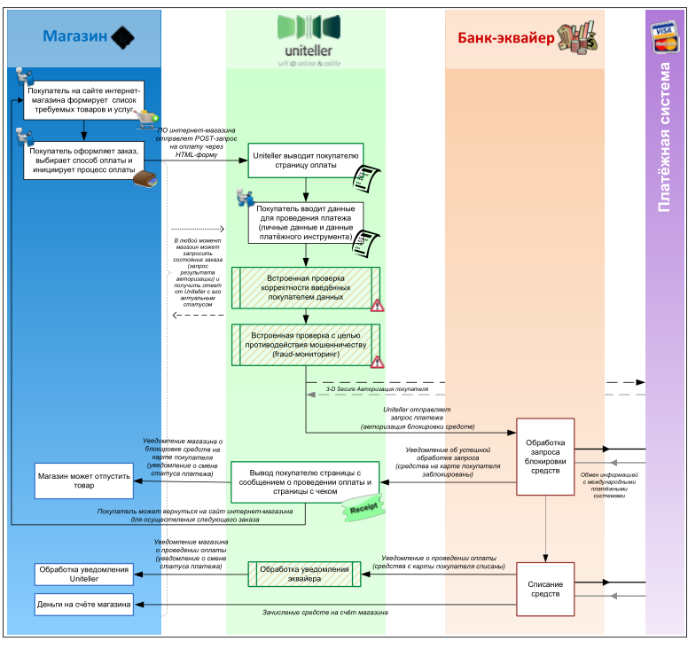
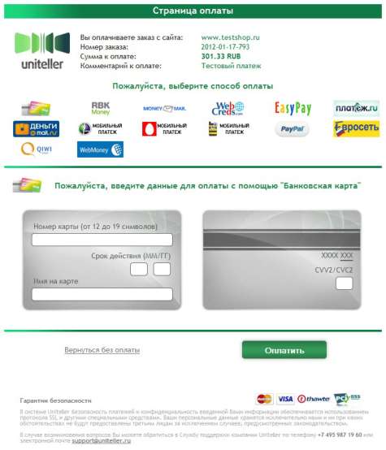
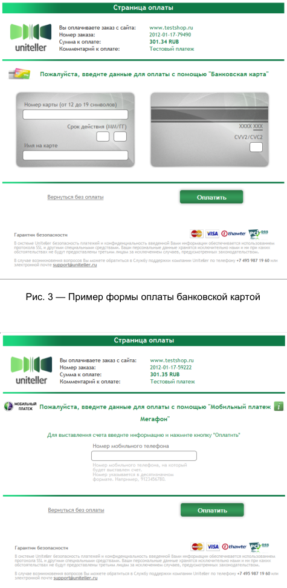
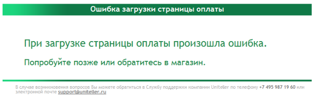
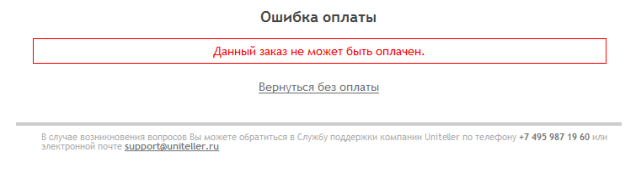
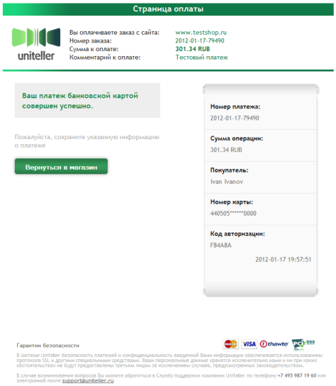
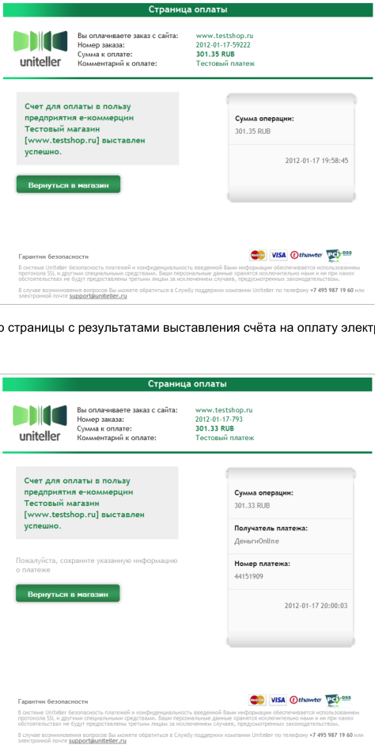
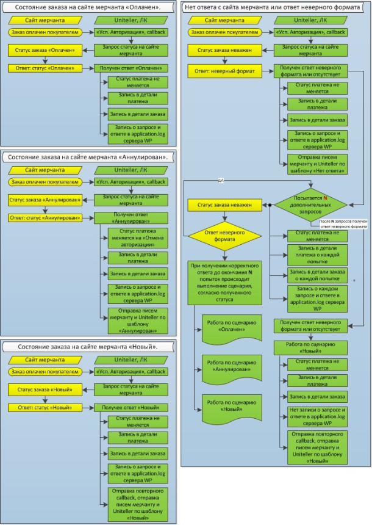
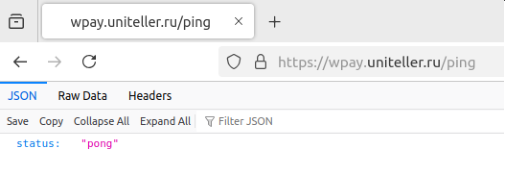

> Источник: [тп_интернет-эквайринг_-_v1.43_rev._48.pdf](pdf/%D1%82%D0%BF_%D0%B8%D0%BD%D1%82%D0%B5%D1%80%D0%BD%D0%B5%D1%82-%D1%8D%D0%BA%D0%B2%D0%B0%D0%B9%D1%80%D0%B8%D0%BD%D0%B3_-_v1.43_rev._48.pdf). Полная конвертация с сохранением порядка страниц. Номера страниц и повторяющиеся колонтитулы сохранены в HTML-комментариях. Примечания конвертации добавлены отдельно от текста источника. Физические переносы в коде сохранены; они могут требовать ручного соединения перед использованием примера.
>
> [Результаты сверки и места для ручной проверки](CONVERSION_REVIEW.md#acquiring-v1.43-rev48).

<a id="page-1"></a>

<!-- Страница PDF: 1 -->


# Технический порядок Интернет-эквайринг

Всего листов: 108

Версия: 1.43 rev. 48
Дата изменения: 2026-06-19

Москва, 2026

<a id="page-2"></a>

<!-- Страница PDF: 2 -->
<!-- Колонтитулы PDF:
Технический порядок. Интернет-эквайринг 2
-->

## Содержание:

Термины и определения ...................................................................................................................... 5
Введение .............................................................................................................................................. 7

1\. Функциональные возможности, предоставляемые в рамках услуги «Интернет-эквайринг» ........ 7

2\. Подключение точки продажи .......................................................................................................... 8

2\.1. Подключение магазина ....................................................................................................................... 8

2\.2. Отключение магазина ......................................................................................................................... 8

3\. Тестовое подключение .................................................................................................................... 8

3\.1. Назначение тестового подключения ................................................................................................. 8

3\.2. Программа тестирования .................................................................................................................... 9

3\.3. Тестирование с помощью «виртуального» эквайера ....................................................................... 9

3\.3.1. Параметры тестового подключения при тестировании с помощью «виртуального» эквайера ....... 9

3\.3.2. Особенность отображения результатов тестовых оплат в Личном кабинете Uniteller при оплате
через «виртуального» эквайера ........................................................................................................... 11

3\.3.3. Проведение тестирования с помощью «виртуального» эквайера .................................................... 11

3\.3.3.1. Тест успешной оплаты .................................................................................................................................... 11

3\.3.3.2. Тест неуспешной оплаты ................................................................................................................................ 11

4\. Порядок выполнения основных операций.................................................................................... 12

4\.1. Операция продажи ............................................................................................................................ 12

4\.1.1. Общая последовательность операции продажи ................................................................................. 12

4\.1.2. Форма оплаты на сайте интернет-магазина Мерчанта и её параметры ........................................... 16

4\.1.3. Способы вывода страницы оплаты. Интеграция страницы оплаты на сайт интернет-магазина .... 24

4\.1.4. Страница оплаты на сайте Uniteller в зависимости от переданных значений параметров
MeanType и EMoneyType ....................................................................................................................... 25

4\.1.5. Платёж в фоновом режиме ................................................................................................................... 30

4\.1.6. Платёж через внешнюю форму ............................................................................................................ 33

4\.1.7. Оплата с помощью платёжной ссылки ................................................................................................. 33

4\.1.8. Использование уникальных доменов мерчантов для организации оплаты .................................... 40

4\.1.9. Особенности оплаты через СБП ............................................................................................................ 40

4\.2. Преавторизация платежа .................................................................................................................. 41

4\.2.1. Общее описание .................................................................................................................................... 41

4\.2.2. Проведение преавторизации платежа ................................................................................................. 41

4\.2.3. Подтверждение платежа, проведённого с преавторизацией ............................................................ 42

4\.3. Рекуррентные платежи ..................................................................................................................... 44

4\.3.1. Общее описание .................................................................................................................................... 44

4\.3.2. Особенности рекуррентных платежей и принципы их проведения в системе Uniteller ................. 45

4\.3.3. Проведение рекуррентных платежей .................................................................................................. 46

4\.4. Регистрация банковских карт для повторных платежей ................................................................ 49

4\.4.1. Общая информация о регистрации банковских карт ......................................................................... 49

4\.4.2. Для чего нужна регистрация карт и типичные механизмы привязки ............................................... 50

4\.4.3. Безопасность и разделение ответственности ...................................................................................... 50

4\.4.3.1. Данные карты, «маска» и её статусы ............................................................................................................ 50

4\.4.3.2. Уникальный идентификатор покупателя Customer_IDP .............................................................................. 51

4\.4.4. Типичные сценарии использования ..................................................................................................... 51

4\.4.4.1. Оплата картой без авторизации в интернет-магазине ................................................................................ 51

4\.4.4.2. Первая оплата картой после авторизации в интернет-магазине ............................................................... 51

4\.4.4.3. Последующие оплаты зарегистрированной картой .................................................................................... 52

4\.4.4.4. Выбор зарегистрированной карты на стороне Uniteller при оплате .......................................................... 53

4\.4.4.5. Регистрация карты по случайной сумме ...................................................................................................... 53

4\.4.4.6. Выбор зарегистрированной карты на стороне интернет-магазина при оплате ........................................ 56

4\.4.4.7. Удаление регистрации карты ........................................................................................................................ 56

4\.4.4.8. Блокировка зарегистрированной карты ....................................................................................................... 56

4\.4.4.9. Разблокировка зарегистрированной карты ................................................................................................. 56

4\.4.4.10. Изменение статуса регистрации карты ........................................................................................................ 56

4\.4.4.11. Получение списка зарегистрированных карт ............................................................................................... 58

4\.4.4.12. Изменение имени зарегистрированной карты и/или признака выбора карты «по умолчанию» ........... 60

4\.4.4.13. Привязка карт по реестру .............................................................................................................................. 61

<a id="page-3"></a>

<!-- Страница PDF: 3 -->
<!-- Колонтитулы PDF:
Технический порядок. Интернет-эквайринг 3
-->

4\.5. Отмена платежа и возврат средств .................................................................................................. 63

4\.5.1. Суть терминов «отмена платежа» и «возврат средств». Особенности реализации отмен у разных
банков-эквайеров .................................................................................................................................. 63

4\.5.2. Запрос отмены платежа и возможные форматы ответа ..................................................................... 64

4\.5.2.1. Общий вид запроса отмены платежа ........................................................................................................... 64

4\.5.2.2. Виды запросов отмены платежа ................................................................................................................... 64

4\.5.2.3. Запрос отмены платежа по OrderID .............................................................................................................. 64

4\.5.2.4. Особенности отмены платежа СБП ............................................................................................................... 67

4\.5.2.5. Особенности отмены платежа SberPay ......................................................................................................... 67

4\.5.3. Отмена платежа с преавторизацией .................................................................................................... 67

4\.5.4. Возврат средств ...................................................................................................................................... 67

4\.6. Получение результатов авторизации .............................................................................................. 68

4\.6.1. Уведомление сервера интернет-магазина о статусе оплаты ............................................................. 68

4\.6.1.1. Общий алгоритм уведомления о статусе оплаты ........................................................................................ 68

4\.6.1.2. Уведомление о статусе оплаты с передачей дополнительных сведений (параметр CallbackFields) ....... 70

4\.6.2. Запрос результата авторизации ............................................................................................................ 71

4\.6.2.1. Общий вид запроса результата авторизации ............................................................................................... 71

4\.6.2.2. Особенности запроса результата авторизации платежа электронной валютой ....................................... 76

4\.6.2.3. Особенности запроса результата авторизации платежа для оплат авиабилетов через ГДС .................... 76

4\.6.3. Ограничения при осуществлении запроса результатов авторизации ............................................... 76

4\.7. Автоматический контроль статусов заказов ................................................................................... 77

4\.7.1. Общая информация об автоматическом контроле статуса заказов .................................................. 77

4\.7.2. Протокол запроса статуса заказа с сервера Мерчанта ....................................................................... 79

5\. Защита от мошеннических операций ............................................................................................ 79

6\. Порядок работы в Личном кабинете ............................................................................................. 79

6\.1. Просмотр списка операций .............................................................................................................. 79

6\.2. Возврат средств из Личного кабинета ............................................................................................. 80

7\. Техническая поддержка пользователей ........................................................................................ 80

8\. Справочная информация ............................................................................................................... 81

8\.1. Возможные поля параметра S_FIELDS ............................................................................................. 81

8\.2. Значения поля response_code........................................................................................................... 83

8\.3. Форматы ответов ............................................................................................................................... 84

8\.3.1. Ответ на запрос состояния транзакции ................................................................................................ 84

8\.3.1.1. Формат сообщения об ошибке ..................................................................................................................... 84

8\.3.1.2. CSV ................................................................................................................................................................... 84

8\.3.1.3. “В скобках” ...................................................................................................................................................... 85

8\.3.1.4. WDDX ............................................................................................................................................................... 85

8\.3.1.5. XML .................................................................................................................................................................. 87

8\.3.1.6. SOAP ................................................................................................................................................................ 88

8\.3.2. Ответ на запрос отмены платежа ......................................................................................................... 89

8\.3.2.1. CSV ................................................................................................................................................................... 89

8\.3.2.2. WDDX ............................................................................................................................................................... 89

8\.3.2.3. XML .................................................................................................................................................................. 90

8\.3.2.4. SOAP ................................................................................................................................................................ 92

8\.3.3. Ответ на запрос рекуррентного платежа ............................................................................................. 94

8\.3.3.1. CSV ................................................................................................................................................................... 94

8\.4. Ошибки загрузки страницы оплаты ................................................................................................. 94

8\.5. Примеры кода на PHP ..................................................................................................................... 100

8\.5.1. Получение отчёта о выполненной транзакции через SOAP ............................................................. 100

8\.5.2. Пример PHP-кода на странице оплаты Мерчанта ............................................................................. 101

8\.5.3. Пример PHP-кода запроса результата авторизации на сервере Uniteller ....................................... 102

8\.5.4. Пример PHP-кода отмены платежа по RRN ........................................................................................ 104

8\.5.5. Пример PHP-кода отмены платежа по Billnumber (RRN) по протоколу SOAP .................................. 106

8\.5.6. Пример PHP-кода отмены платежа по OrderID по протоколу SOAP ................................................. 106

8\.6. Необходимость подписания формы оплаты ................................................................................. 107

8\.7. Проверка доступности сервисов Uniteller ..................................................................................... 107
Приложение 1. Дополнительные функции для оплаты авиаперевозок
Приложение 2. Регистрация банковских карт для повторных платежей. Передача Банком-
эмитентом реестра выпущенных карт при регистрации карт «по реестру»

<a id="page-4"></a>

<!-- Страница PDF: 4 -->
<!-- Колонтитулы PDF:
Технический порядок. Интернет-эквайринг 4
-->

Приложение 3. Интеграция и работа с бонусной программой «Спасибо от Сбербанка»
Приложение 5. Интеграция и работа с сервисом Керченской паромной переправы (ООО
«Морская дирекция»)
Приложение 6. Интеграция и работа с Системой взимания платы (СВП)
Приложение 7. Оплата заказа через кредитную организацию
Приложение 8. Оплата заказов через Apple Pay
Приложение 9. Оплата заказов через Samsung Pay
Приложение 10. Оплата заказов через Google Pay
Приложение 11. Правила обработки платежей по договору с Мерчантом
Приложение 12. Работа с идентификаторами карты «Тройка»
Приложение 13. Оплата с помощью Checkout-скрипта
Приложение 14. Оплата через Autoswitch

<a id="page-5"></a>

<!-- Страница PDF: 5 -->
<!-- Колонтитулы PDF:
Технический порядок. Интернет-эквайринг 5
-->

## Термины и определения

| Термин | Определение |
| --- | --- |
| CVV2 (CVC2) | CVV2 (Card Verification Value 2) — трёхзначный или четырёхзначный код<br>проверки подлинности карты платёжной системы Visa. Аналогичный<br>защитный код для карт MasterCard носит название Card Validation Code 2<br>(CVC2). |
| GDS | см. ГДС |
| HTTP | Протокол передачи гипертекста (Hypertext transfer protocol). Открытый<br>протокол для передачи данных в сети Интернет. |
| ID | Идентификатор (identity). |
| IP-адрес | Cетевой адрес узла в компьютерной сети, построенной по протоколу IP. |
| PAN | Номер платёжной карты (Primary Account Number), кредитной или дебетовой,<br>которая идентифицирует платёжную систему и персональный счёт держателя<br>карты. |
| PCI DSS | Payment Card Industry Data Security Standard (Стандарт защиты информации в<br>индустрии платёжных карт), набор требований к безопасности данных<br>держателей карт, разработанный международными платёжными системами<br>VISA, MasterCard, American Express, JCB, Discover. |
| Uniteller | АО «Предпроцессинговый расчетный центр». |
| Авторизация | (При доступе в Личный кабинет Uniteller) — процесс предоставления<br>пользователю, программе или процессу прав доступа или других полномочий<br>на выполнение некоторых действий.<br>(При платеже по банковской карте) — процедура получения разрешения<br>эмитента на совершение операции оплаты по карте (часто термином<br>«авторизация» обозначается операция блокировки средств на карте<br>Покупателя). |
| ГДС | Глобальная дистрибьюторская система (Global Distribution System, GDS) —<br>информационная система, предоставляющая информацию о рейсах<br>авиакомпаний и возможность бронирования авиабилетов. Мерчанты<br>(Агентства), работающие на рынке услуг по бронированию авиабилетов,<br>обычно интегрированы с одной или несколькими ГДС. |
| Держатель карты<br>или Покупатель | Посетитель электронного магазина Мёрчатна с целью ознакомления с<br>ассортиментом (услугами) и осуществления покупки. |
| Заказ | Заказ в системе Uniteller является сущностью, соответствующей заказу в<br>интернет-магазине Мерчанта. Ключевыми параметрами заказа являются<br>принадлежность к интернет-магазину Мерчанта, номер заказа, сумма, статус. |
| Магазин;<br>интернет-магазин | Сайт интернет-магазина Мерчанта, на котором производится приём платежей<br>от Покупателей и через программное обеспечение которого идёт обмен<br>данными с системой Uniteller. |
| Мерчант | Организация, заключившая с Uniteller договор об оказании услуг по<br>информационно-технологическому сопровождению приёма банковских карт. |

<a id="page-6"></a>

<!-- Страница PDF: 6 -->
<!-- Колонтитулы PDF:
Технический порядок. Интернет-эквайринг 6
-->

| Термин | Определение |
| --- | --- |
| Операция | Операция в системе Uniteller является сущностью, соответствующей попытке<br>оплаты заказа выбранным способом (оплата банковской картой или оплата с<br>помощью электронной платёжной системы). |
| Пароль | Секретная строка символов, которая служит для аутентификации Покупателя. |
| Протокол | Согласованный метод обмена данными, используемый в сетях. |
| Рекуррентный<br>платёж | Платёж, осуществляемый в автоматическом режиме без участия Держателя<br>карты с его согласия и по заранее утверждённому расписанию. |
| СБП | Система быстрых платежей ЦБ РФ |
| Сервер | Компьютер, предоставляющий сервисы другим компьютерам сети. |

<a id="page-7"></a>

<!-- Страница PDF: 7 -->
<!-- Колонтитулы PDF:
Технический порядок. Интернет-эквайринг 7
-->

## Введение

Этот документ является техническим порядком, содержащим необходимую и достаточную
информацию для подключения и последующего бесперебойного получения услуги
«Интернет-эквайринг», предоставляемой компанией Uniteller.
Документ предназначен техническим специалистам, обеспечивающим подключение на
интернет-ресурсах клиентов услуги «Интернет-эквайринг».

## 1. Функциональные возможности, предоставляемые в рамках услуги «Интернет-эквайринг»

Интернет-эквайринг — это приём к оплате платёжных карт через Интернет с использованием
специально разработанного web-интерфейса, позволяющего провести расчёты в интернет-магазинах.

В рамках услуги «Интернет-эквайринг» процессинговый центр Uniteller предоставляет своим
клиентам следующие возможности:

− Обеспечение на сайте интернет-магазина клиента возможности следующих видов оплат:

• банковскими картами всех основных международных платёжных систем (VISA,
MasterCard, JCB, Diners Club, ChinaUnionPay, American Express, «Мир»);

• через популярные электронные платёжные системы: QIWI Кошелек, WebMoney WMR,
Яндекс.Деньги, MOBI.Деньги;

• оплата наличными через сервис Яндекс.Деньги.

− Возможность глубокой кастомизации страницы оплаты, демонстрируемой Покупателю.

− Возможность использовать уникальные доменные имена для организации оплат.

− Наличие кастомизируемого платёжного виджета с подключаемой номенклатурой товаров.

− Проведение платежей с преавторизацией.

− Поддержка рекуррентных платежей.

− Регистрация банковских карт для упрощения последующих платежей.

− Автоматический контроль статусов заказов.

− Интеграция с основными системами бронирования и продажи авиабилетов.

− Автоматическая система защиты от мошеннических операций, поддержка 3D Secure 1.0 и
2.0.

− Личный кабинет системы Uniteller с широкими возможностями мониторинга и
администрирования платежей.

− Интеграция с бонусной программой «Спасибо от Сбербанка».

− Интеграция с системой мобильных платежей Apple Pay, Google Pay, Mir Pay, Samsung Pay.

− Оплата через Систему быстрых платежей ЦБ РФ.

− Оплата через Яндес Сплит.

<a id="page-8"></a>

<!-- Страница PDF: 8 -->
<!-- Колонтитулы PDF:
Технический порядок. Интернет-эквайринг 8
-->

## 2. Подключение точки продажи

### 2.1. Подключение магазина

Точка продажи Мерчанта может быть подключена только при условии подключения Мерчанта
к системе Uniteller.

Мерчант считается подключенным к системе Uniteller при выполнении следующих условий:

− С Uniteller заключён договор об оказании услуг по информационно-технологическому
сопровождению приёма банковских карт.

− С Банком-эквайером заключён договор об обслуживании держателей банковских карт.

− От Uniteller получены идентификаторы клиента (MERCHANT_ID) и платёжного терминала
(TERMINAL_ID) (эти идентификаторы присваиваются эквайером, но Uniteller также
обладает этой информацией).

Если данные о точке продажи, указанные в заявлении, соответствуют правилам Uniteller,
Банка-эквайера и Международных платёжных систем, Uniteller переходит к подключению точки
продажи, регистрируя её на сервере Uniteller, ставя ей в соответствие идентификатор TERMINAL_ID.

Для подключения точки продажи к системе Uniteller выполняются следующие действия:

− Ответственный менеджер отдела продаж Uniteller добавляет в систему Uniteller
следующую информацию:

• Запись с параметрами заключённого договора об оказании услуг по информационно-
технологическому сопровождению приёма банковских карт.

• Записи о торговых точках (интернет-магазинах), подключаемых в рамках данного
договора, с фиксацией идентификаторов TERMINAL_ID. При подключении каждой
торговой точки Мерчанту передаётся её идентификатор Shop_IDP.

− Для подключения возможности оплат товаров и/или услуг валютами электронных
платёжных систем заключается дополнительный договор на обслуживание электронных
валют и информация о нём добавляется в систему Uniteller по представлению менеджера
отдела продаж Uniteller.

### 2.2. Отключение магазина

Под отключением магазина подразумевается прекращение предоставления услуг сервиса
Uniteller, в том числе предоставления информации в Личном кабинете о данной торговой точке
(магазине) Мерчанта.
Uniteller может осуществить блокировку или отключение точки продажи по письменному
заявлению Мерчанта.

## 3. Тестовое подключение

### 3.1. Назначение тестового подключения

Тестовое подключение интернет-магазина Мерчанта к системе Uniteller является обязательным
этапом предоставления услуги «Интернет-эквайринг» и имеет следующее назначение:

− Начальная регистрация торговой точки Мерчанта в системе Uniteller.
(Идентификатор магазина присваивается каждому интернет-магазину Мерчанта в момент

<a id="page-9"></a>

<!-- Страница PDF: 9 -->
<!-- Колонтитулы PDF:
Технический порядок. Интернет-эквайринг 9
-->

подключения точки продажи).

− Реализация в программном обеспечении сайта интернет-магазина алгоритмов обмена
данными с сайтом Uniteller и проверка правильности их работы.

− Знакомство персонала Мерчанта с функциональными возможностями Личного кабинета
системы Uniteller.

− Организационная подготовка персонала Мерчанта к обеспечению процесса приёма оплат
по банковским картам.

В процессинговом центре Uniteller реализовано тестирование с помощью «виртуального»
эквайера — все запросы и ответы обрабатываются процессингом Uniteller, но «виртуальным»
эквайером, эмулирующим работу банка-эквайера, с которым у Мерчанта заключён договор. Для
администрирования тестовых оплат используется Личный кабинет. После завершения тестирования
все настройки для перехода к «боевой» эксплуатации производятся на стороне Uniteller.

Далее алгоритм тестирования рассматривается подробно.

### 3.2. Программа тестирования

Для успешной интеграции с платёжной системой Uniteller достаточно проверки следующих
базовых функциональных возможностей:

− Формирование корректного заказа на оплату через форму оплаты на сайте Мерчанта.

− Получение от процессинга Uniteller уведомления об изменении статуса заказа.

− Запрос результатов авторизации.

− Просмотр операций оплаты в Личном кабинете Uniteller.

− Неуспешная оплата.

− Дополнительно может быть протестирована операция «Возврат средств».

Программа тестирования содержит следующие 2 теста:

1\. Тест успешной оплаты — оплата тестовой картой с корректными параметрами. Этот тест
позволяет проверить случай, при котором Покупатель на сайте Мерчанта производит
оплату картой с корректными параметрами — оплата на сайте принимается, сайт
реагирует правильным образом (выдаёт товар или предоставляет услугу, показывает
Покупателю страницу успешной оплаты и т. д.).

2\. Тест неуспешной оплаты — оплата тестовой картой с некорректными параметрами
(неправильный номер карты, недостаточно средств на карте и т. д.). Этот тест позволяет
проверить случай, при котором Покупатель на сайте Мерчанта производит оплату картой
с некорректными параметрами — сайт, соответственно, не принимает оплату и также
реагирует правильным образом (показывает Покупателю сообщение об ошибке, не
выдаёт товар или не предоставляет услугу).

### 3.3. Тестирование с помощью «виртуального» эквайера

#### 3.3.1. Параметры тестового подключения при тестировании с помощью «виртуального» эквайера

Для тестирования подключения к процессингу Uniteller с помощью «виртуального» эквайера
используется процессинг Uniteller, а для администрирования платежей — Личный кабинет. Поэтому

<a id="page-10"></a>

<!-- Страница PDF: 10 -->
<!-- Колонтитулы PDF:
Технический порядок. Интернет-эквайринг 10
-->

все запросы должны выполняться в соответствии с основными разделами (не относящимися к
тестовому подключению) настоящего Технического порядка, а именно:

− В качестве адреса формы оплаты платёжного шлюза (URL-адрес, который указывается в
HTML-форме оплаты на сайте интернет-магазина):

```text
https://wpay.uniteller.ru/pay/
```

(см. п. 4.1.2
«Форма оплаты на сайте интернет-магазина Мерчанта и её параметры» на стр. 16).

− Для получения результатов авторизации:

```text
https://wpay.uniteller.ru/results/
```

(см. п. 4.6.2.1
«Общий вид запроса результата авторизации» на стр. 71).

− Для получения WSDL-файла:

```text
https://wpay.uniteller.ru/results/wsdl/
```

(см. п. 4.6.2.1 «Общий
вид запроса результата авторизации» на стр. 71).

− Адрес Личного кабинета сервера Uniteller:

```text
https://lk.uniteller.ru/
```

Для тестирования с помощью «виртуального» эквайера необходимы следующие данные:

− Логин и пароль для доступа в Личный кабинет платёжной системы Uniteller —
предоставляются менеджером Uniteller.

− Идентификатор (номер) точки продажи — создаётся менеджером Uniteller и указан в
Личном кабинете в разделе «Точки продажи» (параметр Uniteller Point ID).

− Ключевые адреса на сервере процессинга Uniteller — указаны выше в этом разделе.

− Данные тестовой платёжной карты — указаны ниже в этом разделе.

− Авторизационные данные (логин и пароль), используемые в запросе результатов
авторизации (также необходимы при возврате средств) — эти данные указаны в Личном
кабинете сервера Uniteller в разделе «Параметры авторизации».

Для тестирования следует использовать только данные следующих тестовых платёжных карт:

− Номер карты — 4000000000002487 (или следующие номера карт:

•  4000000000002420

•  4000000000002438

•  5000000000002443

•  5000000000002450

•  2200060300746821 («Мир»)

− Срок действия — 01/35

− Имя держателя карты — UNITELLER TEST

− CVV — 123

Сумма тестового платежа должна быть в пределах 10,00–100,00 руб. (включительно).

Для осуществления тестового подключения точки продажи Мерчанта к системе Uniteller
необходимо ознакомиться с общей последовательностью проведения операции продажи (см. п. 4.1.1
«Общая последовательность операции продажи» на стр. 12) и разместить на странице сайта интернет-
магазина форму оплаты (см. п. 4.1.2 «Форма оплаты на сайте интернет-магазина Мерчанта и её
параметры» на стр. 16).

Так как при проведении тестирования работа с электронными валютами не поддерживается, в
тестовом запросе на оплату параметры MeanType и EMoneyType либо не должны передаваться
(обращаем ваше внимание на то, что в соответствии с алгоритмом вычисления обязательного
параметра Signature, приведённым в табл. 1 на стр. 16, вместо значений параметров MeanType и
EMoneyType в этом случае подставляется значение хэш-функции md5 от пустой строки), либо могут
быть переданы с нулевыми значениями (при расчёте Signature, соответственно, подставлять md5('0')).

<a id="page-11"></a>

<!-- Страница PDF: 11 -->
<!-- Колонтитулы PDF:
Технический порядок. Интернет-эквайринг 11
-->

#### 3.3.2. Особенность отображения результатов тестовых оплат в Личном кабинете Uniteller при оплате через «виртуального» эквайера

Результаты успешно проведённых оплат можно контролировать в Личном кабинете платёжной
системы Uniteller. Подробная информация о работе в Личном кабинете изложена в документе
«Личный кабинет платёжной системы Uniteller. Руководство сотрудника мерчанта».

Обращаем ваше внимание на то, что в настоящее время при просмотре в Личном кабинете
Uniteller оплат, осуществлённых через «виртуального» эквайера, осуществлённые операции не
отображаются в отчёте «Операции по карте» (см. соответствующий раздел в Главном меню Личного
кабинета). Для их просмотра следует использовать отчёт «Заказы» и страницу с подробной
информацией о заказе, переход на которую осуществляется по ссылке в столбце ID на странице
«Заказы».

#### 3.3.3. Проведение тестирования с помощью «виртуального» эквайера

##### 3.3.3.1. Тест успешной оплаты

Проведите тестовую оплату с помощью формы оплаты, все поля в форме оплаты банковской
картой являются обязательными для заполнения:

Параметры тестовой карты:

− Номер карты — 4000000000002487

− Срок действия — 01/35

− Имя Держателя карты — UNITELLER TEST

− CVV2— 123

− Электронная почта — любое значение

− Номер телефона — любое значение

После успешно проведённой оплаты Покупателю будет показана страница с информацией о
проведённой транзакции и кнопкой [Вернуться в интернет магазин]. После нажатия на эту кнопку
браузер Покупателя должен быть направлен на сайт Мерчанта, на страницу с адресом, сохранённым в
переменной URL_RETURN_OK, которая соответствует успешному проведению оплаты с помощью
карты.
На адрес, сохранённый в Личном кабинете в настройках точки продажи магазина в поле «URL-
адрес уведомления магазина», должно прийти уведомление об изменении статуса заказа (см. п. 4.6.1
«Уведомление сервера интернет-магазина о статусе оплаты» на стр. 68).

Осуществите запрос результата авторизации (см. п. 4.6.2 «Запрос результата авторизации» на
стр. 71) и получите ответ со статусом заказа Authorized, который является критерием оплаты заказа (см.
примечание на стр. 15).

В Личном кабинете Uniteller в разделе «Заказы» должна появиться запись, соответствующая
проведённой оплате.

##### 3.3.3.2. Тест неуспешной оплаты

Все поля на форме оплаты банковской картой являются обязательными для заполнения.

<a id="page-12"></a>

<!-- Страница PDF: 12 -->
<!-- Колонтитулы PDF:
Технический порядок. Интернет-эквайринг 12
-->

Параметры тестовой карты:

− Номер карты — 4000000000002479

− Срок действия — 01/35

− Имя Держателя карты — UNITELLER TEST

− CVV2— 123

− Электронная почта — любое значение

− Номер телефона — любое значение

Результатом проведения оплаты с использованием этой карты должен быть показ страницы
оплаты с сообщением об ошибке. Если после этого Покупатель нажмёт кнопку [Вернуться без оплаты],
то его браузер будет направлен на сайт Мерчанта, на страницу с адресом, сохранённым в переменной
URL_RETURN_NO, которая соответствует неуспешной оплате.

## 4. Порядок выполнения основных операций

### 4.1. Операция продажи

#### 4.1.1. Общая последовательность операции продажи

В общем виде последовательность операции продажи изображена на рис. 1.

<a id="page-13"></a>

<!-- Страница PDF: 13 -->
<!-- Колонтитулы PDF:
Технический порядок. Интернет-эквайринг 13
-->

> **Примечание конвертации (стр. 13 PDF):** графика сохранена изображением. Текст внутри растровых элементов не извлекается из текстового слоя PDF; подписи и связи на схеме требуют ручной проверки по изображению.



Магазин Банк-эквайер

Покупатель на сайте интернет-
магазина формирует  список
требуемых товаров и услуг

ПО интернет-магазина
отправлет POST-запрос
на оплату через

Покупатель оформляет заказ, HTML-форму

Uniteller выводит покупателю

выбирает способ оплаты и

страницу оплаты

инициирует процесс оплаты

Покупатель вводит данные Платёжная система
для проведения платежа
(личные данные и данные

В любой момент платёжного инструмента)
магазин может
запросить
состояние заказа
(запрос
результата
авторизации) и Встроенная проверка
получить ответ корректности введённых
от Uniteller с его
актуальным покупателем данных
статусом

Встроенная проверка с целью
противодействия мошенничеству
(fraud-мониторинг)

3-D Secure Авторизация покупателя
Uniteller отправляет
запрос платежа
(авторизация блокировки средств)
Уведомление магазина о Обработка
блокировке средств на Уведомление об успешной запроса
карте покупателя обработке запроса
(уведомление о смене блокировки
(средства на карте покупателя
статуса платежа) Вывод покупателю страницы с заблокированы) средств Обмен информацией
Магазин может отпустить
товар сообщением о проведении оплаты и с международными
страницы с чеком платёжными
системами
Покупатель может вернуться на сайт интернет-магазина
для осуществления следующего заказа
Уведомление магазина
о проведении оплаты
(уведомление о смене Уведомление о проведении оплаты
Обработка уведомления статуса платежа) Обработка уведомления (средства с карты покупателя списаны)
Uniteller эквайера
Списание
средств
Деньги на счёте магазина
Зачисление средств на счёт магазина

Рис. 1 — Общая последовательность операции продажи

1\. Необходимость в оплате возникает при формировании Покупателем на сайте интернет-
магазина заказа — набора товаров и/или услуг, требующего оплаты.

2\. Операция продажи в системе Uniteller инициируется при получении с сайта интернет-
магазина значений полей HTML-формы с параметрами необходимой оплаты. Эта форма
может располагаться, например, на странице «Корзина», а её поля отсылаться при
нажатии Покупателем на сайте интернет-магазина кнопки формы [ Оплатить ]. Пример
шаблона HTML-формы приведён п. 4.1.2 «Форма оплаты на сайте интернет-магазина
Мерчанта и её параметры» на стр. 16.

3\. Существуют следующие способы оплаты:

• банковской картой различных международных платёжных систем (VISA, MasterCard,
DinersClub, JCB, «Мир»);

• с помощью различных электронных платёжных систем (QIWI Кошелек, WebMoney
WMR, Яндекс.Деньги).
Использование того или иного способа оплаты может определяться как предварительно

Мерчантом путём фиксации передаваемых из формы значений параметров MeanType и EMoneyType
(см. п. 4.1.4 «Страница оплаты на сайте Uniteller в зависимости от переданных значений параметров

<a id="page-14"></a>

<!-- Страница PDF: 14 -->
<!-- Колонтитулы PDF:
Технический порядок. Интернет-эквайринг 14
-->

MeanType и EMoneyType» на стр. 25), так и, если это не определено Мерчантом, выбираться самим
Покупателем в ходе оплаты.

4\. В результате отправки параметров вышеуказанной формы Покупателю выводится
страница оплаты. Вид страницы оплаты зависит от того, выбран ли предварительно
способ оплаты, или его только предстоит выбрать (см. п. 4.1.4 «Страница оплаты на сайте
Uniteller в зависимости от переданных значений параметров MeanType и EMoneyType» на
стр. 25), а также от выбранного шаблона страницы оплаты и его настроек (см. п. 4.1.3
«Способы вывода страницы оплаты. Интеграция страницы оплаты на сайт
интернет-магазина» на стр. 24). Если способ оплаты предварительно не определён, то
будет показана страница выбора способа оплаты, в противном случае сразу будет
показана страница оплаты выбранным способом.

5\. На странице оплаты выбранным способом Покупатель вводит данные, требуемые для
проведения платежа (например, данные банковской карты), и нажимает [ Оплатить ].
При этом в системе Uniteller создаётся заказ и операция по карте или электронной валюте
(для оплаты по банковской карте и электронной валютой, соответственно).

6\. Система Uniteller проводит ряд проверок на корректность введённых данных и для
противодействия мошенничеству, а также, в случае проведения платежа с 3-D Secure-
авторизацией, Покупатель проходит 3-D Secure-авторизацию на сервере платёжной
системы.

7\. При успешном прохождении внутренних проверок Uniteller и 3-D Secure-авторизации
система Uniteller направляет запрос блокировки средств (авторизации) в банк-эквайер.

8\. Банк-эквайер проводит свои проверки данных, присланных в запросе платежа, и, при их
успешном прохождении, блокирует на счёте Покупателя требуемую сумму и уведомляет
Uniteller о завершении авторизации блокировки средств.

9\. Система Uniteller выводит Покупателю страницу успешной оплаты, на которой
перечислена вся основная информация по платежу (см. ниже в этом пункте перечень
обязательных данных).
Одновременно система Uniteller посылает уведомление на сайт интернет-магазина о
блокировке средств по оплачиваемому заказу (см. п. 4.6.1 «Уведомление сервера
интернет-магазина о статусе оплаты» на стр. 68). На основании этого сообщения магазин
может отпустить товар по заказу 1.

10\. На основании произведённого запроса авторизации блокировки средств в банк-эквайер
продолжает обработку платежа, пока сумма платежа не будет зачислена со счёта
Покупателя на счёт магазина. При списании средств со счёта Покупателя банк-эквайер
информирует об этом систему Uniteller, а Uniteller, в свою очередь, информирует об этом
магазин (см. п. 4.6.1 «Уведомление сервера интернет-магазина о статусе оплаты» на
стр. 68).

В зависимости от выбранного способа оплата проводится по одной из следующих схем:

− в фоновом режиме — Покупатель остаётся на сайте Uniteller и вводит, при необходимости,
требуемую дополнительную информацию, в результате оплаты происходит отображение
страницы результата оплаты или выставления счёта (см. п. 4.1.5 «Платёж в фоновом

1 Примечание: Критерием оплаты заказа является ответ на запрос Мерчанта о подтверждении блокировки
средств со статусом платежа authorized (или paid, что актуально для оплат электронными валютами и ряда
банков-эквайеров, использующих процессинг по алгоритму «операции покупки», когда весь платёж проводится
в 1 этап, этап блокировки средств отсутствует, и при оплате сразу присваивается статус paid, во всех других
случаях рекомендуется отслеживать статус authorized) (см. п. 4.6.2 «Запрос результата авторизации» на стр. 48).
О необходимости реализации и использования на сайте магазина механизма запросов результатов
авторизации говорится ниже в этом пункте.

<a id="page-15"></a>

<!-- Страница PDF: 15 -->
<!-- Колонтитулы PDF:
Технический порядок. Интернет-эквайринг 15
-->

режиме» на стр. 30);

− через внешнюю форму — Покупатель перенаправляется на сайт выбранной электронной
платёжной системы для продолжения операции оплаты без участия Uniteller (см. п. 4.1.6
«Платёж через внешнюю форму» на стр. 33). При этом система Uniteller отслеживает статус
этой оплаты.

В случае оплаты через электронную платёжную систему создаётся счёт, который Покупатель
должен оплатить впоследствии.

Со страницы оплаты Покупатель может вернуться на сайт интернет-магазина, нажав
[ Вернуться в интернет-магазин ]. Покупатель будет перенаправлен на адрес, сохранённый в
параметре URL_RETURN_OK (если он задан) или URL_RETURN (если задан только он), с
GET-параметром Order_ID, равным Order_IDP. Если в URL-адресе уже присутствует GET-параметр
Order_ID, его значение будет заменено.

```text
Пример:
URL_RETURN_OK=http://example.com/pay/ok/?param1=value1&param2=value2
Перенаправление после оплаты произойдет на адрес:
http://example.com/pay/ok/?param1=value1&param2=value2&Order_ID=1234
```

Код страницы сайта Мерчанта в любом случае должен выполнить запрос, описанный в п. 4.6
«Получение результатов авторизации» (см. стр. 68), к серверу wpay.uniteller.ru, используя Order_ID, и
убедиться в том, что заказ с этим Order_ID действительно существует, имеет правильный статус и
сумму.

В случае ошибки браузер Покупателя будет перенаправлен на другую (или на ту же самую)
страницу на сайте Мерчанта, которая должна сообщить Покупателю о неуспешности платежа.

Не исключена ситуация, когда перенаправление на страницу успешной оплаты на сайте Мерчанта не
происходит (например, по причине сбоя браузера на стороне Покупателя).
По этой причине рекомендуется:

− использовать механизм уведомлений, описанный в п. «Уведомление сервера интернет-
магазина о статусе оплаты» (см. стр. 68), а также

− проверять статус оплаты (см. п. 4.6 «Получение результатов авторизации» на стр. 68) при
любой активности на сайте со стороны Покупателя в случае, когда оплата не
подтверждена соответствующим обращением на страницу успешной оплаты
(URL_RETURN_OK), неуспешной оплаты (URL_RETURN_NO) или страницы подтверждения
факта оплаты (URL_RETURN).
Механизм уведомления интернет-магазина о статусе оплаты является средством информирования,
которое в определённых условиях подвержено сбоям и задержкам. Для Мерчанта критерием
оплаты заказа должен являться только ответ на его запрос получения результата авторизации (см.
п. 4.6.2 «Запрос результата авторизации» на стр. 71) по требуемому заказу и статус заказа в
полученном ответе — Authorized или Paid.

При успешном выполнении оплаты Мерчант обязан вывести Держателю карты страницу,
содержащую следующие данные:

− Торговое наименование Мерчанта ("Doing business as" name).

− Латинское наименование точки приёма, присвоенное Uniteller (сообщается Мерчанту
вместе с идентификатором точки MERCHANT_ID).

− URL электронного магазина.

− Контактный адрес электронной почты предприятия и контактный телефон.

<a id="page-16"></a>

<!-- Страница PDF: 16 -->
<!-- Колонтитулы PDF:
Технический порядок. Интернет-эквайринг 16
-->

− Маскированный номер платёжной карты (от 0 до 6 первых цифр и последние 4 цифры
номера карты (PAN), соединённые звёздочками).

− Сумма операции в валюте, установленной Uniteller в договоре.

− Дата операции.

− Уникальный идентификатор транзакции (RRN).

− Имя Держателя карты.

− Код авторизации платежа (Authorization code).

− Тип операции (продажа).

− Наименование товара/описание услуг.

− Условия возмещения/возврата (если установлены).

− Точная дата окончания демонстрационного периода (если имеет место).

Полный номер карты НЕ ДОЛЖЕН присутствовать на странице успешной оплаты.

Далее будут описаны требуемые параметры и условия проведения операции оплаты и
рассмотрены частные случаи её проведения.

#### 4.1.2. Форма оплаты на сайте интернет-магазина Мерчанта и её параметры

Мерчанту необходимо разместить на странице сайта интернет-магазина, с которой
совершается оплата, HTML-форму, определяющую параметры предстоящей оплаты.
HTML-форма должна передавать (POST- или GET-методом) следующие обязательные (см. табл.

1) и необязательные (см. табл. 2) параметры на адрес:

```text
https://wpay.uniteller.ru/pay/
```

.

Табл. 1 — Обязательные параметры формы оплаты на сайте Мерчанта

| № | Параметр | Описание |
| --- | --- | --- |
| 1 | Shop_IDP | Идентификатор точки продажи в системе Uniteller.<br>• В Личном кабинете этот параметр называется Uniteller Point ID,<br>и его значение доступно на странице «Точки продажи<br>компании» (пункт меню «Точки продажи») в столбце<br>Uniteller Point ID.<br>Формат: текст, содержащий либо латинские буквы и цифры в<br>количестве от 1 до 64, либо две группы латинских букв и цифр,<br>разделенных «-» (первая группа от 1 до 15 символов, вторая группа от 1<br>до 11 символов), к регистру нечувствителен. |
| 2 | Order_IDP | Номер заказа в системе расчётов интернет-магазина, соответствующий<br>данному платежу. Может быть любой непустой строкой максимальной<br>длиной 127 символов, не может содержать только пробелы.<br>Значение Order_IDP должно быть уникальным для всех оплаченных<br>заказов (заказов, по которым успешно прошла блокировка средств) в<br>рамках одного магазина (одной точки продажи). Пока по заказу не<br>проведена блокировка средств (авторизация), допускается несколько<br>запросов с одинаковым Order_IDP (например, несколько попыток<br>оплаты одного и того же заказа). При использовании электронных<br>валют номер заказа должен быть уникальным для каждого запроса на<br>оплату. |

<a id="page-17"></a>

<!-- Страница PDF: 17 -->
<!-- Колонтитулы PDF:
Технический порядок. Интернет-эквайринг 17
-->

| № | Параметр | Описание |
| --- | --- | --- |
| 3 | Subtotal_P | Сумма покупки в валюте, оговоренной в договоре с банком-эквайером.<br>В качестве десятичного разделителя используется точка, не более 2<br>знаков после разделителя. Например, 12.34. |
| 4 | Signature | Подпись, гарантирующая неизменность критичных данных оплаты<br>(суммы, Order_IDP).<br>(см. п. 8.6 «Необходимость подписания формы оплаты» на стр. 107)<br>Signature вычисляется по следующему алгоритму:<br>[Пример из ячейки](#example-17-1)<br>где:<br>• password — пароль из раздела «Параметры Авторизации»<br>Личного кабинета системы Uniteller.<br>• '+' — операция конкатенации текстовых строк (все строки<br>преобразуются в байты в кодировке ASCII).<br>• '&amp;' — символ «разделитель полей». Если необязательный<br>параметр не передаётся в форме, соответствующий этому полю<br>(следующий за ним) знак '&amp;' сохраняется в строке для<br>вычисления Signature.<br>• md5 — криптографическая хеш-функция (символы в нижнем<br>регистре).<br>• uppercase — функция приведения к верхнему регистру.<br>• MeanType — платёжная система банковской карты. Если<br>MeanType не передаётся в форме, то следует его принять пустой<br>строкой 2.<br>• EMoneyType — тип электронной валюты. Если EMoneyType не<br>передаётся в форме, то следует его принять пустой строкой 2.<br>• Lifetime — время жизни формы оплаты в секундах. Если Lifetime<br>не передаётся в форме, то следует его принять пустой строкой 2.<br>• Customer_IDP — идентификатор покупателя, используемый<br>некоторыми интернет-магазинами. Если Customer_IDP не<br>передаётся в форме, то следует его принять пустой строкой 2.<br>• Card_IDP — идентификатор зарегистрированной карты. Если<br>Card_IDP не передаётся в форме, то следует его принять пустой<br>строкой 2.<br>• IData — «длинная запись». Если IData не передаётся в форме, то<br>следует его принять пустой строкой 2.<br>• PT_Code — тип платежа. Если PT_Code не передается в форме,<br>то следует его принять пустой строкой 2. |

> **Примечание конвертации:** примеры из ячеек этой таблицы вынесены ниже без изменения текста; в ячейках стоят ссылки на них.

<a id="example-17-1"></a>

```text
Signature = uppercase(md5(md5(Shop_IDP) + '&' +
md5(Order_IDP) + '&' + md5(Subtotal_P) + '&' + md5(MeanType) +
'&' + md5(EMoneyType) + '&' + md5(Lifetime) + '&' +
md5(Customer_IDP) + '&' + md5(Card_IDP) + '&' + md5(IData) +
'&' + md5(PT_Code) + '&' + md5(password)))
```

2 Примечание: В этом случае в последовательность подставляется значение md5 от пустой строки, равное
d41d8cd98f00b204e9800998ecf8427e

<a id="page-18"></a>

<!-- Страница PDF: 18 -->
<!-- Колонтитулы PDF:
Технический порядок. Интернет-эквайринг 18
-->

| № | Параметр | Описание |
| --- | --- | --- |
| 5 | Параметр<br>URL_RETURN<br>или два<br>параметра:<br>URL_RETURN_OK,<br>URL_RETURN_NO | URL_RETURN 3 — URL страницы, на которую должен вернуться<br>Покупатель после осуществления платежа в системе Uniteller. Длина до<br>255 символов.<br>URL_RETURN_OK 3 — URL страницы, на которую должен вернуться<br>Покупатель после успешного осуществления платежа в системе<br>Uniteller. Если этот параметр задан, то он является более приоритетным,<br>чем параметр URL_RETURN. Длина до 255 символов.<br>URL_RETURN_NO 3 — URL страницы, на которую должен вернуться<br>Покупатель после неуспешного осуществления платежа в системе<br>Uniteller. Если этот параметр задан, то он является более приоритетным,<br>чем параметр URL_RETURN. Длина (до 255 символов. |
| 6 | Currency | Валюта платежа. Параметр обязателен для точек продажи, работающих<br>с валютой, отличной от российского рубля. Для оплат в российских<br>рублях параметр необязательный.<br>Возможные значения:<br>• RUB — российский рубль;<br>• AZN — азербайджанский манат;<br>• EUR — евро;<br>• KGS — киргизский сом;<br>• KZT — казахский тенге;<br>• UAH — украинская гривна;<br>• USD — доллар США. |
| 7 | IsRecurrentStart | Признак того, что платёж является «родительским» для последующих<br>рекуррентных платежей. Может принимать значения:<br>• 1 – значение по умолчанию;<br>• 2 – «родительский» платёж для серии рекуррентов MIT<br>(инициированных мерчантом, без графика) и CIT<br>(инициированных пользователем);<br>• 3 – «родительский» платёж для серии рекуррентов MIT «по<br>графику» (инициированных мерчантом, по графику).<br>Примечание: обязателен для рекуррентных платежей |

3 Примечание: не допускается использование в значении параметров URL_RETURN, URL_RETURN_OK,
URL_RETURN_NO кириллицы — в случае кириллических доменов необходимо использовать punycode, и запрос
на оплату в этом случае должен передаваться только методом POST. Также для любых URL не допускается
частичное кодирование символов в тексте URL — адрес должен задаваться или полностью в некодированном
виде (например,

```text
https://domen.ru/account/shopnumber/
```

), или полностью в кодированном виде
(http%3A%2F%2Fdomen.ru%2Faccount%2Fshopnumber%2F)

<a id="page-19"></a>

<!-- Страница PDF: 19 -->
<!-- Колонтитулы PDF:
Технический порядок. Интернет-эквайринг 19
-->

Табл. 2 — Необязательные параметры формы оплаты на сайте Мерчанта

| № | Параметр | Описание |
| --- | --- | --- |
| 1 | Email<br>(64 символа) | Адрес электронной почты<br>(См. также пояснения про параметр Email после таблицы) |
| 2 | Lifetime | Время жизни формы оплаты в секундах, начиная с момента её показа.<br>Должно быть целым положительным числом. Если Покупатель<br>использует форму дольше указанного времени, то форма оплаты будет<br>считаться устаревшей, и платёж не будет принят. Покупателю в этом<br>случае будет предложено вернуться на сайт Мерчанта для повторного<br>выполнения заказа.<br>Значение параметра рекомендуется устанавливать не более 300 сек. |
| 3 | OrderLifetime | Время жизни (в секундах) заказа на оплату банковской картой, начиная<br>с момента первого вывода формы оплаты.<br>Должно быть целым положительным числом. Если Покупатель пытается<br>оплатить заказ после истечения периода, указанного в OrderLifetime, то<br>платёж не будет принят. Покупателю в этом случае будет показано<br>сообщение: «Данный заказ не может быть оплачен. Заказ устарел.<br>Обратитесь к мерчанту»<br>В случае использования этого параметра он участвует в расчёте подписи<br>запроса, и Signature вычисляется по формуле:<br>[Пример из ячейки](#example-19-2) |
| 4 | Customer_IDP<br>(64 символа) | Идентификатор Покупателя, используемый некоторыми<br>интернет-магазинами |
| 5 | Card_IDP<br>(до 128 символов) | Идентификатор зарегистрированной карты |
| 6 | MerchantOrderId<br>(до 256 символов) | Внешний номер заказа мерчанта<br>(строка в кодировке UTF-8)<br>В случае использования этого параметра он участвует в расчёте подписи<br>запроса, и Signature вычисляется по формуле:<br>[Пример из ячейки](#example-19-3) |
| 7 | PT_Code | Тип платежа. Произвольная строка длиной до десяти символов<br>включительно.<br>В подавляющем большинстве схем подключения интернет-магазинов<br>этот параметр не используется. |

> **Примечание конвертации:** примеры из ячеек этой таблицы вынесены ниже без изменения текста; в ячейках стоят ссылки на них.

<a id="example-19-2"></a>

```text
Signature = uppercase(md5(md5(Shop_IDP) + '&' +
md5(Order_IDP) + '&' + md5(Subtotal_P) + '&' +
md5(MeanType) +'&' + md5(EMoneyType) + '&' + md5(Lifetime) +
'&' + md5(Customer_IDP) + '&' + md5(Card_IDP) + '&' +
md5(IData) + '&' + md5(PT_Code) + '&' + md5(OrderLifetime) +
'&' + md5(password)))
```

<a id="example-19-3"></a>

```text
Signature = uppercase(md5(md5(Shop_IDP) + '&' +
md5(Order_IDP) + '&' + md5(Subtotal_P) + '&' +
md5(MeanType) +'&' + md5(EMoneyType) + '&' + md5(Lifetime) +
'&' + md5(Customer_IDP) + '&' + md5(Card_IDP) + '&' +
md5(IData) + '&' + md5(PT_Code) + '&' + md5(MerchantOrderId) +
'&' + md5(password)))
```

<a id="page-20"></a>

<!-- Страница PDF: 20 -->
<!-- Колонтитулы PDF:
Технический порядок. Интернет-эквайринг 20
-->

| № | Параметр | Описание |
| --- | --- | --- |
| 8 | MeanType | Платёжная система кредитной карты.<br>Может принимать значения: 0 — любая, 1 — VISA, 2 — MasterCard, 3 —<br>Diners Club, 4 — JCB, 5 — American Express. |
| 9 | EMoneyType | Тип электронной валюты. Возможные значения перечислены в табл. 3<br>(см. стр. 23). |
| 10 | PaymentTypeLimits | Разрешенные типы платежей.<br>Возможные значения:<br>• 1 – банковские карты;<br>• 13 – Оплата СБП (C2B);<br>• 14 – Оплата через SberPay;<br>• 15 – Оплата T-Pay.<br>• 16 – Оплата СБП (B2B).<br>• 18 – оплата Яндекс Сплит.<br>JSON-объект формата:<br>[Пример из ячейки](#example-20-4)<br>Параметр PaymentTypeLimits сделан универсальным, и в будущем<br>позволит указывать соотношение оплат СБП и картой. Сейчас<br>возможна только полная оплаты СБП или картой.<br>Если передаётся, то участвует в расчёте Signature (слагаемые в формуле<br>расчета в порядке следования параметров запроса). |
| 11 | Token_IDP | Идентификатор в системе Uniteller привязанного в СБП счёта.<br>Используется совместно с PaymentTypeLimits=13 для оплаты только по<br>указанному привязанному счёту СБП.<br>Целое число до 11 цифр |
| 12 | BillLifetime | Срок жизни заказа оплаты в электронной платёжной системе в часах (от<br>1 до 1080 часов). Значение параметра BillLifetime учитывается только для<br>QIWI-платежей. Если BillLifetime не передаётся, то для QIWI-платежа срок<br>жизни заказа на оплату устанавливается по умолчанию — 72 часа. |
| 13 | Preauth | Признак преавторизации платежа. При использовании в запросе должен<br>принимать значение “1”. |
| 14 | IsRecurrentStart | Признак того, что платёж является «родительским» для последующих<br>рекуррентных платежей. Может принимать значения:<br>• 1 – значение по умолчанию;<br>• 2 – «родительский» платёж для серии рекуррентов MIT<br>(инициированных мерчантом, без графика) и CIT<br>(инициированных пользователем);<br>• 3 – «родительский» платёж для серии рекуррентов MIT «по<br>графику» (инициированных мерчантом, по графику).<br>Примечание: обязателен для рекуррентных платежей |

> **Примечание конвертации:** примеры из ячеек этой таблицы вынесены ниже без изменения текста; в ячейках стоят ссылки на них.

<a id="example-20-4"></a>

```javascript
{тип_платежа1:[ сумма_заказа, сумма_заказа ]…}
```

<a id="page-21"></a>

<!-- Страница PDF: 21 -->
<!-- Колонтитулы PDF:
Технический порядок. Интернет-эквайринг 21
-->

| № | Параметр | Описание |
| --- | --- | --- |
| 15 | IsSaveCard | Обязательное сохранение данных карты для дальнейших платежей.<br>Возможное значение – 1.<br>В случае передачи вместе с Customer_IDP платёж будет проведён<br>только по новой карте (на форме оплаты будут скрыты все другие<br>способы оплаты, например, СБП, SberPay, оплата сохранёнными<br>картами).<br>Платёж станет «родительским» для дальнейших рекуррентных<br>платежей, данные карты будут сохранены без возможности отказа от<br>этого пользователем |
| 16 | CallbackFields | Список дополнительных полей, передаваемых в уведомлении об<br>изменении статуса заказа.<br>Строка, не более 29 символов. Поля должны быть разделены<br>пробелами.<br>Названия возможных полей перечислены в п. 4.6.1.2 «Уведомление о<br>статусе оплаты с передачей дополнительных сведений (параметр<br>CallbackFields)» на стр. 70. |
| 17 | CallbackFormat | Запрашиваемый формат уведомления о статусе оплаты (см. п. 4.6.1 на<br>стр. 68).<br>Если параметр имеет значение "json", то уведомление направляется в<br>json-формате. Во всех остальных случаях уведомление направляется в<br>виде POST-запроса. |
| 18 | BackUrl | Адрес для возврата Плательщика после оплаты через СБП или SberPay в<br>банковском приложении.<br>Строка до 255 символов.<br>Если не задано, для возврата будет выполнен редирект на страницу<br>чека Uniteller |
| 19 | DeepLink | Ссылка на мобильное приложение Клиента для возврата после оплаты<br>через СБП или SberPay.<br>Строка до 255 символов.<br>Если не задано, возврат будет выполнен по ссылке из параметра<br>BackUrl |
| 20 | Language<br>(2 символа) | Код языка интерфейса платёжной страницы. Может быть en или ru. |
| 21 | EWallet<br>(64 символа) | Номер кошелька получателя электронных денежных средств.<br>Если в свойствах точки продажи включён параметр «Квази-кэш» и<br>мерчаном этот параметр не передан, то на странице оплаты<br>отображается обязательное поле для указания номер кошелька.<br>(Латинские буквы и цифры) |
| 22 | DestPhoneNum<br>(12 символов) | Номер телефона, для которого производится пополнение баланса.<br>Если в свойствах точки продажи включён параметр<br>«Телекоммуникационные услуги» и мерчаном этот параметр не<br>передан, то на странице оплаты отображается обязательное поле для<br>указания номера телефона.<br>(формат телефонного номера с кодом страны: +7XXXXXXXXXX) |

<a id="page-22"></a>

<!-- Страница PDF: 22 -->
<!-- Колонтитулы PDF:
Технический порядок. Интернет-эквайринг 22
-->

| № | Параметр | Описание |
| --- | --- | --- |
| 23 | Comment<br>(до 1024 символов) | Комментарий к платежу<br>(при использовании кириллицы использовать кодировку UTF-8) |
| 24 | FirstName 4<br>(64 символа) | Имя Покупателя, переданное с сайта Мерчанта<br>(при использовании кириллицы использовать кодировку UTF-8) |
| 25 | LastName 4<br>(64 символа) | Фамилия Покупателя, переданная с сайта Мерчанта<br>(при использовании кириллицы использовать кодировку UTF-8) |
| 26 | MiddleName<br>(64 символов) | Отчество<br>(при использовании кириллицы использовать кодировку UTF-8) |
| 27 | Phone 5<br>(64 символов) | Телефон |
| 28 | PhoneVerified<br>(64 символов) | Верифицированный мерчантом номер телефона.<br>Если передаётся, то:<br>– значение Phone устанавливается равным PhoneVerified;<br>– участвует в расчёте Signature по формуле:<br>[Пример из ячейки](#example-22-5)<br>Внимание! слагаемые с OrderLifetime и PhoneVerified должны быть в<br>указанной последовательности. Если OrderLifetime не передаётся, то<br>слагаемого с ним нет. |
| 29 | Address<br>(128 символов) | Адрес<br>(при использовании кириллицы использовать кодировку UTF-8)<br>(в стандартном шаблоне в настоящее время не используется) |
| 30 | Country<br>(64 символа) | Название страны Покупателя<br>(при использовании кириллицы использовать кодировку UTF-8)<br>(в стандартном шаблоне в настоящее время не используется) |
| 31 | State<br>(3 символа) | Код штата/региона |
| 32 | City<br>(64 символа) | Город<br>(при использовании кириллицы использовать кодировку UTF-8)<br>(в стандартном шаблоне в настоящее время не используется) |
| 33 | Zip<br>(64 символа) | Почтовый индекс |

> **Примечание конвертации:** примеры из ячеек этой таблицы вынесены ниже без изменения текста; в ячейках стоят ссылки на них.

<a id="example-22-5"></a>

```text
Signature = uppercase(md5(md5(Shop_IDP) + '&' +
md5(Order_IDP) + '&' + md5(Subtotal_P) + '&' +
md5(MeanType) +'&' + md5(EMoneyType) + '&' + md5(Lifetime) +
'&' + md5(Customer_IDP) + '&' + md5(Card_IDP) + '&' +
md5(IData) + '&' + md5(PT_Code) + '&' + md5(PhoneVerified) +
'&' + md5(password)))
```

4 Примечание: если имя и фамилия Покупателя передаются с формы оплаты на сайте Мерчанта, то они будут
включены в текст уведомления о прохождении платежа, высылаемого Покупателю. В этих параметрах
поддерживается кириллица (кодировка UTF-8).
5 Примечание: Phone является обязательным параметром при подключении терминалов без 3DS СберБанка,
где телефон служит для дополнительной идентификации клиента.

<a id="page-23"></a>

<!-- Страница PDF: 23 -->
<!-- Колонтитулы PDF:
Технический порядок. Интернет-эквайринг 23
-->

Параметры Email, Phone, переданные в запросе на оплату от сайта Мерчанта, автоматически
подставляются в соответствующие поля (скрытые) формы оплаты и не могут быть изменены
Покупателем (поведение устанавливается в Личном кабинете Uniteller на странице свойств Точки
продажи в настройках шаблона страницы оплаты). Если эти поля от Мерчанта не переданы, то
соответствующие им поля видны на странице оплаты и доступны для редактирования.

Если процесс покупки и форма оплаты на сайте Мерчанта предусматривают заполнение
Покупателем поля Email, в целях повышения эффективности противодействия мошенническим
операциям рекомендуется передавать этот параметр в запросе на оплату. Не допускается
использовать один и тот же e-mail-адрес во всех запросах. Если алгоритм работы клиента не
предполагает передачу параметра Email, рекомендуется дополнительно согласовать с Uniteller
включение мерчанта в специальную группу правил фрод-мониторинга.

Табл. 3 — Возможные значения параметра EMoneyType

| Значение<br>параметра | Расшифровка |
| --- | --- |
| 0 | Любая система электронных платежей |
| 1 | Яндекс.Деньги |
| 13 | Оплата наличными (Евросеть, Яндекс.Деньги и пр.) |
| 18 | QIWI Кошелек REST (по протоколу REST) |
| 19 | MOBI.Деньги |
| 29 | WebMoney WMR |

HTML-форма может располагаться, например, на странице «Корзина».
Кодировка символов (character encoding) на странице, на которой расположена форма, и
самого содержимого полей формы должна быть UTF-8.

Пример шаблона HTML-формы показан ниже:

```html
<form action="https://wpay.uniteller.ru/pay/" method="POST">
 <input type="hidden" name="Shop_IDP" value="Ваш Shop_ID">
 <input type="hidden" name="Order_IDP" value="Ваш Order_ID">
 <input type="hidden" name="Subtotal_P" value="Сумма платежа">
 <input type="hidden" name="Lifetime" value="Время жизни формы">
 <input type="hidden" name="Signature" value="Подпись платежа">
 <input type="submit" name="Submit" value="Оплатить">
 <input type="hidden" name="URL_RETURN_OK" value="http://example.com/pay/ok/">
 <input type="hidden" name="URL_RETURN_NO" value="http://example.com/pay/fail/">
</form>
```

Обращаем ваше внимание на то, что некорректное формирование формы оплаты приведёт к
ошибке загрузки страницы оплаты Uniteller. Наиболее распространённые случаи, связанные с этим,
рассмотрены в п. 8.4 «Ошибки загрузки страницы оплаты» на стр. 94.

<a id="page-24"></a>

<!-- Страница PDF: 24 -->
<!-- Колонтитулы PDF:
Технический порядок. Интернет-эквайринг 24
-->

#### 4.1.3. Способы вывода страницы оплаты. Интеграция страницы оплаты на сайт интернет-магазина

Система Uniteller поддерживает 3 способа вывода страницы оплаты:

− на сайте Uniteller по адресу:

```text
https://wpay.uniteller.ru/pay/
```

(шаблон страницы оплаты
«Стандартный»);

− на сайте интернет-магазина через элемент iframe (шаблон «Для iframe»);

− на мобильном устройстве, если интернет-магазин имеет сайт, оптимизированный для
вывода на мобильных устройствах (шаблон «Для мобильных устройств»).
Определение способа вывода страницы оплаты и настройка соответствующего шаблона
осуществляются в Личном кабинете Uniteller в настройках точки продажи (см. документ «Личный
кабинет платёжной системы Uniteller. Руководство сотрудника мерчанта», п. «Настройка вида
страницы оплаты»).

Если требуется вывод формы оплаты непосредственно на странице интернет-магазина через
элемент iframe, выполните следующие действия:

1\. В коде страницы в месте размещения элемента iframe добавьте следующий код:

```html
<iframe width="630" height="332" name="pay_iframe"></iframe>
```

(в примере pay_iframe — id элемента iframe; 630 — ширина iframe; 332 — высота iframe;
эти значения можно изменять в соответствии с дизайном страницы).

2\. В форме оплаты (см. п. 4.1.2 «Форма оплаты на сайте интернет-магазина Мерчанта и её
параметры» на стр. 16) для тега form укажите атрибут target со значением, совпадающим
со значением атрибута name элемента iframe. Пример:

```html
<form action="https://wpay.uniteller.ru/pay/" method="POST" target="pay_iframe">
```

Если требуется подстраивать высоту элемента iframe под высоту страницы оплаты Uniteller,
необходимо выполнить следующие действия:

1\. На странице, где будет размещена форма оплаты через iframe, подключите библиотеку
jQuery (необходима для использования функции animate()), как описано по адресу:

```text
http://api.jquery.com/animate/.
```

Пример строки подключения:

```html
    <script src="http://ajax.googleapis.com/ajax/libs/jquery/1.7.1/jquery.min.js"
type="text/javascript"></script>
```

2\. Добавьте на страницу с iframe следующий код:

```html
<script type="text/javascript">
function listener(event) {
        if ( event.origin !== 'https://wpay.uniteller.ru' ) {
            return;
        }
        $('#pay_iframe').animate({height: event.data + 'px'}, 500);
    }
    if (window.addEventListener) {
        window.addEventListener('message', listener, false);
    } else {
        window.attachEvent('onmessage', listener);
    }
</script>
```

<a id="page-25"></a>

<!-- Страница PDF: 25 -->
<!-- Колонтитулы PDF:
Технический порядок. Интернет-эквайринг 25
-->

```html
<iframe width="630" height="332" name="pay_iframe" id="pay_iframe"></iframe>
<script type="text/javascript">
    if ($.browser.msie && Number($.browser.version) < 9) {
        $('#pay_iframe').width(630 + 4);
        $('#pay_iframe').height(332 + 22);
    }
    if ($.browser.webkit) {
        // Chrome добавляет перед body отступ.
        $('#pay_iframe').height(332 + 10);
    }
</script>
```

где pay_iframe — id элемента iframe; 630 — ширина iframe; 332 — высота iframe
(эти значения можно изменять в соответствии с дизайном страницы),
500 — типовой размер 3-D-Secure страницы банка (500x500 пикселей).

Примечание:
Реализация в системе Uniteller поддержки 3DS 2.0 затронула, в том числе, и работу со скрытыми
фреймами. В связи с этим:
нельзя при загрузке страницы оплаты Uniteller использовать атрибут iframe.sandbox.

Uniteller является «проверенным источником» и, с точки зрения безопасности, это допустимо.
Атрибут iframe.sandbox, даже со значениями "allow-same-origin", "allow-top-navigation",
"allow-forms", "allow-scripts" блокирует переход с платёжной формы Uniteller на страницу эмитента
для ввода 3DS-пароля (sandbox-ограничения не дают сделать сабмит формы на страницу эмитента в
основном фрейме Uniteller).

3\. В Личном кабинете Uniteller, в форме редактирования точки продажи, откройте
редактирование шаблона страницы оплаты «Для iframe» и в поле «Доменное имя сайта
магазина с формой оплаты» (самое нижнее в форме) задайте URL домена, из которого
будет вызвана форма оплаты. (См. документ «Личный кабинет платёжной системы
Uniteller. Руководство сотрудника мерчанта» п. „Редактирование шаблона «Для
iframe»“)

4\. В форме оплаты (см. п. 4.1.2 «Форма оплаты на сайте интернет-магазина Мерчанта и её
параметры» на стр. 16) должен быть указан атрибут target со значением, совпадающим
со значением атрибута name элемента iframe. Пример:

```html
<form action="https://wpay.uniteller.ru/pay/" method="POST" target="pay_iframe">
```

#### 4.1.4. Страница оплаты на сайте Uniteller в зависимости от переданных значений параметров MeanType и EMoneyType

После того как Покупатель на сайте Мерчанта в форме оплаты нажмёт кнопку [ Оплатить ], он
будет переведён на одну из страниц сайта Uniteller в зависимости от переданных значений параметров
MeanType и EMoneyType.

Покупатель может быть переведён на одну из следующих страниц сайта Uniteller:

− Форма выбора способа оплаты (см. рис. 2) — форма, на которой, в общем случае,
предоставляется выбор оплаты банковской картой одной из поддерживаемых платёжных
систем или одной из числа поддерживаемых электронной валютой. Если на сервер

<a id="page-26"></a>

<!-- Страница PDF: 26 -->
<!-- Колонтитулы PDF:
Технический порядок. Интернет-эквайринг 26
-->

Uniteller передаётся параметр MeanType или EMoneyType, соответствующий конкретному
типу карты/электронной валюте, то выбор на форме по этому платёжному инструменту
будет отсутствовать.

− Форма оплаты банковской картой (см. рис. 3) — форма, на которой, в общем случае,
предоставляется выбор оплаты банковской картой одной из поддерживаемых
международных платёжных систем. Если на сервер Uniteller передаётся параметр
MeanType, соответствующий конкретному типу карты, то выбор будет отсутствовать.

− Форма оплаты в конкретной электронной платёжной системе (см. рис. 4) — форма, с
помощью которой осуществляется оплата в электронной платёжной системе,
соответствующей переданному параметру EMoneyType.

− Страница с сообщением об ошибке — см. табл. 5 на стр. 29.

> **Примечание конвертации (стр. 26 PDF):** графика сохранена изображением. Текст внутри растровых элементов не извлекается из текстового слоя PDF; подписи и связи на схеме требуют ручной проверки по изображению.



Рис. 2 — Форма выбора способа оплаты

<a id="page-27"></a>

<!-- Страница PDF: 27 -->
<!-- Колонтитулы PDF:
Технический порядок. Интернет-эквайринг 27
-->

> **Примечание конвертации (стр. 27 PDF):** графика сохранена изображением. Текст внутри растровых элементов не извлекается из текстового слоя PDF; подписи и связи на схеме требуют ручной проверки по изображению.



Рис. 3 — Пример формы оплаты банковской картой

Рис. 4 — Пример формы оплаты электронной валютой

В случае если выполняются следующие условия:

− в системе Uniteller есть договор на предоставление Мерчанту услуги интернет-эквайринга;

− в системе Uniteller есть договор с Мерчантом на обслуживание электронных валют, и
договор имеет статус «Действует»;

<a id="page-28"></a>

<!-- Страница PDF: 28 -->
<!-- Колонтитулы PDF:
Технический порядок. Интернет-эквайринг 28
-->

− по условиям договора на обслуживание электронных валют разрешено обслуживание
магазина с требуемым идентификатором Shop_IDP;
Покупатель перейдёт на страницу в соответствии с табл. 4.

Табл. 4 — Зависимость страницы сайта Uniteller, на которую переходит пользователь со страницы
оплаты сайта Мерчанта, в зависимости от значений параметров MeanType и EMoneyType

| № | Значение<br>параметра<br>MeanType<br>(N — целочисленное<br>значение в допустимом<br>диапазоне) | Значение<br>параметра<br>EMoneyType<br>(N — целочисленное<br>значение в допустимом<br>диапазоне) | Страница на сайте Uniteller |
| --- | --- | --- | --- |
| 1 | Не передаётся | Не передаётся | Форма выбора способа оплаты (см. рис. 2 на стр. 26). |
| 2 | 0 | Не передаётся | Форма оплаты картой (см. рис. 3 на стр. 27). |
| 3 | N | Не передаётся | Форма оплаты картой (см. рис. 3 на стр. 27). |
| 4 | Не передаётся | 0 | Форма выбора способа оплаты, но без информации о<br>картах (см. рис. 2 на стр. 26). |
| 5 | Не передаётся | N | Форма оплаты в соответствующей электронной<br>платёжной системе (см. рис. 4 на стр. 27). |
| 6 | 0 | 0 | Форма выбора способа оплаты (см. рис. 2 на стр. 26). |
| 7 | N | 0 | Форма выбора способа оплаты (см. рис. 2 на стр. 26). |
| 8 | 0 | N | Форма выбора способа оплаты (см. рис. 2 на стр. 26). На<br>форме можно выбрать только карты или единственно<br>указанную электронную платёжную систему. |
| 9 | N | N | Форма выбора способа оплаты (см. рис. 2 на стр. 26). На<br>форме можно выбрать только карты или единственную<br>указанную электронную платёжную систему. |

Если передаётся параметр MeanType и выполняется одно из условий (магазину не разрешены
оплаты электронными валютами):

− в системе Uniteller нет договора с Мерчантом на обслуживание электронных валют или
имеющийся договор не находится в статусе «Действует»;

− в системе Uniteller есть договор с Мерчантом на обслуживание электронных валют в
статусе «Действует», но по нему не разрешено обслуживание магазина с переданным
идентификатором Shop_IDP или не разрешены платежи по электронной валюте с
переданным EMoneyType;
то Покупатель перейдёт на страницу с формой оплаты картой (см. рис. 3 на стр. 27).

Если на этапе загрузки страницы оплаты возникла ошибка интеграции (например, Мерчант
передал параметры с ошибками), то будет загружена страница «Ошибка загрузки страницы оплаты»
(см. рис. 5), на которой текст ошибки в явном виде не показывается.

<a id="page-29"></a>

<!-- Страница PDF: 29 -->
<!-- Колонтитулы PDF:
Технический порядок. Интернет-эквайринг 29
-->

> **Примечание конвертации (стр. 29 PDF):** графика сохранена изображением. Текст внутри растровых элементов не извлекается из текстового слоя PDF; подписи и связи на схеме требуют ручной проверки по изображению.



Рис. 5 — Страница «Ошибка загрузки страницы оплаты»

Для того чтобы прочесть текст ошибки (например, чтобы понять проблему интеграции при
тестовом подключении) необходимо открыть исходный код страницы «Ошибка загрузки страницы
оплаты» и прочитать описание ошибки в HTML-комментарии сразу после тега &lt;body&gt;.
Пример:

```html
…
<body>
<!-- MERCHANT ERROR: Signature is not valid -->
<div id=”page”>
   <div id=”header”>Ошибка загрузки страницы оплаты</div>
…
```

Сообщение об ошибке возможно в ситуациях, перечисленных в табл. 5.
Список самих сообщений об ошибках, возможных при ошибке загрузки страницы оплаты,
приведён в п. 8.4 «Ошибки загрузки страницы оплаты» на стр. 94.

Табл. 5 — Возможные сообщения об ошибках, определяемые переданными значениями параметров
MeanType и EMoneyType

| № | Условие | Значение<br>параметра<br>MeanType | Значение<br>параметра<br>EMoneyType<br>(N — целочисленное<br>значение в допустимом<br>диапазоне) | Сообщение об ошибке |
| --- | --- | --- | --- | --- |
| 1 | В системе нет<br>действующего договора на<br>обслуживание<br>электронных валют или по<br>действующему договору не<br>разрешено обслуживание<br>магазина с требуемым<br>Shop_IDP | Не передаётся | Передаётся | «К сожалению, вы не можете<br>оплатить данный заказ.<br>Установлено ограничение<br>интернет-магазина.» |
| 2 | По действующему в<br>системе договору на<br>обслуживание<br>электронных валют не<br>разрешено обслуживание<br>требуемой электронной<br>валюты (EMoneyType=N) | Не передаётся | N | «К сожалению, вы не можете<br>оплатить данный заказ.<br>Установлено ограничение<br>интернет-магазина.» |

Возможна ещё одна ошибка оплаты — «Данный заказ не может быть оплачен», о которой
информирует страница, представленная на рис. 6.

<a id="page-30"></a>

<!-- Страница PDF: 30 -->
<!-- Колонтитулы PDF:
Технический порядок. Интернет-эквайринг 30
-->

> **Примечание конвертации (стр. 30 PDF):** графика сохранена изображением. Текст внутри растровых элементов не извлекается из текстового слоя PDF; подписи и связи на схеме требуют ручной проверки по изображению.



Рис. 6 — Страница «Ошибка оплаты»

Вероятной причиной возникновения этой ошибки является то, что в запросе на оплату передан
номер (Order_IDP) уже оплаченного заказа или номер ранее выставленного запроса на оплату
электронной валютой. Убедитесь в том, что передаваемое в Uniteller значение параметра Order_IDP
соответствет всем требованиям, указанным в описании этого параметра в табл. 1 (на стр. 16).

#### 4.1.5. Платёж в фоновом режиме

Ряд платёжных инструментов (например, оплата банковской картой, оплата наличными)
производят оплату в так называемом фоновом режиме, когда Покупатель для совершения оплаты не
перенаправляется с сайта Uniteller на сайт платёжной системы, а вводит всю необходимую
информацию, а также получает страницу с результатами оплаты, непосредственно на сайте Uniteller.

В общем случае оплата в фоновом режиме имеет следующую последовательность:

1\. Пользователь на сайте Uniteller (см. рис. 2 на стр. 26) выбирает способ оплаты, который
проводится в фоновом режиме, или с формы оплаты Мерчанта передаётся параметр,
определяющий соответствующий способ оплаты.

2\. Пользователь переходит на страницу с формой оплаты выбранным способом (см. рис. 3
на стр. 27, рис. 4 на стр. 27), на которой вводит, если требуется, информацию,
необходимую для осуществления платежа.

3\. Если проверка введённой Покупателем информации проходит успешно, то происходит
отправка платежа. В случае некорректно введённой информации Покупателю
показывается соответствующее сообщение об ошибке.

4\. Если платёж отправлен успешно, то происходят следующие события:

• В случае оплаты по банковской карте производится блокировка средств на карте
(авторизационная транзакция) на сумму заказа (параметр Subtotal_P). В системе
Uniteller создаётся заказ и операция по карте в статусе «Успешная авторизация».

• Для платежа по банковской карте на странице с результатами оплаты указана
следующая информация (см. рис. 7) (на адрес электронной почты Покупателя будет
выслано письмо с этими же данными):
o Номер заказа — номер, который был передан на форму оплаты в параметре
Order_IDP.
o Сумма операции.
o Покупатель — имя владельца карты, введённое Покупателем на форме оплаты.
o Номер карты — маскированный номер карты (показываются только первые 6 и
последние 4 цифры номера, разделённые звёздочками).
o Код авторизации — номер процессинга, который идентифицирует эту транзакцию в
банке-эквайере.
o Дата операции — дата и время выполнения операции.

• В случае оплаты через электронную валюту в системе Uniteller создаётся заказ и
операция по электронной валюте со статусом «Ожидает оплаты», а Покупателю

<a id="page-31"></a>

<!-- Страница PDF: 31 -->
<!-- Колонтитулы PDF:
Технический порядок. Интернет-эквайринг 31
-->

показывается страница с результатами выставления счёта6 (см. рис. 8).
Для платежа «Евросеть» форма результата оплаты будет содержать данные
«Получатель платежа» («ДеньгиOnline») и «Номер платежа в Евросети», по которому
Покупатель сможет оплатить заказ в торговой точке Евросети (см. рис. 9).

5\. Если отправка платежа завершилась ошибкой, Покупателю показывается страница с
сообщением об ошибке оплаты.

> **Примечание конвертации (стр. 31 PDF):** графика сохранена изображением. Текст внутри растровых элементов не извлекается из текстового слоя PDF; подписи и связи на схеме требуют ручной проверки по изображению.



Рис. 7 — Страница с результатом оплаты банковской картой

6 Примечание: Если счёт при оплате электронной валютой выставлен, то повторно инициировать оплату этого
же заказа нельзя. Если по каким-то причинам первоначально выставленный счёт оплачен не будет, а продать
товар надо, то магазину следует сформировать новый заказ и инициировать его оплату.

<a id="page-32"></a>

<!-- Страница PDF: 32 -->
<!-- Колонтитулы PDF:
Технический порядок. Интернет-эквайринг 32
-->

> **Примечание конвертации (стр. 32 PDF):** графика сохранена изображением. Текст внутри растровых элементов не извлекается из текстового слоя PDF; подписи и связи на схеме требуют ручной проверки по изображению.



Рис. 8 — Пример страницы с результатами выставления счёта на оплату электронной валютой

Рис. 9 — Страница с результатом выставления счёта при платеже «Евросеть»

<a id="page-33"></a>

<!-- Страница PDF: 33 -->
<!-- Колонтитулы PDF:
Технический порядок. Интернет-эквайринг 33
-->

#### 4.1.6. Платёж через внешнюю форму

При оплате следующими платёжными инструментами: Яндекс.Деньги, QIWI, WebMoney WMR,
оплата производится через внешнюю форму выбранной электронной платёжной системы с переходом
Покупателя на сайт этой платёжной системы.

В общем случае оплата через внешнюю форму имеет следующую последовательность:

1\. Пользователь на сайте Uniteller (см. рис. 2 на стр. 26) выбирает способ оплаты, который
проводится через внешнюю форму, или с формы оплаты Мерчанта передаётся параметр,
определяющий соответствующий способ оплаты.

2\. Пользователь переходит на страницу оплаты выбранной электронной валютой (см. рис. 4
на стр. 27), на которой вводит, если требуется, информацию, необходимую для
осуществления платежа.

3\. Если проверка введённой Покупателем информации проходит успешно, или ввод
дополнительной информации не требуется, Пользователь перенаправляется на сайт
соответствующей электронной платёжной системы. При этом в системе Uniteller
создаётся заказ и операция по электронной валюте в статусе «Ожидание оплаты».
В случае некорректно введённой информации Покупателю показывается
соответствующее сообщение об ошибке.

4\. Открывается страница на сайте соответствующей электронной платёжной системы.
Пользователь оплачивает заказ в соответствии с инструкциями на этой странице.
Возможны следующие особенности:

• В различных платёжных системах возможны варианты как on-line оплаты счёта, так и
разнесённого во времени выставления счёта и его оплаты.

• Объём информации о первоначальном заказе Покупателя в интернет-магазине
Мерчанта на странице оплаты платёжной системы варьируется и зависит от дизайна
страницы и процесса оплаты соответствующей платёжной системы.

• Не у всех платёжных систем на страницах оплат имеется возможность (кнопка, ссылка
и т. д.) возврата в интернет-магазин Мерчанта, в котором сделан первоначальный
заказ.

#### 4.1.7. Оплата с помощью платёжной ссылки

В случае если у Мерчанта отсутствует веб-интерфейс, через который клиенты совершают
покупки (например, продажи осуществляются по телефону), система Uniteller позволяет
зарегистрировать заказ на оплату по прямому запросу, направленному Мерчантом на специальный
адрес. Параметры этого запроса формирует Мерчант и направляет его в Uniteller — в ответ Uniteller
возвращает ряд параметров, одним из которых является платёжная ссылка, которая предоставляется
Покупателю для продолжения оплаты.

Оплата заказа Покупателем при помощи платёжной ссылки содержит следующие основные
шаги:

1\. Покупатель переходит по ссылке, предоставленной ему сотрудниками Мерчанта и
сформированной в ходе регистрации заказа.

2\. При получении запроса сервер платёжного шлюза Uniteller определяет Мерчанта, точку
продажи и заказ.
В случае если заказ уже оплачен или аннулирован (например, по истечении времени
жизни заказа), выполнение оплаты прекращается и Покупателю выдаётся сообщение о
невозможности совершения оплаты по этому заказу.

<a id="page-34"></a>

<!-- Страница PDF: 34 -->
<!-- Колонтитулы PDF:
Технический порядок. Интернет-эквайринг 34
-->

3\. Если оплата возможна, Покупателю отображается стандартная для этого Мерчанта
страница оплаты, на которой отображается номер заказа и его сумма.

4\. Дальнейшая оплата проходит в соответствии с общим сценарием оплаты через
платёжную форму (см. п. 4.1.5 «Платёж в фоновом режиме» на стр. 30).

Запрос регистрации заказа для оплаты заказа с помощью платёжной ссылки должен
передаваться методом POST на адрес:

```text
https://api.uniteller.ru/simple/register
```

Обязательные и необязательные параметры запроса перечислены в табл. 6 и табл. 7.

Табл. 6 — Обязательные поля запроса регистрации заказа для оплаты с помощью платёжной ссылки

| № | Поле | Описание поля | Примечание |
| --- | --- | --- | --- |
| 1 | OrderID | Номер заказа | Строка UTF-8 длиной до 64 символов.<br>Параметр может быть пустым — в этом<br>случае сервер платёжного шлюза сам<br>сгенерирует уникальный номер заказа и<br>вернёт его в ответе на запрос |
| 2 | UPID | Номер точки продажи в<br>системе Uniteller, на<br>которую регистрируется<br>заказ | Строка UTF-8 длиной до 16 символов |
| 3 | OrderLifeTime | Время жизни заказа в часах<br>и минутах | Строка формата hhh:mm<br>Параметр может быть пустым — в этом<br>случае будет принято значение по<br>умолчанию – 24 часа 00 минут |
| 4 | CurrentDate | Текущая дата сервера<br>мерчанта | Строка в UTC+3 формате YYYY-MM-DD<br>hh:mm:ss (московское время) |
| 5 | Subtotal_P | Сумма заказа | Десятичное число с точкой в качестве<br>разделителя, не более 10 знаков перед<br>и 2 знаков после разделителя.<br>Например, 12.34.<br>Сумма заказа не может равняться 0 |
| 6 | Lifetime | Время жизни формы<br>оплаты в секундах, начиная<br>с момента её показа | Целое положительное число.<br>Может быть пустой строкой |

<a id="page-35"></a>

<!-- Страница PDF: 35 -->
<!-- Колонтитулы PDF:
Технический порядок. Интернет-эквайринг 35
-->

| № | Поле | Описание поля | Примечание |
| --- | --- | --- | --- |
| 7 | Параметр<br>URL_RETURN<br>или два<br>параметра:<br>URL_RETURN_OK<br>URL_RETURN_NO | URL_RETURN — URL<br>страницы, на которую<br>должен вернуться<br>Покупатель после<br>осуществления платежа в<br>системе Uniteller.<br>URL_RETURN_OK — URL<br>страницы, на которую<br>должен вернуться<br>Покупатель после<br>успешного осуществления<br>платежа в системе Uniteller.<br>URL_RETURN_NO — URL<br>страницы, на которую<br>должен вернуться<br>Покупатель после<br>неуспешного<br>осуществления платежа в<br>системе Uniteller | Длина до 255 символов<br>Если заданы параметры<br>URL_RETURN_OK и URL_RETURN_NO, то<br>они являются более приоритетным, чем<br>параметр URL_RETURN |

<a id="page-36"></a>

<!-- Страница PDF: 36 -->
<!-- Колонтитулы PDF:
Технический порядок. Интернет-эквайринг 36
-->

| № | Поле | Описание поля | Примечание |
| --- | --- | --- | --- |
| 8 | Signature | Подпись запроса | Строка UTF-8 длиной 64 символа<br>Рассчитывается по формуле:<br>[Пример из ячейки](#example-36-6)<br>где:<br>• uppercase — функция<br>приведения к верхнему<br>регистру;<br>• sha256 — криптографическая<br>хеш-функция (символы в<br>нижнем регистре);<br>• «+» — операция конкатенации<br>(объединения) строк (все строки<br>преобразуются в байты в<br>кодировке ASCII);<br>• '&amp;' — символ «разделитель<br>полей». Если необязательный<br>параметр не передаётся в<br>форме, соответствующий этому<br>полю (следующий за ним) знак<br>'&amp;' сохраняется в строке для<br>вычисления Signature.<br>• Password — пароль из раздела<br>«Параметры Авторизации»<br>Личного кабинета системы<br>Uniteller. |

> **Примечание конвертации:** примеры из ячеек этой таблицы вынесены ниже без изменения текста; в ячейках стоят ссылки на них.

<a id="example-36-6"></a>

```text
Signature=uppercase(sha256(sha256(O
rderID) + '&' + sha256(UPID) +
'&' + sha256(OrderLifeTime) + '&' +
sha256(CurrentDate) + '&' +
sha256(Subtotal_P) + '&' +
sha256(Lifetime) + '&' +
sha256(password)))
```

Табл. 7 — Необязательные поля запроса регистрации заказа для оплаты с помощью платёжной
ссылки

| № | Поле | Описание поля | Примечание |
| --- | --- | --- | --- |
| 1 | Preauth | Признак преавторизации платежа | При использовании в<br>запросе должен принимать<br>значение "1" |

<a id="page-37"></a>

<!-- Страница PDF: 37 -->
<!-- Колонтитулы PDF:
Технический порядок. Интернет-эквайринг 37
-->

| № | Поле | Описание поля | Примечание |
| --- | --- | --- | --- |
| 2 | Currency | Валюта платежа | Параметр обязателен для<br>точек продажи,<br>работающих с валютой,<br>отличной от российского<br>рубля. Для оплат в<br>российских рублях<br>параметр необязательный |
| 3 | IsRecurrentStart | Признак того, что платёж является<br>«родительским» для последующих<br>рекуррентных платежей.<br>Может принимать значения:<br>• 1 – значение по умолчанию;<br>• 2 – «родительский» платёж для<br>серии рекуррентов MIT<br>(инициированных мерчантом,<br>без графика) и CIT<br>(инициированных<br>пользователем);<br>• 3 – «родительский» платёж для<br>серии рекуррентов MIT «по<br>графику» (инициированных<br>мерчантом, по графику). | Обязателен для<br>рекуррентных платежей |
| 4 | CallbackFields | Список дополнительных полей,<br>передаваемых в уведомлении об<br>изменении статуса заказа | Строка, не более 29<br>символов. Поля должны<br>быть разделены<br>пробелами.<br>Названия возможных<br>полей перечислены в<br>п. 4.6.1.2 «Уведомление о<br>статусе оплаты с<br>передачей<br>дополнительных сведений<br>(параметр CallbackFields)»<br>на стр. 70 |
| 5 | CallbackFormat | Формат уведомления о статусе оплаты | Если параметр имеет<br>значение "json", то<br>уведомление направляется<br>в json-формате. Во всех<br>остальных случаях<br>уведомление направляется<br>в виде POST-запроса |
| 6 | MerchantOrderId | Внешний номер заказа мерчанта | Строка до 256 символов в<br>кодировке UTF-8 |

<a id="page-38"></a>

<!-- Страница PDF: 38 -->
<!-- Колонтитулы PDF:
Технический порядок. Интернет-эквайринг 38
-->

| № | Поле | Описание поля | Примечание |
| --- | --- | --- | --- |
| 7 | BackUrl | Адрес для возврата Плательщика после<br>оплаты через СБП или SberPay в<br>банковском приложении | Строка до 255 символов.<br>Если не задано, для<br>возврата будет выполнен<br>редирект на страницу чека<br>Uniteller |
| 8 | DeepLink | Ссылка на мобильное приложение<br>Клиента для возврата после оплаты<br>через СБП или SberPay | Строка до 255 символов.<br>Если не задано, возврат<br>будет выполнен по ссылке<br>из параметра BackUrl |
| 9 | PaymentTypeLimits | Разрешенные типы платежей.<br>Возможные значения:<br>– 1 – банковские карты;<br>– 13 – оплата СБП (C2B);<br>– 14 – оплата SberPay;<br>– 15 – оплата T-Pay;<br>– 16 – оплата СБП (B2B);<br>– 18 – оплата Яндекс Сплит | JSON-объект формата:<br>[Пример из ячейки](#example-38-7) |
| 10 | Token_IDP | Идентификатор в системе Uniteller<br>привязанного в СБП счёта.<br>Используется совместно с<br>PaymentTypeLimits=13 для оплаты только<br>по указанному привязанному счёту СБП | Целое число до 11 цифр |
| 11 | Customer_IDP | Идентификатор Покупателя,<br>используемый некоторыми интернет-<br>магазинами | (64 символа)<br>Если в запросе передан<br>Customer_IDP, то будет<br>показана форма со<br>списком уже привязанных<br>карт и возможностью<br>сохранить новую карту |
| 12 | Card_IDP | Идентификатор зарегистрированной<br>карты | (до 128 символов)<br>Если в запросе переданы<br>Сustomer_IDP +Card_IDP, то<br>будет показана форма c<br>предзаполненной<br>сохраненной картой |
| 13 | Email | Адрес электронной почты Держателя<br>карты | (64 символа)<br>Если в запросе передан<br>Email, то в платежной<br>форме будет предзаполнен<br>адрес электронной почты<br>Плательщика |

> **Примечание конвертации:** примеры из ячеек этой таблицы вынесены ниже без изменения текста; в ячейках стоят ссылки на них.

<a id="example-38-7"></a>

```javascript
{тип_платежа1:[
сумма_заказа,
сумма_заказа ]…}
```

<a id="page-39"></a>

<!-- Страница PDF: 39 -->
<!-- Колонтитулы PDF:
Технический порядок. Интернет-эквайринг 39
-->

Внимание!

− Для указанной точки продажи в системе Uniteller должны быть отключены платежи с
фискализацией. В противном случае запрос выполнен не будет. (Для платежей с
фискализацией адрес запроса другой).

− Текущая дата сервера мерчанта в UTC может отличаться от текущей даты UTC сервера
платёжного шлюза не более чем на 10 минут. В противном случае запрос выполнен не
будет. В любом случае время жизни заказа будет отсчитываться от текущего времени
платежного шлюза, а не от текущего времени сервера мерчанта.

Ответ на запрос регистрации заказа представляет собой стандартный HTTP ответ с кодом 200.

Тело ответа содержит объект в формате JSON, состоящий из полей, указанных в табл. 8.

Табл. 8 — Поля ответа на запрос регистрации заказа для оплаты с помощью платёжной ссылки без
фискализации

| № | Поле | Описание поля | Примечание |
| --- | --- | --- | --- |
| 1 | Code | Числовой код результата выполнения<br>операции | Два символа, допустимы<br>только цифры |
| 2 | Note | Текстовое пояснение к числовому коду<br>операции | Строка UTF-8 длиной до<br>1024 символов |
| 3 | OrderID | Идентификатор заказа | Строка UTF-8 длиной до<br>64 символов |
| 4 | Link | Платёжная ссылка | Строка UTF-8 длиной до<br>500 символов |

Возможные коды результата (поле Code):

− 00 — запрос обработан успешно;

− 01 — запрос обработан неуспешно;

− 02 — неверный формат запроса;

− 03 — неверные данные запроса;

− 04 — заказ с таким номером уже зарегистрирован.

Если запрос обработан успешно (код ответа 00 или 04), то в поле ответа OrderID будет
возвращён номер зарегистрированного заказа, в поле Link будет возвращена платёжная ссылка для
зарегистрированного заказа.

Если запрос обработан неуспешно (код ответа не равен 00 или 04), поля OrderID и Link будут
пустыми. Ошибка может возникать по следующим причинам: используется функционал, не
соответствующий точке продаж; запрос направляется по точке, на которой подключена фискализация
платежей 7 (даже при тестовом подключении).
Если запрос направялется для точки без подключенной фискализации платежей, то неуспешное
выполнение операции на стороне платёжного шлюза (код ответа 01) рассматривается как серьёзный

7 Примечание: см. документ «Технический порядок. Платежи с фискализацией», пп. «Регистрация заказа
через API (версия 1.0)», «Регистрация заказа через API (версия 2.0)».

<a id="page-40"></a>

<!-- Страница PDF: 40 -->
<!-- Колонтитулы PDF:
Технический порядок. Интернет-эквайринг 40
-->

программный сбой и требует немедленного привлечения технических специалистов для исследования
и устранения причин и последствий сбоя.

Ответ «Неверный формат запроса» (код 02) означает, что какое-то поле запроса отсутствует
или, напротив, в запросе присутствуют «лишние» поля.

Ответ «Неверные данные запроса» (код 03) означает, что значение какого-то поля запроса
содержит некорректные данные. В этом случае в поле Note будут содержаться пояснения — какие
именно поля содержат неверные значения.

Предельное время выполнения запроса — 10 секунд.
Если в течение этого времени ответ не получен по любой причине (не удалось соединиться с
сервером, нет ответа от сервера, ответ от сервера не соответствует установленному формату) — запрос
следует повторить через 10 секунд.
Предельное число повторений запроса — 3.
Если предельное число повторений запроса превышено, а ответ так и не получен —
предполагается, что ответ негативный, то есть соответствует коду 01 (операция выполнена неудачно).

#### 4.1.8. Использование уникальных доменов мерчантов для организации оплаты

Платёжная система Uniteller позволяет использовать уникальные домены Мерчанта для
адресации запросов на оплату. Например, вместо основного домена Uniteller для платежей интернет-
эквайринга wpay.uniteller.ru (и смежных адресов) может использоваться адрес Мерчанта типа
pay.firmname.ru.

Для организации такой схемы Мерчанту необходимо выполнить следующее (на примере
домена Мерчанта firmname.ru и платёжной страницы pay.firmname.ru):

1\. В primary DNS firmname.ru добавить IP Uniteller — А-запись
pay.firmname.ru 185.38.204.18.

2\.  Для выбранного домена приобрести SSL сертификат.

3\. Выбрать 1 вариант оплат через выбранный домен из следующих:

• wpay – платежи интернет-эквайринга без фискализации;

• fpay – платежи интернет-эквайринга с фискализацией;

• upay – оплата через бесконтактные системы оплаты MirPay, МТС Pay и др.

4\. Передать менеджеру Uniteller или в Службу технической поддержки Uniteller заявку (в
свободной форме), включающую имя домена (п. 1), ключ и SSL-сертификат (п. 2) и тип
платежей (п. 3).

5\.  Новый адрес должен быть передан со стороны Мерчанта в запросе на оплату.

6\. SSL-сертификат действует год. Срок его действия отслеживается со стороны Мерчанта.

#### 4.1.9. Особенности оплаты через СБП

Оплата через Систему быстрых платежей ЦБ РФ поддерживается в Системе Uniteller, но эта
возможность находится на этапе активного развития в Uniteller и у банков-партнёров, поэтому она
связана с рядом особенностей и ограничений.

<a id="page-41"></a>

<!-- Страница PDF: 41 -->
<!-- Колонтитулы PDF:
Технический порядок. Интернет-эквайринг 41
-->

В настоящее время на платежи через СБП в Системе Uniteller накладываются следующие
ограничения:

− Оплата СБП поддерживается только в операциях оплаты с использованием платёжной
формы системы фискализации версии 2.0 и старше (см п. «Операция оплаты с
использованием платёжной формы (версия 2.0)» документа «Технический порядок
Платежи с фискализацией 2.1»).

− При оплате СБП с фискализацией невозможно совершить операции с преавторизацией (см.
п. 4.2 ниже).

− Оплаты через СБП поддерживаются только на платёжной странице Uniteller с шаблоном
№ 2 (unitellerAdaptive).

− Поля BillNumber, ApprovalCode, BillNumber, Card_IDP, CardNumber, Customer_IDP, ECI,
EMoneyType не заполняются для СБП-платежей и игнорируются при отправке уведомления
с CallbackFields (т. е. отсутствуют в уведомлении).

### 4.2. Преавторизация платежа

#### 4.2.1. Общее описание

Платёжная система Uniteller позволяет выполнять платежи с преавторизацией.
Преавторизация — это возможность блокирования средств на карте пользователя без
направления представления (settlement) в платёжную систему.
Для того чтобы средства были списаны с карты и перечислены Эквайрером на расчётный счёт
Мерчанта, последнему необходимо по каждой преавторизации отправить команду подтверждения
платежа (см. п. 4.2.3 «Подтверждение платежа, проведённого с преавторизацией», стр. 42).
Уведомление о необходимости финансового списания (в виде POST- или GET-запроса) должно
быть направлено в систему Uniteller в течение 5 календарных дней после проведения успешной
преавторизации. По истечении указанного срока запросы будут обработаны, но с большой долей
вероятности такие операции будут успешно опротестованы Эмитентом, а средства по ним будут
впоследствии списаны со счёта Мерчанта в банке-эквайрере.

Мерчант в любой момент может отменить преавторизацию либо вернуть средства по
завершенному платежу, выполнив операцию «Отмена платежа».

#### 4.2.2. Проведение преавторизации платежа

Мерчант для каждого своего магазина и каждого сформированного заказа может определить
необходимость проводить оплату в обычном режиме (пользователь провел успешный платёж, больше
ничего не требуется) или проводить оплату только после отправки дополнительного подтверждения
операции (платёж с преавторизацией).
Для выполнения платежа с преавторизацией Мерчант должен передать необязательный
параметр Preauth со значением “1” — в этом случае для завершения платежа от Мерчанта потребуется
дополнительное подтверждение. Проведение оплаты для Покупателя магазина не отличается от
последовательности, описанной в п. 4.1«Операция продажи» (см. стр. 12).

Также ПО Мерчанта может обратиться по определенным адресам на сервере WPay, чтобы
получить результаты авторизации.

Если для магазина Мерчанта задан параметр «URL-адрес уведомления магазина», то на этот
адрес приходит HTTP POST запрос с параметрами:

− Order_ID —номер заказа;

− Status — статус (authorized, paid, canceled);

<a id="page-42"></a>

<!-- Страница PDF: 42 -->
<!-- Колонтитулы PDF:
Технический порядок. Интернет-эквайринг 42
-->

− Signature — цифровая подпись (uppercase(md5(Order_ID + Status + password))).

Статус authorized будет отправлен после проведения успешной преавторизации, paid — после
успешной оплаты (списания средств), canceled — после успешной отмены преавторизации либо
успешного возврата.

#### 4.2.3. Подтверждение платежа, проведённого с преавторизацией

Для отправки подтверждения по проведённой ранее преавторизации необходимо выполнить
POST- или GET-запрос на адрес

```text
https://wpay.uniteller.ru/confirm/
```

с параметрами, указанными в табл. 9 и
табл. 10. В ответ вернутся значения, перечисленные в параметре S_FIELDS (см. п. 8.1 «Возможные поля
параметра S_FIELDS» на стр. 81).
Формат ответа будет зависеть от переданного параметра Format:

− 1 – Ответ в формате CSV. В качестве разделителя используется точка с запятой «;».

− 2 – Ответ в формате WDDX.

− 3 – Ответ в формате XML.
Если параметр Format не указан, ответ будет в формате CSV.

Табл. 9 — Обязательные параметры запроса подтверждения платежа, проведённого с
преавторизацией

| № | Параметр | Тип | Описание |
| --- | --- | --- | --- |
| 1 | Billnumber | 12 цифр | Номер платежа в системе Uniteller<br>(RRN) |
| 2 | Shop_ID | Строка длиной до 64 символов | Идентификатор точки продажи в<br>системе Uniteller.<br>Доступен Мерчанту в Личном<br>кабинете на странице «Точки<br>продажи компании» (пункт меню<br>«Точки продажи») в столбце<br>Uniteller Point ID. |
| 3 | Login | Строка до 64 символов | Логин. Доступен Мерчанту в Личном<br>кабинете, пункт меню<br>«Параметры Авторизации». |
| 4 | Password | 80 символов | Пароль. Доступен Мерчанту в Личном<br>кабинете, пункт меню<br>«Параметры Авторизации». |

<a id="page-43"></a>

<!-- Страница PDF: 43 -->
<!-- Колонтитулы PDF:
Технический порядок. Интернет-эквайринг 43
-->

Табл. 10 — Необязательные параметры запроса подтверждения платежа, проведённого с
преавторизацией

| № | Параметр | Тип | Значение по<br>умолчанию | Описание |
| --- | --- | --- | --- | --- |
| 1 | Subtotal_P | Число |  | Измененная сумма транзакции.<br>Должна быть не более суммы<br>исходного платежа.<br>Передается только в случае<br>необходимости изменения суммы<br>платежа 8. |
| 2 | Currency | 3-символа | Код валюты<br>авторизации | Код валюты. Может быть использован<br>только код валюты авторизации. |
| 3 | Language | 2 символа | 'ru' | Язык выдачи результатов |
| 4 | Format | 1 (CSV),<br>2 (WDDX),<br>3 (XML) | 1 | Формат выдачи результата.<br>В формате 1 поля разделены точкой с<br>запятой. |
| 5 | S_FIELDS |  | пустое значение<br>(или не<br>передаётся) —<br>все поля | Набор информационных полей,<br>возвращаемых в ответе на запрос.<br>Формат представления информации в<br>ответе определяется параметром<br>Format.<br>(Подробно поддерживаемые поля<br>параметра S_FIELDS описаны в п. 8.1<br>«Возможные поля параметра<br>S_FIELDS» на стр. 81) |

В случае возникновения ошибки будут возвращены 2 параметра: firstcode и secondcode,
значения которых приведены в табл. 11.

Табл. 11 — Возможные сообщения об ошибках при запросе подтверждения платежа, проведённого с
преавторизацией

| Код<br>(firstcode) | Сообщение<br>(secondcode) | Расшифровка |
| --- | --- | --- |
| 1 | Authentication error | Некорректные данные авторизации (Login, Password) |
| 3 | Mandatory parameter<br>'%fieldName%' is not<br>present in the request | Не указан обязательный параметр (%fieldName% - имя<br>параметра) |
| 4 | Bill not found | Не найден платёж |
| 5 | Field %fieldName% has bad<br>format | Неверный формат значения или значение не входит в<br>область допустимых (%fieldName% - имя параметра) |

8 Примечание: При необходимости списания суммы, меньшей первоначально заблокированной, Uniteller
рекомендует сначала выполнить частичную отмену на значение разницы (см. п. 4.5.2 на стр. 48), а потом
выполнить подтверждение на оставшуюся сумму, так как некоторые эквайеры не проводят оперативную
разблокировку оставшейся после частичного списания суммы, и она остаётся заблокированной до истечения
максимального срока блокировки (может достигать 30 дней).

<a id="page-44"></a>

<!-- Страница PDF: 44 -->
<!-- Колонтитулы PDF:
Технический порядок. Интернет-эквайринг 44
-->

| Код<br>(firstcode) | Сообщение<br>(secondcode) | Расшифровка |
| --- | --- | --- |
| 10 | S_FIELDS contains field<br>'%name%' which is not<br>allowed | В поле S_FIELDS присутствует неподдерживаемый<br>параметр. %name% - код параметра |
| 15 | The operation failed | По некоторым причинам операция была прервана.<br>Попробуйте в другой раз |
| 18 | Authorization confirm is not<br>allowed | Невозможно выполнить подтверждение |
| 19 | Authorization confirm is too<br>late | Подтверждение получено слишком поздно |

Отправка запроса подтверждения не приводит к немедленной отправке команды завершения
платежа по данному заказу. Отправка команд завершений платежа происходит автоматически для
преавторизаций с полученным от Мерчанта подтверждением перед закрытием операционного дня (в
20:30).
Если в течение определённого периода времени, зависящего от условий работы банка-
эквайера, ПО Мерчанта не отправило подтверждения по платежам с преавторизацией, эти платежи
будут отклонены эквайером (никаких дополнительных действий для этого не требуется), и
заблокированные ранее средства на счёте Покупателя по этим заказам станут доступны к
использованию.
Если ПО Мерчанта отправило подтверждение для заказа и получило успешный ответ, то любая
следующая отправка подтверждения по данному заказу будет приводить к ответу, содержащему код и
текст ошибки.
Если ПО Мерчанта отправило подтверждение для заказа и получило код и текст ошибки, то
Мерчанту необходимо проанализировать эту ошибку и понять, что требуется изменить в запросе для
получения успешного ответа по нему.
Если ПО Мерчанта отправило подтверждение для заказа, который уже просрочен (отклонен),
и получило успешный ответ, то при отправке команды завершения платежа по данному заказу от
банка-эквайера будет получена ошибка.

### 4.3. Рекуррентные платежи

#### 4.3.1. Общее описание

Платёжная система Uniteller позволяет выполнять рекуррентные платежи. Рекуррентные
платежи — это платежи, осуществляемые без участия Держателя карты (в автоматическом режиме), с
согласия Держателя карты и по заранее утверждённому расписанию (в том числе по наступлении
определённых событий).
Примеры рекуррентных платежей:

− ежемесячное списание абонентской платы за Интернет;

− списание суммы по счёту за мобильный телефон согласно сделанным за месяц вызовам
(при кредитной форме оплаты);

− автоматическое пополнение баланса мобильного телефона на 200 руб. при балансе
меньше 100 руб.;

− списание суммы, исходя из условия — если остаток по счёту в онлайн-игре равен 10 руб.,
то платёж на 1000 руб., если 50 руб., то платёж на 500 рублей.

<a id="page-45"></a>

<!-- Страница PDF: 45 -->
<!-- Колонтитулы PDF:
Технический порядок. Интернет-эквайринг 45
-->

#### 4.3.2. Особенности рекуррентных платежей и принципы их проведения в системе Uniteller

Можно выделить следующие особенности рекуррентных платежей:

− Инициирование рекуррентного платежа происходит без участия Держателя карты, поэтому
отсутствует возможность получить CVV2(CVC2)-код банковской карты. По этой же причине
e-mail-письмо с результатами оплаты Покупателю не высылается.

− Для проведения рекуррентного платежа необходимы данные его «родительского»
платежа, осуществлённого с участием Держателя карты и служащего «шаблоном» для
подобных ему последующих рекуррентных платежей. «Родительским» платежом может
быть как платёж по услуге «Интернет-эквайринг», так и платёж по услуге «Интернет-
эквайринг в сфере самообслуживания».

− Рекуррентный платёж, по сути, не отличается от единичного платежа по банковской карте.
Его особенностью является только то, что часть данных, необходимых для осуществления
платежа, не заносится Покупателем, а берётся из «родительского» платежа.

− Так как при осуществлении рекуррентного платежа не участвует Держатель карты, то нет
возможности обеспечить поддержку 3-D Secure-авторизации (при этом «родительский»
платёж может быть проведён с поддержкой 3-D Secure-авторизации). Связанные с этим
риски несёт Мерчант.

− Торговые точки, через которую осуществляется рекуррентный платёж, и «родительского»
платежа должны принадлежать в системе Uniteller одной компании.

При обеспечении рекуррентных платежей Uniteller руководствуется следующими принципами:

− Всё общение с Покупателем (Держателем карты) осуществляет Мерчант. Uniteller имеет
отношения только с Мерчантом.

− Все действия по юридическому обеспечению отношений с Покупателем, а также по
установке и поддержке требуемого расписания платежей осуществляет Мерчант.
Обращаем внимание на то, что для осуществления рекуррентных платежей Мерчантом
должно быть получено явное согласие Держателя карты. Это может быть отметка о
согласии с Правилами списания на сайте Мерчанта, подтверждение нажатием на кнопку
[ОК] во всплывающем окне и т. д. Подписание письменного документа не требуется.
Периодичность списания задаётся либо Держателем карты самостоятельно, либо явно
задаётся Мерчантом, чтобы избежать двояких толкований. Рекомендуется каким-либо
образом протоколировать в электронном виде выбор Держателя карты для последующего
возможного разбирательства спорных ситуаций.

− При проведении рекуррентных платежей функция Uniteller заключается в обработке
запросов на платёжи, поступившие от Мерчанта. Если от Мерчанта поступил запрос на
платёж, то Uniteller считает, что этот платёж легитимен и отвечает требованиям Покупателя
и Мерчанта.

− Сумма рекуррентного платежа может не совпадать с суммой его «родительского» платежа.

− Любой рекуррентный платёж может служить «родительским» платежом для последующих
однотипных рекуррентных платежей.

− Включение поддержки рекуррентных платежей интернет-магазином Мерчанта
осуществляется только сотрудниками Uniteller.

− Для некоторых экваейров (информацию по конкретному эквайеру можно получить у
менеджера Uniteller) интервал между рекуррентными платежами не может превышать 180
дней.

− Мерчант может проводить рекуррентные платежи по «родительскому» платежу такое
количество раз, которое указано в соглашении с держателем карты, но при этом не более
двух неуспешных попыток в сутки. При большем количестве неуспешных попыток
рекуррентный платёж будет отклоняться фрод-мониторингом Uniteller.

− Если при проведении рекуррентного платежа получен код ответа F01, необходимо
прекратить дальнейшее проведение рекуррента и провести новый «родительский»

<a id="page-46"></a>

<!-- Страница PDF: 46 -->
<!-- Колонтитулы PDF:
Технический порядок. Интернет-эквайринг 46
-->

платеж.

#### 4.3.3. Проведение рекуррентных платежей

Для выполнения рекуррентного платежа необходимо выполнить POST- или GET-запрос с
параметрами, указанными в табл. 12 и табл. 13, на адрес:

− Если «родительский» платёж по услуге «Интернет-эквайринг»:

```text
https://wpay.uniteller.ru/recurrent/
```

− Если «родительский» платёж по услуге «Интернет-эквайринг в сфере самообслуживания»:

```text
https://api.uniteller.ru/recurrent/
```

Внимание: обращаем ваше внимание на то, что протокол взаимодействия с банком-эквайером
может не позволить проводить рекуррентные платежи на основе платежа самообслуживания. В случае
необходимости, уточняйте информацию у вашего менеджера Uniteller.

Для одной точки продажи разрешено не более 5 одновременных платежей с одного
уникального IP-адреса.

Табл. 12 — Обязательные параметры запроса выполнения рекуррентного платежа

> **Примечание конвертации (стр. 46 PDF):** таблица содержит объединённые ячейки. Их текст приведён один раз, в начальной ячейке; покрываемые ячейки оставлены пустыми. Границы объединений требуют ручной проверки по [изображению таблицы](assets/acquiring-v1.43-rev48/page-046-table-1.png).

| № |  | Параметр | Описание |
| --- | --- | --- | --- |
| 1 |  | Shop_IDP | Идентификатор точки продажи в системе Uniteller, через которую<br>осуществляется рекуррентный платёж.<br>В Личном кабинете этот параметр называется Uniteller Point ID и его<br>значение доступно на странице «Точки продажи компании» (пункт<br>меню «Точки продажи») в столбце Uniteller Point ID. |
| 2 |  | Order_IDP | Номер заказа в системе расчётов интернет-магазина, соответствующий<br>данному платежу. Может быть любой непустой строкой максимальной<br>длиной 127 символов, не может содержать только пробелы. |
| 3 |  | Subtotal_P | Сумма покупки в валюте, оговоренной в договоре с Эквайером. В<br>качестве десятичного разделителя используется точка. Например, 12.34. |
| 4 | Передавать или Parent_Order_IDP, или Card_IDP вместе с Customer_IDP |  |  |
|  | 4.1 | Parent_Order_IDP | Номер (Order_IDP) «родительского» платежа в системе расчётов<br>интернет-магазина. Может быть любой непустой строкой<br>максимальной длиной 127 символов, не может содержать только<br>пробелы. |
|  | 4.2 | Card_IDP | Идентификатор зарегистрированной карты.<br>Строка до 128 символов |
|  | 4.3 | Customer_IDP | Идентификатор Покупателя.<br>Cтрока до 64 символов |

<a id="page-47"></a>

<!-- Страница PDF: 47 -->
<!-- Колонтитулы PDF:
Технический порядок. Интернет-эквайринг 47
-->

| № | Параметр | Описание |
| --- | --- | --- |
| 5 | Signature | Подпись, гарантирующая неизменность критичных данных оплаты<br>(суммы, Order_IDP) (см. п. 8.6 «Необходимость подписания формы<br>оплаты» на стр. 107).<br>Signature вычисляется по следующему алгоритму:<br>[Пример из ячейки](#example-47-8)<br>где:<br>• password — пароль из раздела «Параметры Авторизации»<br>Личного кабинета системы Uniteller.<br>• '+' — операция конкатенации текстовых строк (все строки<br>преобразуются в байты в кодировке ASCII).<br>• '&amp;' — символ «разделитель полей».<br>• md5 — криптографическая хеш-функция.<br>• uppercase — функция приведения к верхнему регистру.<br>• md5(Parent_Order_IDP) заменяется на md5(Customer_IDP) + '&amp;' +<br>md5(Card_IDP) в порядке их следования в запросе (в<br>зависимости от передаваемых параметров |

> **Примечание конвертации:** примеры из ячеек этой таблицы вынесены ниже без изменения текста; в ячейках стоят ссылки на них.

<a id="example-47-8"></a>

```text
Signature = uppercase(md5(md5(Shop_IDP) + '&' +
md5(Order_IDP) + '&' + md5(Subtotal_P) + '&' +
md5(Parent_Order_IDP) + '&' + md5(password)))
```

Табл. 13 — Необязательные параметры запроса выполнения рекуррентного платежа

| № | Параметр | Описание |
| --- | --- | --- |
| 1 | Parent_Shop_IDP | Идентификатор точки продажи в системе Uniteller, через которую был<br>проведён «родительский» платёж.<br>Если рекуррентный платёж осуществляется через ту же точку продажи,<br>что и «родительский» платёж, то параметр Parent_Shop_IDP можно не<br>передавать.<br>Если параметр Parent_Shop_IDP передаётся, то он участвует в формуле<br>расчёта параметра Signature:<br>[Пример из ячейки](#example-47-9) |
| 2 | CallbackFormat | Запрашиваемый формат уведомления о статусе оплаты.<br>Если параметр имеет значение "json", то уведомление направляется в<br>json-формате. Во всех остальных случаях уведомление направляется в<br>виде POST-запроса |
| 3 | MerchantOrderId | Внешний номер заказа мерчанта<br>(строка до 256 символов в кодировке UTF-8) |

> **Примечание конвертации:** примеры из ячеек этой таблицы вынесены ниже без изменения текста; в ячейках стоят ссылки на них.

<a id="example-47-9"></a>

```text
Signature = uppercase(md5(md5(Shop_IDP) + & +
md5(Parent_Shop_IDP) + & + md5(Order_IDP) + & +
md5(Subtotal_P) + & + md5(Parent_Order_IDP) + & +
md5(password)))
```

<a id="page-48"></a>

<!-- Страница PDF: 48 -->
<!-- Колонтитулы PDF:
Технический порядок. Интернет-эквайринг 48
-->

| № | Параметр | Описание |
| --- | --- | --- |
| 4 | RecurrentType | Тип рекуррентного платежа.<br>Возможные значения:<br>• 1 – MIT (инициированный мерчантом, без графика);<br>• 2 – MIT (инициированный мерчантом, по графику);<br>• 3 – CIT (инициированный пользователем).<br>Если RecurrentType передаётся, то он участвует в формуле расчёта<br>Signature |

Ответ на запрос будет передан в формате CSV (разделитель — точка с запятой «;").
Формат ответа подобен ответу при отмене платежа, но дополнен значением параметра
Signature.
Формат ответа на запрос рекуррентного платежа указан в п. «Форматы ответов» в пп. «Ответ
на запрос рекуррентного платежа» на стр. 94.

В случае возникновения ошибки будет возвращено 2 параметра: ErrorCode и ErrorMessage,
значения которых приведены в Табл. 14.

Табл. 14 — Возможные сообщения об ошибках при запросе выполнения рекуррентного платежа

| Код<br>(ErrorCode) | Сообщение<br>(ErrorMessage) | Расшифровка |
| --- | --- | --- |
| 2 | Invalid signature | Неверная подпись в запросе |
| 3 | Mandatory parameter<br>'%fieldName%' is not<br>present in the request | Не указан обязательный параметр (%fieldName% — имя<br>параметра) |
| 5 | Field %fieldName% has bad<br>format | Неверный формат значения или значение не входит в<br>область допустимых (%fieldname% — имя параметра) |
| 15 | The operation failed | По некоторым причинам операция была прервана.<br>Попробуйте в другой раз. |
| 22 | Recurrent payment not<br>allowed | Магазин не поддерживает рекуррентные платежи |
| 23 | Incorrect Parent_Order_IDP | Ссылка на «родительский» платёж отсутствует или<br>указывает на неуспешный платёж. |
| 24 | Order_IDP already exists | Такой Order_IDP уже существует |
| 25 | Shop_IDP not found | Не найден Shop_IDP |
| 25 | Incorrect Customer_IDP or<br>Card_IDP | Некорректное значение параметра Customer_IDP или/и<br>Card_IDP |
| 25 | Card not found or not active | Карта не найдена или неактивна |
| 26 | Parent_Order_IDP must be<br>marked as IsRecurrentStart | «Родительский» платёж должен быть проведён с<br>признаком IsRecurrentStart |
| 27 | Restricted response<br>category | Получены неуспешный код ответа и категория кода<br>ответа, запрещающие проведение рекуррентных<br>платежей по этой карте. Карта автоматически добавлена<br>в черный список |

<a id="page-49"></a>

<!-- Страница PDF: 49 -->
<!-- Колонтитулы PDF:
Технический порядок. Интернет-эквайринг 49
-->

| Код<br>(ErrorCode) | Сообщение<br>(ErrorMessage) | Расшифровка |
| --- | --- | --- |
| 28 | Payment result not received | Uniteller выполнил все действия по оплате<br>рекуррентного платежа в СБП, но в течение 10 с. ответ об<br>успешной оплате от банка не получен. Мерчанту<br>необходимо самостоятельно проверять статус заказа |

Обращаем ваше внимание на то, что в соответствии с требованиями некоторых платёжных
систем в системе Uniteller поддерживается параметр IsRecurrentStart (см. табл. 1, табл. 2 на стр. 16, 19),
который рекомендуется передавать с формы оплаты магазина для платежей, назначенных
«родительскими» для серии последующих рекуррентных платежей. Компания Uniteller рекомендует
своим клиентам обеспечить в своих информационных системах использование параметра
IsRecurrentStart (см. также примечание 9 внизу страницы).

В Личном кабинете Uniteller можно настроить точку продажи Мерчанта так, что все платежи
через эту точку будут с параметром IsRecurrentStart. С помощью интерфейса Личного кабинета для
любого нерекуррентного платежа точки продажи с такой настройкой можно создать новый заказ и
осуществить его оплату рекуррентным платёжом (для точки продажи также должна быть включена
фискализация платежей).

В соответствии с требованиями НСПК рекуррентные платежи разделяются на подтипы:

− повторяющийся платеж по графику;

− повторяющийся платеж без графика.
Система Uniteller поддерживает эту классификацию рекуррентных платежей, тип платежа
устанавливается с помощью интерфейса Личного кабинета.

Для подключения функции рекуррентных платежей своей точки продажи Мерчанту
необходимо обратиться к менеджеру Uniteller.

### 4.4. Регистрация банковских карт для повторных платежей

#### 4.4.1. Общая информация о регистрации банковских карт

Для облегчения Покупателям интернет-магазинов оплаты покупок по банковским картам
платёжная система Uniteller позволяет регистрировать банковские карты с сохранением их основных
данных для проведения по этим картам повторных платежей.
Для оплаты банковской картой, зарегистрированной ранее в платёжной системе Uniteller,
держателю карты не нужно вводить все данные карты на форме оплаты — достаточно указать только
CVV2/CVC2, и, возможно, пройти 3DSecure-авторизацию. При этом Покупатель может иметь несколько
зарегистрированных банковских карт и выбирать непосредственно на платёжной форме Uniteller или
на сайте интернет-магазина, какой именно картой он будет оплачивать свой заказ.
Использование механизма регистрации карт при осуществлении своих платежей находится
полностью в ведении интернет-магазина.

9 Примечание: Новая версия протокола взаимодействия с банком ВТБ (эквайер «Мультикарта ВТБ24 Posxml
ADS») требует для осуществления рекуррентных платежей обязательного проведения «родительского платежа»
с параметром IsRecurrentStart=1. В будущем поддержка этого параметра может стать обязательной и для
других банков.

<a id="page-50"></a>

<!-- Страница PDF: 50 -->
<!-- Колонтитулы PDF:
Технический порядок. Интернет-эквайринг 50
-->

#### 4.4.2. Для чего нужна регистрация карт и типичные механизмы привязки

Возможны различные сценарии применения магазином механизмов привязки карт, например,
наиболее распространенными являются:

− Сохранение данных карты (за исключением CVV2/CVC2) при первой оплате по желанию
Покупателя. При последующих оплатах в этом магазине Покупатель может выбрать
зарегистрированную карту из списка и не вводить большое количество данных карты.

− Привязка карты выполняется не только для минимизации ввода данных пользователем, но
также и для снижения риска мошеннических операций с нелегальным использованием
банковских карт. Процесс привязки карты отделяется от последующих оплат. Оплата
пользователем при таком режиме использования чаще всего в магазине производится
только по зарегистрированной карте, при этом выбор конкретной зарегистрированной
карты, привязанной к пользователю, может производиться на стороне магазина.

− Карты, выпускаемые банком, привязываются автоматически (без участия покупателя
интернет-магазина) к указанному интернет-магазину и связываются с идентификаторами
соответствующих покупателей данного магазина. Такой режим используется, например, в
случае выпуска кобрендовых карт совместно банком и магазином, что позволяет
владельцам таких карт, являющихся одновременно пользователями интернет-магазина,
сразу получать возможность упрощенной оплаты в магазине по этим картам.

Существует три базовых механизма привязки карт:

− Привязка по успешному платежу — карта регистрируется, если при обычной оплате, вводя
полные данные карты, покупатель подтверждает желание (ставит галочку) «Сохранить
данные карты», и платёж завершается успехом (см. п. 4.4.4.2 «Первая оплата картой после
авторизации в интернет-магазине» на стр. 51).

− Привязка по случайной сумме — карта регистрируется, если после авторизации случайной
суммы покупатель её правильно подтверждает (см. п. 4.4.4.5 «Регистрация карты по
случайной сумме» на стр. 53).

− Привязка по реестру — карта регистрируется на основе полученных от Банка-эмитента
данных и активируется после указания связи этой карты с покупателем, информация о
которой получена от интернет-магазина (см. п. 4.4.4.13 «Привязка карт по реестру» на
стр. 61).

#### 4.4.3. Безопасность и разделение ответственности

##### 4.4.3.1. Данные карты, «маска» и её статусы

Зарегистрированная карта — это основные данные банковской карты (за исключением
CVV2/CVC2), хранящиеся в процессинговом центре Uniteller. Данные карты никогда не передаются ни
интернет-магазину, ни самому покупателю (через форму оплаты или как-либо иначе).
Каждая зарегистрированная карта принадлежит какому-либо зарегистрированному
посетителю интернет-магазина. На одного посетителя может быть зарегистрировано несколько карт.
Одна и та же карта может быть зарегистрирована на нескольких посетителей одного и того же или
различных интернет-магазинов.

Каждая зарегистрированная карта имеет уникальный идентификатор Card_IDP, «маску»
отображения и статус. «Маска» отображения служит для того, чтобы предоставить посетителю
интернет-магазина информацию о том, какие карты зарегистрированы на него, но в то же время не
раскрыть данных карты в соответствии с требованиями безопасности.

«Маска» карты состоит из первых 6 и последних 4 цифр номера карты, разделённых
звёздочками (пример: 123456\*\*\*\*1234). Иногда перед «маской» выводится тип карты словами (т. е.
параметр CardType, пример: VISA 123456\*\*\*\*1234). «Маска» карты показывается покупателю и может
быть передана интернет-магазину.

<a id="page-51"></a>

<!-- Страница PDF: 51 -->
<!-- Колонтитулы PDF:
Технический порядок. Интернет-эквайринг 51
-->

Статус карты может принимать одно из 3 значений:

− «Не подтверждена» — посетитель начал процедуру регистрации карты, но еще не
подтвердил указанием случайной суммы.

− «Активна» — совершать оплату зарегистрированной картой можно только, если она имеет
статус «активна».

− «Заблокирована» — активная карта блокируется для того, чтобы по ней временно нельзя
было совершать платежи.

##### 4.4.3.2. Уникальный идентификатор покупателя Customer_IDP

Интернет-магазин должен присвоить уникальный идентификатор Customer_IDP каждому
своему зарегистрированному посетителю. Таким идентификатором может служить имя пользователя
в системе интернет-магазина (телефон, e-mail, логин и др.). Процессинговый центр отличает одного
покупателя от другого только по параметру Customer_IDP, который получает от интернет-магазина при
входе покупателя на платёжную страницу. Интернет-магазин должен предотвратить возможность
использования Customer_IDP не тем посетителем, которому он был выдан. Ответственность за
корректную аутентификацию и авторизацию покупателей несёт интернет-магазин.
Оплата картой, данные которой хранятся в процессинговом центре, возможна только при
указании корректного CVV2/CVC2 карты. Если карта поддерживает 3DSecure-авторизацию, покупателю
также придётся каждый раз при оплате её проходить.

Внимание: в качестве значения Customer_IDP нельзя использовать "Nobody" — это внутренний
зарезервированный параметр.

#### 4.4.4. Типичные сценарии использования

##### 4.4.4.1. Оплата картой без авторизации в интернет-магазине

Последовательность действий при оплате банковской картой без авторизации в
интернет-магазине имеет следующие основные шаги:

1\. Покупатель интернет-магазина, не прошедший авторизацию на сайте магазина (также в
случае, если покупатель прошёл регистрацию на сайте магазина, но магазин не передал
на сайт Uniteller его идентификатор Customer_IDP), переходит на стандартную страницу
оплаты картой на сайте Uniteller, на которой нужно указать все данные карты.

2\. Покупатель указывает требуемые данные карты, которой совершает оплату.

3\. В случае если все данные указаны верно, платёж совершается, данные карты не
сохраняются.

4\. При последующих оплатах покупателю придётся снова вводить все данные карты.

##### 4.4.4.2. Первая оплата картой после авторизации в интернет-магазине

Последовательность действий при первой оплате банковской картой после авторизации в
интернет-магазине имеет следующие основные шаги:

1\. Посетитель интернет-магазина авторизуется на сайте магазина, магазин ставит ему в
соответствие уникальный идентификатор Customer_IDP.

2\. При вызове интернет-магазином формы оплаты заказа этого посетителя магазин
указывает помимо прочих параметров идентификатор покупателя Customer_IDP.

3\. При переходе на страницу оплаты картой на сайте Uniteller процессинговый центр
определяет, что для данного покупателя нет ни одной зарегистрированной карты.

<a id="page-52"></a>

<!-- Страница PDF: 52 -->
<!-- Колонтитулы PDF:
Технический порядок. Интернет-эквайринг 52
-->

4\. Покупателю отображается стандартная страница оплаты картой, на которой требуется
указать все данные карты.

5\. Также на стандартной странице оплаты отображается флажок «Сохранить данные карты»
(по умолчанию флажок установлен), включающий регистрацию банковской карты.

6\. Если покупатель снял флажок «Сохранить данные карты», дальнейшее поведение
страницы оплаты и процессингового центра не отличается от сценария «Оплата картой
без авторизации в интернет-магазине» (см. п. 4.4.4.1 на стр. 51).

7\. Если галочка установлена, и попытка оплаты завершена успешно, карта регистрируется в
процессинговом центре на этого покупателя этого интернет-магазина. Данным карты
присваивается уникальный идентификатор Card_IDP и формируется соответствующая
«маска» отображения. Карте присваивается статус «активна».

8\. Интернет-магазину не сообщается никакой дополнительной информации о факте
регистрации карты на этого покупателя.

##### 4.4.4.3. Последующие оплаты зарегистрированной картой

Последовательность действий при последующей оплате зарегистрированной банковской
картой имеет следующие основные шаги:

1\. Посетитель интернет-магазина авторизуется на сайте магазина, магазин ставит ему в
соответствие уникальный идентификатор Customer_IDP.

2\. При вызове интернет-магазином формы оплаты заказа этого посетителя, магазин
указывает помимо прочих параметров идентификатор покупателя Customer_IDP.

3\. При переходе на страницу оплаты картой на сайте Uniteller процессинговый центр
определяет, что у данного покупателя уже есть зарегистрированная карта.

4\. Покупателю отображается упрощённая форма на странице оплаты картой, на которой
присутствует текст, поясняющий ситуацию, и выводятся пиктограммы выбора карты для
оплаты.

5\. На пиктограмме зарегистрированной карты во всплывающей подсказке выводится её
«маска». Также есть пиктограмма «Банковская карта» для оплаты «другой»
(незарегистрированной) картой.

6\. Покупатель имеет выбор — оплатить свой заказ при помощи указанной
зарегистрированной картой, оплатить свой заказ другой картой или отменить
регистрацию этой карты (удалить данные зарегистрированной карты).

7\. В первом случае покупатель на странице оплаты вводит только CVV2/CVC2 карты и,
возможно, проходит 3DSecure- авторизацию.

8\. Во втором случае покупатель переходит к стандартной странице оплаты, на которой
вводит все данные новой карты. Если данные новой карты в точности соответствуют
данным уже зарегистрированной карты, регистрация новой карты не производится (такая
карта уже зарегистрирована в системе). Если при этом галочка
«Сохранить данные карты» установлена, то статус карты меняется на «активна»
(например, если был статус «заблокирована»), если галочка не установлена, то статус не
меняется.

9\. В третьем случае процессинговый центр удаляет связь зарегистрированной карты и
данного покупателя. Покупатель переходит к стандартной странице оплаты картой, на
которой нужно указать все данные карты. См. также п. 4.4.4.7 «Удаление регистрации
карты» на стр. 56.

<a id="page-53"></a>

<!-- Страница PDF: 53 -->
<!-- Колонтитулы PDF:
Технический порядок. Интернет-эквайринг 53
-->

##### 4.4.4.4. Выбор зарегистрированной карты на стороне Uniteller при оплате

Последовательность действий при выборе на сайте Uniteller из списка зарегистрированных
карт карты для осуществления оплаты имеет следующие основные шаги:

1\. Посетитель интернет-магазина авторизуется на сайте магазина, магазин ставит ему в
соответствие уникальный идентификатор Customer_IDP.

2\. При вызове интернет-магазином формы оплаты заказа этого посетителя магазин
указывает, помимо прочих параметров, идентификатор покупателя Customer_IDP.

3\. При переходе на страницу оплаты картой на сайте Uniteller процессинговый центр
определяет, что у данного покупателя уже есть несколько зарегистрированных карт.

4\. Покупателю отображается упрощенная форма на странице оплаты картой, на которой
присутствует текст, поясняющий ситуацию, и выводится список выбора карты для оплаты.

5\. В списке выбора карты для оплаты показаны «маски» отображения всех активных карт,
зарегистрированных на этого покупателя этого интернет-магазина, и есть пункт
«Оплатить другой картой».

6\. Покупатель может выбрать для оплаты любую карту из списка или выбрать пункт
«Оплатить другой картой».

7\. В первом случае покупатель на странице оплаты вводит только CVV2/CVC2 карты и,
возможно, проходит 3DSecure-авторизацию.

8\. Во втором случае покупатель переходит к стандартной странице оплаты, на которой
вводит все данные новой карты. Если данные новой карты в точности соответствуют
данным какой-либо из уже зарегистрированных карт, регистрация новой карты не
производится. Если при этом галочка «Сохранить данные карты» установлена, то статус
карты меняется на «активна», если галочка не установлена, то статус не меняется.

9\. Также покупатель имеет возможность удалить любую карту из списка
зарегистрированных карт (см. также п. 4.4.4.7 «Удаление регистрации карты» на стр. 56).

10\. Если покупатель удаляет последнюю зарегистрированную карту, он автоматически
переходит на стандартную страницу оплаты, и дальнейшие действия не отличаются от
сценария «Первая оплата картой после авторизации в интернет-магазине» (см. п. 4.4.4.2
на стр. 51). В том числе, покупатель может тут же зарегистрировать новую карту.

##### 4.4.4.5. Регистрация карты по случайной сумме

Чтобы предоставить возможность регистрировать карты по случайной сумме интернет-
магазину необходимо разместить на своём сайте соответствующую форму перехода к регистрации
карты, пример шаблона которой показан ниже.

<a id="page-54"></a>

<!-- Страница PDF: 54 -->
<!-- Колонтитулы PDF:
Технический порядок. Интернет-эквайринг 54
-->

Пример HTLM-шаблона формы перехода к регистрации по случайной сумме показан ниже:

```html
<form action="https://wpay.uniteller.ru/pay/" method="POST">
<input type="hidden" name="Shop_IDP" value="Ваш Shop_ID">
<input type="hidden" name="Order_IDP" value="Ваш Order_ID">
<input type="hidden" name="Lifetime" value="Время жизни формы">
<input type="hidden" name="Customer_IDP" value="Идентификатор посетителя">
<input type="hidden" name="Signature" value="Подпись формы">
<input type="submit" name="Submit" value="Зарегистрировать">
<input type="hidden" name="Card_Registration" value="1">
<input type="hidden" name="URL_RETURN_OK" value="http://example.com/pay/ok/">
<input type="hidden" name="URL_RETURN_NO" value="http://example.com/pay/fail/">
</form>
```

где:

− Shop_IDP — идентификатор интернет-магазина. Доступен Мерчанту в Личном кабинете на
странице «Точки продажи компании» (пункт меню «Точки продажи») в столбце
Uniteller Point ID.

− Order_IDP — номер заказа в системе расчётов интернет-магазина или любой уникальный
идентификатор, по которому в дальнейшем интернет-магазин может запрашивать
результат авторизации по заказу. Может быть любой строкой максимальной длиной 127
символов.

− Lifetime — время жизни формы в секундах, начиная с момента её показа. Должно быть
целым положительным числом. Если Покупатель использует форму дольше указанного
времени, то форма оплаты будет считаться устаревшей, и платёж не будет принят.
Покупателю в этом случае будет предложено вернуться на сайт Мерчанта для повторного
выполнения заказа.

− Customer_IDP — уникальный идентификатор покупателя.

− Card_Registration — признак показа формы регистрации карты по случайной сумме. Для
показа этой формы должен быть равен '1'. В случае отсутствия или любого другого
значения на сайте Uniteller будет показана форма оплаты картой.

− Signature — подпись, гарантирующая неизменность критичных данных формы. Signature
вычисляется по следующему алгоритму:

```text
Signature = uppercase(md5(md5(Shop_IDP) + '&' + md5(Order_IDP) + '&' + md5(Lifetime) +
'&' + md5(Customer_IDP) + '&' + md5(password)))
```

где:

− password — пароль из раздела «Параметры Авторизации» Личного кабинета системы
Uniteller.

− '+' — операция конкатенации текстовых строк (все строки преобразуются в байты в
кодировке ASCII).

− '&amp;' — символ «разделитель полей». Если необязательный параметр не передаётся в
форме, соответствующий этому полю (следующий за ним) знак '&amp;' сохраняется в строке
для вычисления Signature.

− md5 — криптографическая хеш-функция (символы в нижнем регистре).

− uppercase — функция приведения к верхнему регистру.

− Lifetime — время жизни формы в секундах. Если Lifetime не передаётся в форме, то
следует его принять пустой строкой (в последовательность подставляется значение md5 от
пустой строки — d41d8cd98f00b204e9800998ecf8427e).

Последовательность действий при регистрации карты по случайной сумме имеет следующие
основные шаги:

1\. Посетитель интернет-магазина авторизуется на сайте магазина, магазин ставит ему в
соответствие уникальный идентификатор Customer_IDP.

<a id="page-55"></a>

<!-- Страница PDF: 55 -->
<!-- Колонтитулы PDF:
Технический порядок. Интернет-эквайринг 55
-->

2\. На сайте интернет-магазина посетителю предлагается зарегистрировать карту по
случайной сумме. После подтверждения посетителем своего согласия на сайте
интернет-магазина формируется форма перехода к регистрации по случайной сумме, в
которой указываются идентификатор магазина Shop_IDP, идентификатор покупателя
Customer_IDP и параметр Card_Registration='1' (пример формы см. выше). Запрос с
параметрами формы передаётся на сайт Uniteller.

3\. На сайте Uniteller посетителю отображается страница регистрации карты, на которой
требуется указать все данные карты. Сумма к оплате генерируется автоматически в
размере от 0.01 до 9.99 руб., независимо от того, какое значение было передано в
форме. Для всех эквайеров, поддерживающих преавторизацию платежа, платёж
проводится с параметром Preauth (платёж с преавторизацией, см. п. 4.2
«Преавторизация платежа» на стр. 41), для остальных проводится обычная блокировка
средств. В отличие от страницы оплаты на странице регистрации сумма платежа не
отображается покупателю и не присылается по электронной почте. На странице
регистрации имеется поясняющий текст.

4\. Если попытка оплаты завершена успешно, карта регистрируется в процессинговом центре
на этого покупателя этого интернет-магазина. Данным карты присваивается уникальный
идентификатор Card_IDP и формируется соответствующая «маска» отображения. Карте
присваивается статус «не подтверждена».

5\. Результатом успешной попытки оплаты является блокировка на карте покупателя суммы,
случайно сгенерированной для регистрации карты. Покупателю требуется
самостоятельно через инструменты, предоставленные банком-эмитентом
(SMS-оповещение, личный кабинет на сайте банка, звонок в клиентскую службу и т. д.),
узнать сумму, заблокированную на его карте в результате платежа. Покупателю
отображается страница с текстом, поясняющим ситуацию.

6\. Интернет-магазину не сообщается никакой дополнительной информации о факте
регистрации карты на этого покупателя, но сообщается про статус попытки оплаты (см.
п. 4.2.2 «Проведение преавторизации платежа» на стр. 41).

7\. Если попытка оплаты завершена успешно, то интернет-магазин может получить при
помощи запроса «Получение результатов авторизации» (см. п. 4.6 «Получение
результатов авторизации» на стр. 68) информацию о финансовой операции с указанием
суммы оплаты (Subtotal_P) и значения параметра Card_IDP — идентификатора
зарегистрированной карты. Поле Card_IDP присутствует только для успешных операций
регистрации по случайной сумме.

8\. Покупатель интернет-магазина на сайте магазина вводит заблокированную сумму для
подтверждения регистрации карты. Интернет-магазин сам проверяет правильность
введённой суммы для соответствующей карты и сам ограничивает количество попыток
(рекомендуется предоставлять не более 5 попыток).

9\. Если покупатель успешно прошёл проверку, то интернет-магазин должен послать запрос
на изменение статуса карты с «не подтверждена» на «активна» (см. п. 4.4.4.10
«Изменение статуса регистрации карты» на стр. 56).

10\. Если покупатель не прошёл проверку (исчерпано количество попыток или истёк
максимальный срок), то интернет-магазин должен послать запрос на удаление
регистрации карты (см. п. 4.4.4.10 «Изменение статуса регистрации карты» на стр. 56).

11\. После того как покупатель подтвердит или не подтвердит регистрацию карты, или по
истечении определённого срока (рекомендуется не более 6 часов) интернет-магазин
должен отменить платёж (см. п. 4.5 «Отмена платежа и возврат средств» на стр. 63,
п. 4.5.3 «Отмена платежа с преавторизацией» на стр. 67).

<a id="page-56"></a>

<!-- Страница PDF: 56 -->
<!-- Колонтитулы PDF:
Технический порядок. Интернет-эквайринг 56
-->

##### 4.4.4.6. Выбор зарегистрированной карты на стороне интернет-магазина при оплате

Последовательность действий при выборе на сайте интернет-магазина из списка
зарегистрированных карт карты для осуществления оплаты имеет следующие основные шаги:

1\. Посетитель интернет-магазина авторизуется на сайте магазина, магазин ставит ему в
соответствие уникальный идентификатор Customer_IDP.

2\. Посетителю показывается список зарегистрированных активных карт, из которого он
должен выбрать карту для осуществления оплаты. Для идентификации нужной карты для
каждой из них отображается её «маска». На форме оплаты для этого покупателя
интернет-магазин указывает идентификатор магазина Shop_IDP, идентификатор
покупателя Customer_IDP и идентификатор Card_IDP карты, выбранной покупателем.

3\. При переходе на сайт Uniteller покупателю отображается упрощённая форма на странице
оплаты картой, выводятся поясняющий текст и «маска» ранее выбранной карты.

4\. Покупатель на странице оплаты вводит только CVV2/CVC2 карты, и, возможно, проходит
3DSecure -авторизацию.

##### 4.4.4.7. Удаление регистрации карты

При выборе покупателем действия по удалению ранее зарегистрированной карты
интернет-магазин направляет в Uniteller соответствующий запрос с указанием Card_IDP карты,
регистрацию которой требуется удалить (см. п. 4.4.4.10 «Изменение статуса регистрации карты» на
стр. 56). Операция может завершиться успехом или неудачей.

##### 4.4.4.8. Блокировка зарегистрированной карты

При выборе покупателем действия по блокировке ранее зарегистрированной карты
интернет-магазин направляет в Uniteller соответствующий запрос с указанием Card_IDP карты, оплаты
по которой требуется заблокировать (см. п. 4.4.4.10 «Изменение статуса регистрации карты» на
стр. 56). В случае успеха статус карты меняется на «заблокирована». Заблокирована может быть только
активная карта.

##### 4.4.4.9. Разблокировка зарегистрированной карты

При выборе покупателем действия по разблокировке ранее зарегистрированной карты
интернет-магазин направляет в Uniteller соответствующий запрос с указанием Card_IDP карты, оплаты
по которой требуется разблокировать (см. п. 4.4.4.10 «Изменение статуса регистрации карты» на
стр. 56). В случае успеха статус карты меняется на «активна».

##### 4.4.4.10. Изменение статуса регистрации карты

Для того чтобы со стороны интернет-магазина удалить регистрацию карты или изменить её
статус (подтвердить, заблокировать, разблокировать), нужно выполнить запрос на
адрес:

```text
https://wpay.uniteller.ru/cardv3/
```

с GET- или POST-параметрами, указанными в табл. 15 и табл. 16.

Табл. 15 — Обязательные параметры запроса изменения статуса регистрации карты

| № | Параметр | Тип | Описание |
| --- | --- | --- | --- |
| 1 | Shop_IDP | Строка до 64 символов | Идентификатор точки продажи в<br>системе Uniteller. |

<a id="page-57"></a>

<!-- Страница PDF: 57 -->
<!-- Колонтитулы PDF:
Технический порядок. Интернет-эквайринг 57
-->

| № | Параметр | Тип | Описание |
| --- | --- | --- | --- |
| 2 | Login | Строка до 64 символов | Логин. Доступен Мерчанту в Личном<br>кабинете, пункт меню<br>«Параметры Авторизации». |
| 3 | Password | Строка 80 символов | Пароль. Доступен Мерчанту в Личном<br>кабинете, пункт меню<br>«Параметры Авторизации». |
| 4 | Card_IDP | Строка до 128 символов | Идентификатор зарегистрированной<br>карты. |
| 5 | Customer_IDP | Может быть любой строкой<br>максимальной длиной 64 символа. | Идентификатор пользователя,<br>используемый некоторыми интернет-<br>магазинами. |
| 6 | Action | Возможные значения:<br>1 – подтвердить регистрацию;<br>2 – удалить регистрацию;<br>3 – заблокировать карту;<br>4 – разблокировать карту. | Действие, которое нужно сделать с<br>картой. |

Табл. 16 — Необязательные параметры запроса изменения статуса регистрации карты

| № | Параметр | Тип | Значение по<br>умолчанию | Описание |
| --- | --- | --- | --- | --- |
| 1 | Format | Возможные значения:<br>1 (CSV);<br>2 (WDDX);<br>3 (XML). | 1 | Формат выдачи результата.<br>В формате 1 поля разделены точкой с<br>запятой. |

Ответ на запрос будет содержать поля, указанные в табл. 17.

Табл. 17 — Поля ответа на запрос изменения статуса регистрации карты

| № | Поле | Тип | Значение |
| --- | --- | --- | --- |
| 1 | ErrorCode | Число (целое<br>неотрицательное) | 0, если запрос прошёл успешно, или номер<br>ошибки в случае ошибки |
| 2 | ErrorMessage | Строка | Текстовое описание ошибки |

В случае возникновения ошибки в ответе на запрос будут возвращены 2 параметра: firstcode и
secondcode, значения которых приведены в табл. 18.

Табл. 18 — Возможные сообщения об ошибках при запросе изменения статуса регистрации карты

| Код<br>(firstcode) | Сообщение<br>(secondcode) | Расшифровка |
| --- | --- | --- |
| 1 | Authentication error | Некорректные данные авторизации (Login, Password) |

<a id="page-58"></a>

<!-- Страница PDF: 58 -->
<!-- Колонтитулы PDF:
Технический порядок. Интернет-эквайринг 58
-->

| Код<br>(firstcode) | Сообщение<br>(secondcode) | Расшифровка |
| --- | --- | --- |
| 3 | Mandatory parameter<br>'%fieldName%' is not<br>present in the request | Не указан обязательный параметр (%fieldName% — имя<br>параметра) |
| 5 | Field %fieldName% has bad<br>format | Неверный формат значения или значение не входит в<br>область допустимых (%fieldname% — имя параметра) |
| 15 | The operation failed | По некоторым причинам операция была прервана.<br>Попробуйте в другой раз. |
| 30 | Card not found | Карта не найдена |
| 31 | Card can’t be activated<br>because it’s blocked | Карта не может быть активирована, так как она<br>заблокирована |
| 32 | Card can’t be blocked<br>because it’s not confirmed | Карта не может быть заблокирована, так как она<br>неактивна |
| 33 | Card can’t be unblocked<br>because it’s not confirmed | Карта не может быть разблокирована, потому что она не<br>активна |
| 34 | TempCard not found | Карта с таким TempCard_IDP (для заданного Shop_IDP) не<br>найдена |
| 35 | Card is already registered | Карта уже зарегистрирована |
| 36 | Card name's length is more<br>than 50 symbols | Имя карты содержит больше 50 символов |
| 37 | Card with a such name<br>already exists | Карта с таким именем уже существует |

##### 4.4.4.11. Получение списка зарегистрированных карт

Для получения списка зарегистрированных карт конкретного покупателя (заданного
Customer_IDP) интернет-магазин должен направить запрос на сайт Uniteller, в ответе на который будет
передан список зарегистрированных карт (Card_IDP), для каждой из которых возвращаются поля,
перечисленные в табл. 21.

Запрос получения списка зарегистрированных карт выполняется на
адрес:

```text
https://wpay.uniteller.ru/cardv3/
```

(или

```text
https://wpay.uniteller.ru/cardv4/
```

для получения CardNumber
в формате 8+4, см. табл. 21) с GET- или POST-параметрами, указанными в табл. 19 и табл. 20.

Табл. 19 — Обязательные параметры запроса получения списка зарегистрированных карт

| № | Параметр | Тип | Описание |
| --- | --- | --- | --- |
| 1 | Shop_IDP | Строка до 64 символов | Идентификатор точки продажи в<br>системе Uniteller. |
| 2 | Login | Строка до 64 символов | Логин. Доступен Мерчанту в Личном<br>кабинете, пункт меню<br>«Параметры Авторизации». |

<a id="page-59"></a>

<!-- Страница PDF: 59 -->
<!-- Колонтитулы PDF:
Технический порядок. Интернет-эквайринг 59
-->

| № | Параметр | Тип | Описание |
| --- | --- | --- | --- |
| 3 | Password | Строка 80 символов | Пароль. Доступен Мерчанту в Личном<br>кабинете, пункт меню<br>«Параметры Авторизации». |
| 4 | Customer_IDP | Может быть любой строкой<br>максимальной длиной 64символа. | Идентификатор пользователя,<br>используемый некоторыми интернет-<br>магазинами. |

Табл. 20 — Необязательные параметры запроса получения списка зарегистрированных карт

| № | Параметр | Тип | Значение по<br>умолчанию | Описание |
| --- | --- | --- | --- | --- |
| 1 | Format | Возможные значения:<br>1 (CSV);<br>2 (WDDX);<br>3 (XML). | 1 | Формат выдачи результата.<br>В формате 1 поля разделены точкой с<br>запятой. |

Внимание! Частота запросов списка зарегистрированных карт не должна превышать 1 запроса
в 2 сек. с одного IP-адреса.

В случае успеха для каждой карты будет возвращена запись из полей, указанных в табл. 21.

Табл. 21 — Поля ответа на запрос получения списка зарегистрированных карт в случае успеха

| № | Поле | Тип | Значение |
| --- | --- | --- | --- |
| 1 | Card_IDP | Целое число до 128 цифр | Идентификатор зарегистрированной карты |
| 2 | CardType | Строка | Тип платёжной системы карты (visa,<br>mastercard, dinnersclub, jcb, mir) |
| 3 | CardNumber | Строка | Маскированный номер карты:<br>- Первые 6 цифр и последние 4 цифры номера<br>карты (PAN), соединённые звёздочками (при<br>запросе на https://wpay.uniteller.ru/cardv3/);<br>- Первые 8 цифр и последние 4 цифры номера<br>карты (PAN), соединённые звёздочками (при<br>запросе на https://wpay.uniteller.ru/cardv4/). |
| 4 | CardStatus | Число (целое<br>неотрицательное) | Состояние привязки карты:<br>(0 — не подтверждена, 1 — активна,<br>2 — заблокирована). |
| 5 | AcquirerID | Строка | Идентификатор банка-эквайера в системе<br>Uniteller<br>(возможны названия на английском языке и<br>ошибки, связанные с кодировкой символов) |
| 6 | IsOwnCard | Логический | Признак «своя»/«чужая» для предъявленной к<br>оплате карты у выбранного эквайера.<br>(«0» — «чужая», «1» — «своя») |

<a id="page-60"></a>

<!-- Страница PDF: 60 -->
<!-- Колонтитулы PDF:
Технический порядок. Интернет-эквайринг 60
-->

| № | Поле | Тип | Значение |
| --- | --- | --- | --- |
| 7 | CardName | Строка | Имя карты |
| 8 | IsDefault | Логический | Признак того, что карта является картой по<br>умолчанию |
| 9 | CardExpDate | Дата в формате ГГММ | Срок действия карты |

При запросе списка зарегистрированных карт может быть передан необязательный параметр
Selected_Card, в значении которого передаётся идентификатор карты, если требуется получить
информацию только по ней (а не по всему списку карт). Если передан некорректный параметр
Selected_Card (например, указанный идентификатор не существует), будет возвращён пустой список
карт.

В случае возникновения ошибки в ответе будут поля, указанные в табл. 22.

Табл. 22 — Поля ответа на запрос получения списка зарегистрированных карт в случае ошибки

| № | Поле | Тип | Значение |
| --- | --- | --- | --- |
| 1 | ErrorCode | Число (целое<br>неотрицательное) | Номер ошибки |
| 2 | ErrorMessage | Строка | Текстовое описание ошибки |

Возможные сообщения об ошибках соответствуют указанным в табл. 18 на стр. 57.

##### 4.4.4.12. Изменение имени зарегистрированной карты и/или признака выбора карты «по умолчанию»

В системе Uniteller каждой зарегистрированной карте может быть присвоено дополнительное
поле «Имя карты» —текст не более 50 символов, которым посетитель интернет-магазина называет
сохранённую карту для более удобной её идентификации.

В настоящее время имя карты фигурирует не во всех вариантах дизайна платёжных страниц
Uniteller. Но сценарий изменения имени зарегистрированной карты возможен и описан ниже.

Для изменения имени зарегистрированной карты и/или установка/снятие для неё признака
карты «по умолчанию» интернет-магазин должен направить запрос на
адрес:

```text
https://wpay.uniteller.ru/cardv3/
```

с GET- или POST-параметрами, указанными в табл. 23 и табл. 24.

Табл. 23 — Обязательные параметры запроса изменения имени зарегистрированной карты и/или
признака выбора карты «по умолчанию»

| № | Параметр | Тип | Описание |
| --- | --- | --- | --- |
| 1 | Shop_IDP | Строка до 64 символов | Идентификатор точки продажи в<br>системе Uniteller. |
| 2 | Login | Строка до 64 символов | Логин. Доступен Мерчанту в Личном<br>кабинете, пункт меню<br>«Параметры Авторизации». |
| 3 | Password | Строка 80 символов | Пароль. Доступен Мерчанту в Личном<br>кабинете, пункт меню<br>«Параметры Авторизации». |

<a id="page-61"></a>

<!-- Страница PDF: 61 -->
<!-- Колонтитулы PDF:
Технический порядок. Интернет-эквайринг 61
-->

| № | Параметр | Тип | Описание |
| --- | --- | --- | --- |
| 4 | Customer_IDP | Может быть любой строкой<br>максимальной длиной 64символа. | Идентификатор пользователя,<br>используемый некоторыми интернет-<br>магазинами. |
| 5 | Card_Name | Строка не больше 50 символов в<br>кодировке UTF-8 | Имя карты<br>(Если заданное имя состоит только из<br>пробелов, то карте присваивается<br>пустое имя (null)) |
| 6 | Card_IDP | Строка до 128 символов | Идентификатор зарегистрированной<br>карты |
| 7 | IsDefault | Логический | Признак того, что карта является<br>картой «по умолчанию».<br>(«0» – карта не является картой «по<br>умолчанию»;<br>«1» – карта является картой «по<br>умолчанию») |

Табл. 24 — Необязательные параметры запроса изменения имени зарегистрированной карты и/или
признака выбора карты «по умолчанию»

| № | Параметр | Тип | Значение по<br>умолчанию | Описание |
| --- | --- | --- | --- | --- |
| 1 | Format | Возможные значения:<br>1 (CSV);<br>2 (WDDX);<br>3 (XML). | 1 | Формат выдачи результата.<br>В формате 1 поля разделены точкой с<br>запятой. |

В случае успеха будут обновлены значения имени карты и признака выбора её «по
умолчанию».
В ответе будут возвращены поля, указанные в табл. 25.

Табл. 25 — Поля ответа на запрос изменения имени зарегистрированной карты и/или признака
выбора карты «по умолчанию»

| № | Поле | Тип | Значение |
| --- | --- | --- | --- |
| 1 | ErrorCode | Число (целое<br>неотрицательное) | Номер ошибки |
| 2 | ErrorMessage | Строка | Текстовое описание ошибки |

Возможные сообщения об ошибках соответствуют указанным в табл. 18 на стр. 57.

##### 4.4.4.13. Привязка карт по реестру

В случае привязки карт «по реестру» карта регистрируется в системе Uniteller на основе данных,
полученных от Банка-эмитента, и данных о сопоставлении карты и покупателя интернет магазина,
полученной от магазина.
Для того чтобы связать полученную от банка информацию о карте(ах) с конкретным
пользователем интернет-магазина, магазин должен направить в Uniteller запрос, в котором передать

<a id="page-62"></a>

<!-- Страница PDF: 62 -->
<!-- Колонтитулы PDF:
Технический порядок. Интернет-эквайринг 62
-->

идентификатор магазина Shop_IDP, а также пару значений параметров Customer_IDP и TempCard_IDP
(то значение, которое было получено магазином от банка при выпуске карты). В результате обработки
запроса все сохранённые в Uniteller карты c TempCard_IDP привязываются к данному Customer_IDP и
получают статус «активна». На запрос магазин может получить либо положительный ответ, либо
сообщение об ошибке. Сообщение об ошибке будет получено в случае, если ни одна карта не была
привязана для заданных значений Shop_IDP, Customer_IDP, TempCard_IDP.
Для того чтобы связать полученные от банка карты с конкретным пользователем магазина,
интернет-магазин должен выполнить запрос на адрес:

```text
https://wpay.uniteller.ru/cardv3/
```

с GET- или POST-параметрами, указанными в табл. 26 и табл. 27.

Табл. 26 — Обязательные параметры запроса привязки карт «по реестру»

| № | Параметр | Тип | Описание |
| --- | --- | --- | --- |
| 1 | Shop_IDP | 2 числа, разделённые дефисом:<br>Первое от 10 до 15 разрядов;<br>Второе от 1 до 11 разрядов. | Идентификатор точки продажи в<br>системе Uniteller. |
| 2 | Login | Строка до 64 символов | Логин. Доступен Мерчанту в Личном<br>кабинете, пункт меню<br>«Параметры Авторизации». |
| 3 | Password | Строка 80 символов | Пароль. Доступен Мерчанту в Личном<br>кабинете, пункт меню<br>«Параметры Авторизации». |
| 4 | Customer_IDP | Может быть любой строкой<br>максимальной длиной 64символа. | Идентификатор пользователя,<br>используемый некоторыми интернет-<br>магазинами. |
| 5 | TempCard_IDP | Может быть любой строкой<br>максимальной длиной 128<br>символов. | Идентификатор карты для данного<br>Shop_IDP, например, инвентарный<br>номер выпущенной карты.<br>Генерируется либо магазином, либо<br>банком. |

Табл. 27 — Необязательные параметры запроса привязки карт «по реестру»

| № | Параметр | Тип | Значение по<br>умолчанию | Описание |
| --- | --- | --- | --- | --- |
| 1 | Format | Возможные значения:<br>1 (CSV);<br>2 (WDDX);<br>3 (XML). | 1 | Формат выдачи результата.<br>В формате 1 поля разделены точкой с<br>запятой. |

Ответ на запрос будет содержать поля, указанные в табл. 28.

Табл. 28 — Поля ответа на запрос привязки карт «по реестру»

| № | Поле | Тип | Значение |
| --- | --- | --- | --- |
| 1 | ErrorCode | Число (целое<br>неотрицательное) | 0 – в случае успеха или номер ошибки |
| 2 | ErrorMessage | Строка | Текстовое описание ошибки |

<a id="page-63"></a>

<!-- Страница PDF: 63 -->
<!-- Колонтитулы PDF:
Технический порядок. Интернет-эквайринг 63
-->

Возможные сообщения об ошибках соответствуют указанным в табл. 18 на стр. 57.

### 4.5. Отмена платежа и возврат средств

#### 4.5.1. Суть терминов «отмена платежа» и «возврат средств». Особенности реализации отмен у разных банков-эквайеров

Оплата платежа банком-эквайером происходит в несколько этапов. Наиболее важными для нас
являются:

1\. Блокировка средств на карте покупателя (авторизация) — этап после всех проверок
плательщика со стороны Uniteller и банка-эквайера, в результате которого средства,
необходимые для оплаты заказа, резервируются (блокируются) на счёте покупателя. Если
блокировка средст проведена, то есть все основания ожидать, что заказ будет оплачен.

2\. Списание средств — этап, в результате которого денежные средства фактически
списываются со счёта Покупателя и зачисляются на счёт Продавца.
Этапы блокировки средств и списания происходят в указанной последовательности и могут
быть разнесены по времени.

Под термином «Отмена платежа» («отмена блокировки средств», «отмена авторизации»)
подразумевается снятие блокировки с ранее заблокированных денежных средств на счёте Покупателя.
Последующего списания средств не происходит (если разблокирована вся сумма) или оно происходит
на оставшуюся сумму (если разблокирована только часть первоначальной суммы).
Под термином «Возврат средств» подразумевается операция, обратная списанию средств, то
есть возврат ранее переведённых средств со счёта Продавца на счёт Покупателя (обратный платёж). О
возврате средств можно говорить только после проведённого списания средств.

Запрос для инициирования в системе Uniteller возврата средств идентичен запросу отмены
платежа (см. ниже в этом разделе). Если на момент обработки этого запроса деньги по операции
продажи ещё не были списаны, то будет инициирована операция отмены платежа, если же деньги уже
были списаны, то будет инициирована операция возврата средств.

Для эквайеров ОАО «ТрансКредитБанк», ООО «МультиКарта», ОАО «АК БАРС», а также для
оплат с помощью Яндекс.Деньги 10 поддерживаются частичные отмены платежа (возврат средств) —
отмены на сумму, меньшую суммы первоначального платежа (или первоначальную сумму за вычетом
уже произведённых отмен (текущий баланс)). Для всех остальных эквайеров поддерживаются только
отмены на полную сумму платежа.
Для эквайера ОАО «ТрансКредитБанк», ООО «МультиКарта» и для оплат Яндекс.Деньгами
поддерживаются многократные отмены (возвраты) по первоначальному платежу, для всех остальных
эквайеров разрешена только одна отмена (возврат).

Платёжная система Uniteller, со своей стороны, и если отсутствуют ограничения внешних
участников, (например, банка-эквайера), гарантирует обеспечение отмены платежа или возврата
средств в течение 1 года с момента проведения операции. Отмены более поздних операций не
гарантируются, но будут проводиться при наличии такой возможности. Это связано с миграцией
данных в системе и закрытием прошедших периодов работы.

10 Примечание: здесь имеется в виду оплата непосредственно электронной валютой «Яндекс.Деньги». Оплаты
наличными и с помощью мобильного платежа через интерфейс сервиса Яндекс.Деньги возврат средств не
поддерживают.

<a id="page-64"></a>

<!-- Страница PDF: 64 -->
<!-- Колонтитулы PDF:
Технический порядок. Интернет-эквайринг 64
-->

#### 4.5.2. Запрос отмены платежа и возможные форматы ответа

##### 4.5.2.1. Общий вид запроса отмены платежа

Для отмены совершённой продажи необходимо выполнить POST- или GET-запрос на адрес:

```text
https://wpay.uniteller.ru/unblock/
```

(для ответа в формате SOAP необходим запрос на адрес:

```text
https://wpay.uniteller.ru/unblock/wsdl/
```

) с указанием параметров, указанных в п. 4.5.2.3 ниже.

В ответ вернутся значения, перечисленные в параметре S_FIELDS (см. п. 8.1 «Возможные поля
параметра S_FIELDS» на стр. 81).

Формат ответа будет зависеть от переданного параметра Format:

− 1 – Ответ в формате CSV. В качестве разделителя используется точка с запятой «;».

− 2 – Ответ в формате WDDX.

− 3 – Ответ в формате XML.

− 4 – Ответ в формате SOAP.
Если параметр Format не установлен, ответ будет в формате CSV.

##### 4.5.2.2. Виды запросов отмены платежа

По способу идентификации отменяемого платежа система Uniteller поддерживает следующие
виды запросов отмены:

− по Billnumber — по идентификатору платежа в системе Uniteller (совпадает с RRN);

− по OrderID — по идентификатору заказа в системе Uniteller.

##### 4.5.2.3. Запрос отмены платежа по OrderID

Для отмены платежа по OrderID необходимо направить запрос, как указано в п. 4.5.2.1 выше, с
параметрами, указанными в табл. 29 и табл. 30.

Внимание: Для отмены заказа по OrderID по протоколу SOAP необходимо в URL запроса передать
GET-параметр OrderID=1 — признак отмены по номеру заказа (пример:

```text
https://wpay.uniteller.ru/unblock/wsdl/?OrderID=1
```

, см. также п. 8.5.6 «Пример PHP-кода отмены
платежа по OrderID по протоколу SOAP» на стр. 106)

Табл. 29 — Обязательные параметры запроса отмены платежа по Order_ID

| № | Параметр | Тип | Описание |
| --- | --- | --- | --- |
| 1 | OrderID | Непустая строка<br>максимальной длиной 127<br>символов, не может<br>содержать только пробелы | Номер заказа в системе расчётов интернет-<br>магазина |
| 2 | Shop_ID | Строка до 64 символов | Идентификатор точки продажи в системе<br>Uniteller. Доступен Мерчанту в Личном<br>кабинете в пункте меню «Точки продажи»,<br>столбец Uniteller Point ID. |

<a id="page-65"></a>

<!-- Страница PDF: 65 -->
<!-- Колонтитулы PDF:
Технический порядок. Интернет-эквайринг 65
-->

| № | Параметр | Тип | Описание |
| --- | --- | --- | --- |
| 3 | Signature | Строка UTF-8 длиной 64<br>символа | Подпись запроса<br>Рассчитывается по формуле:<br>[Пример из ячейки](#example-65-10)<br>где:<br>• uppercase — функция приведения к<br>верхнему регистру;<br>• sha256 — криптографическая хеш-<br>функция (символы в нижнем регистре);<br>• «+» — операция конкатенации<br>(объединения) строк (все строки<br>преобразуются в байты в кодировке<br>ASCII);<br>• '&amp;' — символ «разделитель полей».<br>Если необязательный параметр не<br>передаётся в запросе, соответствующий<br>этому полю (следующий за ним) знак<br>'&amp;' также должен отсутствовать при<br>вычислении Signature.<br>• Password — пароль из раздела<br>«Параметры Авторизации» Личного<br>кабинета системы Uniteller.<br>Внимание: в расчёте Signature должны<br>участвовать только те параметры, которые<br>передаются в запросе |

> **Примечание конвертации:** примеры из ячеек этой таблицы вынесены ниже без изменения текста; в ячейках стоят ссылки на них.

<a id="example-65-10"></a>

```text
Signature=uppercase(sha256(sha256(OrderI
D) + '&' + sha256(Shop_ID) + '&' +
sha256(Subtotal_P) + '&' +
sha256(Format) + '&' +
sha256(Currency) + '&' +
sha256(RVRReason) + '&' +
sha256(Language) +
'&' +sha256(S_FIELDS) + '&' +
sha256(Password)))
```

Табл. 30 — Необязательные параметры запроса отмены платежа по Order_ID

| № | Параметр | Тип | Значение по<br>умолчанию | Описание |
| --- | --- | --- | --- | --- |
| 1 | Subtotal_P | Число | Сумма<br>авторизации | Сумма возврата средств. Должна быть<br>в диапазоне от 0.01 руб. до суммы<br>платежа включительно. В качестве<br>десятичного разделителя используется<br>точка.<br>(Если Subtotal_P не передаётся в<br>запросе, то отмена платежа происходит<br>на полную сумму) |

<a id="page-66"></a>

<!-- Страница PDF: 66 -->
<!-- Колонтитулы PDF:
Технический порядок. Интернет-эквайринг 66
-->

| № | Параметр | Тип | Значение по<br>умолчанию | Описание |
| --- | --- | --- | --- | --- |
| 2 | Currency | 3-символа | Код валюты<br>авторизации | Код валюты отмены или возврата<br>средств. Может быть использован<br>только код валюты авторизации. |
| 3 | RVRReason | 1 (отказ магазина<br>от операции),<br>2 (отказ держателя<br>от операции),<br>3 (мошенническая<br>операция) | 1 | Причина отмены операции |
| 4 | Language | 2 символа | ru | Язык выдачи результатов |
| 5 | Format | 1 (CSV),<br>2 (WDDX),<br>3 (XML),<br>4 (SOAP). | 1 | Формат выдачи результата.<br>В формате 1 поля разделены точкой с<br>запятой. |
| 6 | S_FIELDS |  | пустое значение<br>(или не<br>передаётся) —<br>все поля | Набор информационных полей,<br>возвращаемых в ответе на запрос.<br>Формат представления информации в<br>ответе определяется параметром<br>Format.<br>(Подробно поддерживаемые поля<br>параметра S_FIELDS описаны в п. 8.1<br>«Возможные поля параметра<br>S_FIELDS» на стр. 81) |

В случае возникновения ошибки будет возвращено 2 параметра: firstcode и secondcode,
значения которых приведены в табл. 31.

Табл. 31 — Возможные сообщения об ошибках при запросе отмены платежа

| Код<br>(firstcode) | Сообщение<br>(secondcode) | Расшифровка |
| --- | --- | --- |
| 1 | Authentication error | Некорректные данные авторизации (Login, Password),<br>неуспешная попытка авторизации (например, из-за<br>ошибки расчёта Signature) |
| 3 | Mandatory parameter<br>'%fieldName%' is not<br>present in the request | Не указан обязательный параметр (%fieldName% - имя<br>параметра) |
| 4 | Bill not found | Не найден платёж |
| 5 | Field %fieldName% has bad<br>format | Неверный формат значения или значение не входит в<br>область допустимых (%fieldname% - имя параметра) |
| 10 | S_FIELDS contains field<br>'%name%' which is not<br>allowed | В поле S_FIELDS присутствует не поддерживаемый<br>параметр.<br>%name% - код параметра |
| 15 | The operation failed | По некоторым причинам операция была прервана.<br>Попробуйте в другой раз. |

<a id="page-67"></a>

<!-- Страница PDF: 67 -->
<!-- Колонтитулы PDF:
Технический порядок. Интернет-эквайринг 67
-->

| Код<br>(firstcode) | Сообщение<br>(secondcode) | Расшифровка |
| --- | --- | --- |
| 16 | The order has already been<br>cancelled | Транзакция была отменена ранее |
| 17 | Authorization reversal is not<br>allowed | Невозможно выполнить отмену. |
| 35 | Partial return is not<br>supported | Частичный возврат не поддерживается |

##### 4.5.2.4. Особенности отмены платежа СБП

Отмены платежа СБП имеют следующие особенности:

− Так как возвраты в СБП работают асинхронно, в ответе на запрос полного возврата
вернется статус Paid. Запрос на возврат будет направлен в НСПК. Заказ примет статус
Canceled через некоторое время, после того как обновится статус заказа в НСПК и Uniteller.
Контролировать статус заказа можно через запрос статуса (см. п. 4.6.2 «Запрос результата
авторизации» на стр. 71) либо через соответствующее уведомление сервера мерчанта (см.
п. 4.6.1 «Уведомление сервера интернет-магазина о статусе оплаты» на стр. 68). Значение
Total в уведомлении на запрос отмены (см. п. 8.1 «Возможные поля параметра S_FIELDS»
на стр. 81) будет равен 0.

− При отмене платежа, осуществлённого через СБП, в параметре Total возвращается
значение текущего «баланса» заказа (равного после отмены 0), в отличие от случая оплаты
с помощью карты, где в параметре Total после отмены платежа возвращается сумма
заказа.

##### 4.5.2.5. Особенности отмены платежа SberPay

Для платежей SberPay возможна только отмена по OrderID (см. п. 4.5.2.3 «Запрос отмены
платежа по OrderID» на стр. 64).

#### 4.5.3. Отмена платежа с преавторизацией

Мерчант имеет возможность в любой момент времени отменить заказ (из Личного кабинета
или отправив запрос на определённый URL) с помощью операции «Отмена платежа». В случае если
Мерчант отменяет операцию, по которой уже было отправлено подтверждение, но еще не
отправлялась команда завершения платежа, то операция будет отменена, а команда завершения
платежа отправляться не будет. Если Мерчант отменяет операцию, по которой уже отправлялась
команда завершения платежа, то по такой операции будет выполнена команда возврата средств.

#### 4.5.4. Возврат средств

В случае возникновения необходимости возврата средств Держателю карты в системе Uniteller
возможна операция «Возврат средств». Возврат средств осуществляется только применительно к
конкретной операции продажи.
Проведение возврата средств должен осуществлять уполномоченный сотрудник Мерчанта,
имеющий авторизованный доступ к Личному кабинету и надлежащим образом
проинструктированный по вопросам безопасности при обращении с данными Держателей карт.

<a id="page-68"></a>

<!-- Страница PDF: 68 -->
<!-- Колонтитулы PDF:
Технический порядок. Интернет-эквайринг 68
-->

Операция возврата средств может быть инициирована или путём отсылки запроса на адрес:

```text
https://wpay.uniteller.ru/unblock/
```

, или через Личный кабинет системы Uniteller.
Запрос для инициирования возврата средств идентичен запросу отмены платежа (см. п. 4.5.2
«Запрос отмены платежа и возможные форматы ответа» на стр. 64). Если на момент обработки этого
запроса деньги по операции продажи ещё не были списаны, то будет инициирована операция отмены
платежа, если же деньги уже были списаны, то будет инициирована операция возврата средств.

Порядок проведения операции «Возврат средств» через Личный кабинет описан в п. 6
«Порядок работы в Личном кабинете» (см. стр. 79).

### 4.6. Получение результатов авторизации

#### 4.6.1. Уведомление сервера интернет-магазина о статусе оплаты

##### 4.6.1.1. Общий алгоритм уведомления о статусе оплаты

После успешной оплаты картой Покупателя система Uniteller уведомляет сервер интернет-
магазина Мерчанта об изменении статуса заказа на authorized11.
Также уведомление отсылается в следующих случаях:

− выполнение транзакции по снятию блокировки средств (в том числе частичная отмена
авторизации);

− выполнение операции по возврату списанных средств (в том числе частичный возврат
средств);

− выполнение списания средств;

− оплата заказа в электронной платёжной системе.

Уведомление происходит путём отправки HTTP POST запроса (в виде массива POST-параметров
с [CONTENT_TYPE] =&gt; application/x-www-form-urlencoded) на адрес, который Мерчант задаёт в Личном
кабинете системы Uniteller в параметре «URL-адрес уведомления магазина» на странице
«Редактирование точки продажи» (раздел «Точки продажи»). Запрос имеет параметры, указанные в
табл. 32.
Также для отправки уведомлений в настройках точки продажи должен быть включён параметр
«Уведомлять об изменении статуса заказа».
Примечания:

− Мерчант должен самостоятельно обеспечить постоянную доступность адреса, заданного
для получения уведомлений.

− Если на странице Мерчанта, заданной в параметре «URL-адрес уведомления магазина» в
качестве страницы приёма уведомлений, используется перенаправление (редирект), то
параметры уведомления о статусе оплаты не удастся извлечь из POST-запроса — система
Uniteller эти параметры также дублирует методом GET-, который и следует в данном случае
использовать Мерчанту.

Табл. 32 — Параметры запроса уведомления сервера интернет-магазина о статусе оплаты

| № | Параметр | Описание |
| --- | --- | --- |
| 1 | Order_ID | Номер заказа в системе расчётов интернет-магазина |

11 Примечание: У некоторых банков-эквайеров в алгоритме обработки платежа фактически отсутствует этап
блокировки средст, и оплата происходит за одну транзакцию. В таких случаях в уведомлении сервера интернет-
магазина указывается сразу статус paid.

<a id="page-69"></a>

<!-- Страница PDF: 69 -->
<!-- Колонтитулы PDF:
Технический порядок. Интернет-эквайринг 69
-->

| № | Параметр | Описание |
| --- | --- | --- |
| 2 | Status | Статус заказа.<br>Статус заказа может принимать следующие значения:<br>• authorized — средства успешно заблокированы (выполнена<br>авторизационная транзакция).<br>• Not authorized — оплата неуспешна по различным причинам<br>(возвращается при запросе статуса авторизации).<br>• paid — оплачен (выполнена финансовая транзакция или заказ<br>оплачен в электронной платёжной системе).<br>• canceled — отменён (выполнена транзакция разблокировки<br>средств или выполнена операция по возврату платежа после<br>списания средств).<br>• partly canceled — выполнена частичная отмена/возврат платежа<br>(статус передаётся только в следующих случаях:<br>– в уведомлении о статусе оплаты, если в ЛК, в настройках точки<br>продажи, установлен флаг «Уведомлять об изменении баланса<br>по заказу»;<br>– в ответе на запрос результата авторизации (см. п. 4.6.2.1), если<br>передан ShowPartlyCanceled=1).<br>• Pending — ожидается 3DS-верификация пользователя<br>(возвращается при запросе статуса авторизации).<br>• waiting — ожидается оплата выставленного счёта. Статус<br>используется только для оплат электронными валютами, при<br>которых процесс оплаты может содержать этап выставления<br>через систему Uniteller счёта на оплату и этап фактической<br>оплаты этого счёта Покупателем, которые существенно<br>разнесены во времени.<br>См. также Примечания 12 и 13 внизу страницы. |
| 3 | Signature | Цифровая подпись, которая вычисляется по алгоритму:<br>[Пример из ячейки](#example-69-11)<br>где:<br>• password — пароль из раздела «Параметры Авторизации»<br>Личного кабинета системы Uniteller.<br>• '+' — операция конкатенации текстовых строк (все строки<br>преобразуются в байты в кодировке ASCII).<br>• md5 — криптографическая хеш-функция.<br>• uppercase — функция приведения к верхнему регистру. |

> **Примечание конвертации:** примеры из ячеек этой таблицы вынесены ниже без изменения текста; в ячейках стоят ссылки на них.

<a id="example-69-11"></a>

```text
Signature = uppercase(md5(Order_ID + Status + password)),
```

12 Примечание: также поле Status может принимать значение not authorized (средства не заблокированы по
ряду причин). В случае ошибки платежа автоматическое уведомление об этом статусе не высылается. Статус
not authorized может фигурировать только в результатах запроса результата авторизации (см. п. 4.6.2 «Запрос
результата авторизации» на стр. 51).
13 Примечание: Обращаем ваше внимание на то, что в текущей версии сервиса Uniteller в уведомлении сервера
интернет-магазина о статусе оплаты значения статусов передаются со строчной (маленькой) буквы (например,
authorized, paid и др.), а в ответе на запрос результата авторизации — с заглавной (большой) (например,
Authorized, Paid и др.).

<a id="page-70"></a>

<!-- Страница PDF: 70 -->
<!-- Колонтитулы PDF:
Технический порядок. Интернет-эквайринг 70
-->

Пример:

```text
Array
(
    [Signature] => 0D6D02F5FA96EF89DD4CC88965144554
    [Order_ID] => stand-тест_smoke;№%:?*1356553186000004-ecommerce
    [Status] => authorized
)
```

Если уведомление по каким-либо причинам не получено сервером интернет-магазина
(например, в момент уведомления сервер недоступен; критерием доставки уведомления является
ответ сервера Мерчанта с кодом 200), то система Uniteller сделает дополнительные попытки посылки
уведомления. Всего (вместе с первым уведомлением, закончившимся неудачей) будет сделано (с
нарастающим интервалом) 10 попыток уведомления сервера интернет-магазина за период около 3,5
часов (или больше, в зависимости от загрузки системы Uniteller и размера очереди операций).
В случае если все 10 попыток уведомить сервер интернет-магазина об изменении статуса
оплаты не будут приняты, дальнейшие попытки прекращаются, а интернет-магазину для уточнения
статуса интересующей оплаты следует самостоятельно инициировать запрос, как описано в п. 4.6.2
«Запрос результата авторизации» ниже.
Переход платежа в системе Uniteller в новый статус прекращает попытки уведомить Мерчанта
о предыдущем статусе.

##### 4.6.1.2. Уведомление о статусе оплаты с передачей дополнительных сведений (параметр CallbackFields)

Кроме общего алгоритма уведомления сервера интернет-магазина о статусе оплаты,
изложенного в п. 4.6.1.1 выше, для оплат банковскими картрами в уведомление можно включить
следующую дополнительную информацию, которую Мерчант может использовать, например, в своей
информационной системе:

− AcquirerID — идентификатор банка-эквайера в системе Uniteller.

− ApprovalCode — код подтверждения транзакции от процессингового центра.

− BillNumber — номер платежа в системе Uniteller (RRN).

− Card_IDP — идентификатор зарегистрированной карты (передаётся только для уже
зарегистрированных в Uniteller карт).

− CardNumber — маскированный номер карты (передается только для операций с картой).

− IssuerName — имя банка-эмитента карты.

− Token_IDP — идентификатор сохранённого токена СБП (будет пустым, если Плательщик не
привязывал счёт, или банк не прислал уведомление об успешной привязке счёта).

− Customer_IDP —идентификатор Покупателя.

− ECI — информация о 3DS (передается только для операций с картой), возможные значения:

• 5 — 3DS Full;

• 6 — 3DS-Acquirer only;

• 7 — E-commerce без 3DS.

− EMoneyType — тип электронной валюты (передается только для операций с электронной
валютой).

− PaymentType — тип оплаты, возможные значения:

• 1 — оплата картой;

• 3 — оплата электронной валютой;

• 13 — оплата через СБП;

• 14 — оплата через SberPay;

• 15 — оплата T-Pay;

• 16 — оплата Яндекс Сплит.

− Total — сумма всех средств, уплаченных по одному заказу.

− Balance — текущий баланс платежа (с учётом частичных отмен и возвратов).

<a id="page-71"></a>

<!-- Страница PDF: 71 -->
<!-- Колонтитулы PDF:
Технический порядок. Интернет-эквайринг 71
-->

При уведомлении о статусе оплаты в формате JSON (задаётся параметром CallbackFormat) все
дополнительные поля имеют тип — строка (string).
Пример уведомления с дополнительной информацией в формате JSON показан ниже:

```javascript
{"AcquirerID":"253","BillNumber":"947192142100","Order_ID":"37098637.9BFXHHWPZRWUYXQEEX
NZYU.FF","Status":"paid","Signature":"F749C587CBEDA278686757BE7E1BAF86"}
```

Чтобы в уведомлении передавалась эта дополнительная информация, в запрос с формы
оплаты на сайте Мерчанта (см. п. 4.1.2 на стр. 16) должен быть включён параметр CallbackFields,
содержащий список полей, значения которых требуется передавать в уведомлении, названия полей
разделяются пробелом. Порядок, в котором перечисляются поля в параметре CallbackFields, не важен,
но в дальнейшем эти поля участвуют в расчёте подписи уведомления (параметр Signature) и именно в
том порядке, в котором перечислены в CallbackFields (см. формулу ниже):

```text
Signature = uppercase(md5(Order_ID + Status + Field1 + Field2 + ... + FieldN +
password)),
```

где:

− Field1…FieldN — поля, перечисленные в параметре CallbackFields;

− описание остальных элементов формулы расчёта см. Табл. 32 на стр. 68.

Если параметр CallbackFields будет передан пустым, то уведомление не будет содержать
дополнительных полей (будет соответствовать п. 4.6.1.1).

Если параметр CallbackFields будет содержать недопустимые значения или формат, то
возникнет ошибка загрузки страницы оплаты (см. п. 4.1.4 «Страница оплаты на сайте Uniteller в
зависимости от переданных значений параметров MeanType и EMoneyType» на стр. 25), и код
страницы с сообщением об ошибке будет содержать следующий текст ошибки:

```xml
<!-- MERCHANT ERROR: CallbackFields is not valid -->
```

(см. п. 8.4 «Ошибки загрузки страницы оплаты» на стр. 94).

#### 4.6.2. Запрос результата авторизации

##### 4.6.2.1. Общий вид запроса результата авторизации

Для того чтобы получить результат проведения авторизации, нужно выполнить запрос на
адрес:

```text
https://wpay.uniteller.ru/results/
```

(для ответа в формате SOAP адрес:

```text
https://wpay.uniteller.ru/results/wsdl/
```

) с GET- или POST-параметрами, указанными в табл. 33 и табл. 34.
База данных платёжной системы Uniteller хранит информацию о финансовых транзакциях за
последний год. Информация по более ранним транзакция, в том числе и запрос результата
авторизации по ним, недоступна.

Формат ответа на этот запрос зависит от отправленного значения параметра Format (см. табл.
33 на стр. 72).
Возможные форматы ответа:

− CSV;

− «В скобках»;

− WDDX;

− XML;

− SOAP.
Подробное описание формата ответа приведено в п. 8.3 «Форматы ответов» (см. стр. 84).

<a id="page-72"></a>

<!-- Страница PDF: 72 -->
<!-- Колонтитулы PDF:
Технический порядок. Интернет-эквайринг 72
-->

Табл. 33 — Обязательные параметры запроса результатов авторизации

| № | Параметр | Описание |
| --- | --- | --- |
| 1 | Shop_ID | Идентификатор точки продажи в системе Uniteller.<br>Доступен Мерчанту в Личном кабинете на странице «Точки<br>продажи компании» (пункт меню «Точки продажи») в столбце<br>Uniteller Point ID. |
| 2 | Login | Логин. Доступен Мерчанту в Личном кабинете, пункт меню<br>«Параметры Авторизации». |
| 3 | Password | Пароль. Доступен Мерчанту в Личном кабинете, пункт меню<br>«Параметры Авторизации». |
| 4 | Format<br>(1 — CSV,<br>2 — WDDX,<br>3 — «в скобках»,<br>4 — XML,<br>5 — SOAP) | Формат выдачи результата.<br>Значением параметра могут быть числа в диапазоне 1–5.<br>При значении 1 (формат=CSV) поля разделены разделителем,<br>указанным в поле Delimiter (см. ниже), при значении 3<br>(формат=«в скобках») каждое поле заключено в разделители,<br>указанные в OpenDelimiter и CloseDelimiter (см. ниже).<br>Детальная информация о каждом из форматов представлена в<br>п. «Форматы ответов» (см. стр. 84). |

Табл. 34 — Необязательные параметры запроса результатов авторизации

> **Примечание конвертации (стр. 72 PDF):** таблица содержит объединённые ячейки. Их текст приведён один раз, в начальной ячейке; покрываемые ячейки оставлены пустыми. Границы объединений требуют ручной проверки по [изображению таблицы](assets/acquiring-v1.43-rev48/page-072-table-2.png).

| № | Параметр | Описание |
| --- | --- | --- |
| 1 | ShopOrderNumber | Номер заказа в системе расчётов интернет-магазина. Если этот<br>параметр указывается, то ответ содержит результат<br>авторизации по указанному заказу.<br>(Примечание: передаваемый параметр обязательно должен<br>иметь значение, не допускается передавать пустой параметр.)<br>Если при запросе результатов авторизации по номеру заказа не<br>указывается период операций (параметры Start… и End…, см.<br>ниже), то возвращаются результаты за всю историю операций с<br>этим номером заказа. |
| 2 | Success | Какие операции включать в ответ.<br>Возможные значения:<br>0 — неуспешные (со статусами Waiting, Not Authorized),<br>1 — успешные (со статусами Authorized, Paid, Canceled),<br>2 — все.<br>По умолчанию — 2. |
| Параметры задания периода, за который выводятся операции<br>Примечание: поддерживается задание периода создания (регистрации) заказа в системе ИЛИ<br>периода последнего изменения заказа (сочетать параметры этих двух групп нельзя) |  |  |
| 3 | Параметры периода создания заказа |  |
| 3.1 | StartDay | Параметры Start… (…Day, …Month и т. д.) и End… определяют<br>начало/конец периода (включительно, фильтрация по дате<br>регистрации заказа в системе Uniteller), операции за который |
| 3.2 | StartMonth |  |
| 3.3 | StartYear |  |

<a id="page-73"></a>

<!-- Страница PDF: 73 -->
<!-- Колонтитулы PDF:
Технический порядок. Интернет-эквайринг 73
-->

> **Примечание конвертации (стр. 73 PDF):** таблица содержит объединённые ячейки. Их текст приведён один раз, в начальной ячейке; покрываемые ячейки оставлены пустыми. Границы объединений требуют ручной проверки по [изображению таблицы](assets/acquiring-v1.43-rev48/page-073-table-1.png).

| № | Параметр | Описание |
| --- | --- | --- |
| 3.4 | StartHour | будут включены в отчёт.<br>Ограничения при осуществлении запроса результатов<br>авторизации указаны в п. 4.6.3 на стр. 76.<br>Для получения результатов авторизации за определенный<br>период задавать параметры Start… и End… следует одним из<br>следующих образов:<br>• Не задавать ни одного параметра Start… и End… —<br>будет выполнен запрос за последние 24 часа до<br>момента запроса.<br>• Задавать 3 параметра: Год, Месяц, День (без Часов и<br>Минут; все 3 параметра обязательны) — будет<br>выполнен запрос за полные сутки указанного периода.<br>При отсутствии хотя бы одного из параметров будет<br>возвращено сообщение об ошибке: You need to specify<br>EndYear, EndMonth and EndDay to setEndDate.<br>• Задавать 5 параметров: Год, Месяц, День, Час, Минуты<br>(все 5 параметров обязательны) — будет выполнен<br>запрос за указанный период с точностью до минут. При<br>отсутствии хотя бы одного из параметров будет<br>возвращено сообщение об ошибке: You need to specify<br>EndYear, EndMonth, EndDay, EndHour and EndMin to set<br>EndDate with time.<br>Если в запросе передан параметр Header=1, то в ответе на<br>запрос заданный период будет возвращён параметрами<br>StartDate и EndDate в формате dd.mm.yyyy hh:mm:ss.<br>Если одновременно задан (с помощью параметров Start… и<br>End…) период запрашиваемых операций и передан номер<br>заказа (ShopOrderNumber), то эти 2 условия обрабатываются по<br>принципу «И», то есть будет возвращён ответ по операциям,<br>соответствующим заданному номеру заказа и совершённых в<br>заданный период времени. |
| 3.5 | StartMin |  |
| 3.6 | EndDay |  |
| 3.7 | EndMonth |  |
| 3.8 | EndYear |  |
| 3.9 | EndHour |  |
| 3.10 | EndMin |  |
| 4 | Параметры периода изменения заказа<br>Примечания:<br>• флаг Success для парамтеров этой группы не имеет смысла, так как учитываются<br>только операции, приводящие к изменению состояния заказа (то есть успешные);<br>• В отдельных случаях интеграция с эквайером цМДМ может временно не<br>поддерживать эти параметры |  |
| 4.1 | StartDayOfChange | Параметры Start… (…Day, …Month и т. д.) и End… определяют<br>начало/конец периода (включительно, фильтрация по дате<br>изменения заказа в системе Uniteller), операции за который<br>будут включены в отчёт.<br>Все особенности использования и ограничения аналогичны<br>параметрам периода создания заказа (параметры 3.x, см.<br>выше).<br>Дополнительное ограничение: на запрос будут возвращены |
| 4.2 | StartMonthOfChange |  |
| 4.3 | StartYearOfChange |  |
| 4.4 | StartHourOfChange |  |
| 4.5 | StartMinOfChange |  |
| 4.6 | EndDayOfChange |  |
| 4.7 | EndMonthOfChange |  |

<a id="page-74"></a>

<!-- Страница PDF: 74 -->
<!-- Колонтитулы PDF:
Технический порядок. Интернет-эквайринг 74
-->

> **Примечание конвертации (стр. 74 PDF):** таблица содержит объединённые ячейки. Их текст приведён один раз, в начальной ячейке; покрываемые ячейки оставлены пустыми. Границы объединений требуют ручной проверки по [изображению таблицы](assets/acquiring-v1.43-rev48/page-074-table-1.png).

| № | Параметр | Описание |
| --- | --- | --- |
| 4.8 | EndYearOfChange | только операции по картам (без операций СБП, SberPay и т. д.) |
| 4.9 | EndHourOfChange |  |
| 4.10 | EndMinOfChange |  |
| 5 | MeanType<br>(0 — любым,<br>1 — VISA,<br>2 — MasterCard,<br>3 — DinersClub,<br>4 — JCB,<br>5 — AMEX) | Операции с каким типом платёжного средства нужно включать<br>в отчёт. |
| 6 | EMoneyType<br>(значения см. в табл. 3 на<br>стр. 23) | Операции с каким типом электронного платёжного средства<br>нужно включать в отчёт. |
| 7 | PaymentsResults | В ответе вернуть:<br>• 0 или не передается – только последнюю оплату по<br>заказу;<br>• 1 – только успешные попытки оплаты;<br>• 2 – все попытки оплаты по заказу, включая неуспешные;<br>• 3 – только последнюю оплату по заказу и успешные<br>возвраты (не поддерживается для СБП).<br>Для значения "3" строка успешного возврата представляет<br>собой копию строки авторизации/покупки с переопределением<br>следуюших полей (если запрашиваются):<br>• BillNumber - RRN операции возврата;<br>• Total - сумма операции возврата;<br>• Date - дата операции возврата;<br>• PacketDate - дата операции возврата;<br>• Status = Refund |
| 8 | ShowPartlyCanceled | Будет ли возвращаться в ответе параметр Partly canceled в<br>случае частичной отмены/возврата платежа.<br>Возможные значения: 1 или 0 (или отсутствует) |
| 9 | ZipFlag<br>(0 — браузер,<br>1 — файл,<br>2 — архивированный<br>файл) | Режим выдачи результата.<br>По умолчанию 0.<br>В режиме 2 результат архивируется в файл формата \*.zip. |
| 10 | Header<br>(0 — нет,<br>1 — да) | Будут ли возвращаться в ответе параметры запроса.<br>По умолчанию 0.<br>Примечание: для XML-формата (Format=4) Header всегда<br>установлен в 1. |
| 11 | Header1<br>(0 — нет,<br>1 — да) | Будут ли возвращаться в ответе заголовки полей.<br>По умолчанию 0.<br>Примечание: для XML-формата (Format=4) Header1 всегда<br>установлен в 1. |

<a id="page-75"></a>

<!-- Страница PDF: 75 -->
<!-- Колонтитулы PDF:
Технический порядок. Интернет-эквайринг 75
-->

| № | Параметр | Описание |
| --- | --- | --- |
| 12 | Delimiter<br>(«;», «,», «:», «/») | Разделитель полей в CVS-формате.<br>Если указан другой символ, будет использован символ по<br>умолчанию — «;». |
| 13 | OpenDelimiter<br>(«[», «{», «(») | Открывающий разделитель полей в формате «в скобках».<br>Если указан другой символ, будет использован символ по<br>умолчанию — «[». |
| 14 | CloseDelimiter<br>(«]», «}», «)») | Закрывающий разделитель полей в формате «в скобках».<br>Если указан другой символ, будет использоваться символ по<br>умолчанию —«]». |
| 15 | RowDelimiter<br>(«13», «10», «13,10»,<br>«10,13») | Разделитель строк. По умолчанию «13,10». |
| 16 | S_FIELDS | Набор информационных полей, возвращаемых в ответе на<br>запрос.<br>Формат представления информации в ответе определяется<br>параметром Format.<br>(Подробно поддерживаемые поля параметра S_FIELDS описаны<br>в п. 8.1 «Возможные поля параметра S_FIELDS» на стр. 81). |

Значения параметров MeanType и EMoneyType определяют наборы данных в ответе на запрос
(см. табл. 35).

Табл. 35 — Наборы данных в ответе на запрос результатов авторизации в зависимости от значений
параметров MeanType и EMoneyType

| № | Значение<br>параметра<br>MeanType | Значение<br>параметра<br>EMoneyType | Набор данных |
| --- | --- | --- | --- |
| 1 | Не передаётся | Не передаётся | Список всех операций по картам и электронным валютам |
| 2 | 0 | Не передаётся | Список всех операций только по картам |
| 3 | N<br>(целочисленный<br>идентификатор) | Не передаётся | Список всех операций по указанному типу карт |
| 4 | Не передаётся | 0 | Список всех операций только по электронным валютам |
| 5 | Не передаётся | N<br>(целочисленный<br>идентификатор) | Список всех операций по указанному типу электронной<br>валюты |
| 6 | 0 | 0 | Список всех операций по картам и электронным валютам |
| 7 | N<br>(целочисленный<br>идентификатор) | 0 | Список всех операций по электронным валютам и<br>операции по указанному типу карт |
| 8 | 0 | N<br>(целочисленный<br>идентификатор) | Список всех операций по картам и операции по<br>указанному типу электронной валюты |

<a id="page-76"></a>

<!-- Страница PDF: 76 -->
<!-- Колонтитулы PDF:
Технический порядок. Интернет-эквайринг 76
-->

| № | Значение<br>параметра<br>MeanType | Значение<br>параметра<br>EMoneyType | Набор данных |
| --- | --- | --- | --- |
| 9 | N<br>(целочисленный<br>идентификатор) | N<br>(целочисленный<br>идентификатор) | Список операций по указанному типу карт и по указанному<br>типу электронной валюты |

В ответе на запрос результата авторизации будут возвращены данные последней транзакции
по каждому заказу (согласно запросу), независимо от того, сколько попыток оплаты и с какими
результатами было произведено по каждому из них.

Примеры ответов на запрос результата авторизации приведены в п. 8.3.1 «Ответ на запрос
состояния транзакции» на стр. 84.

Обращаем ваше внимание на то, что текущая версия сервиса Uniteller имеет особенность с
использованием строчных/заглавных букв в написании статусов платежа. См. примечание 13 на
стр. 69.

##### 4.6.2.2. Особенности запроса результата авторизации платежа электронной валютой

Для операций по оплате заказа с помощью электронной валюты, помимо общих данных о
заказе (OrderNumber, Comment, Date, Total, Currency, IPAddress, Status, PacketDate) и данных,
относящихся к электронной валюте (PaymentType=3 (оплата с помощью электронной валют),
EMoneyType (тип электронной валюты), EOrderData (данные заказа, выставленного в электронной
платежной системе (опционально)), будет возвращён параметр BillNumber — уникальный номер
операции с электронной валютой.

##### 4.6.2.3. Особенности запроса результата авторизации платежа для оплат авиабилетов через ГДС

Подробная информация об организации в системе Uniteller оплат, связанных с
авиаперевозками, приведена в Приложении к этому техническому порядку — «Дополнительные
функции для оплаты авиаперевозок».

Для платежей, связанных с оплатой авиаперевозок через системы ГДС, ответ на запрос
результатов авторизации содержит 2 записи (оплата комиссионного вознаграждения и оплата
билетов). Ввозвращаемый параметр gds_payment_purpose_id (назначение платежа через ГДС) имеет
значение: 10 или 20 для оплаты комиссионного вознаграждения Агентства и платежа за билеты
соответственно. Для всех остальных платежей этот параметр будет пустым.

#### 4.6.3. Ограничения при осуществлении запроса результатов авторизации

На выполнение запросов результатов авторизации накладываются следующие ограничения:

− Частота запросов не должна превышать 1 запроса в 5 сек.

− Для конкретного заказа разрешено не более 5 одновременных запросов для одной точки
продажи с одного уникального IP-адреса.

− Для всех заказов точки продажи в диапазоне времени разрешено не более 1
одновременного запроса с одного уникального IP-адреса для одной точки продажи.

− При запросе результатов авторизации с указанием периода, операции за который будут
включены в отчёт (параметры Start… и End…), длительность указанного периода не может
превышать 7 суток, в противном случае запрос не будет выполнен с сообщением об

<a id="page-77"></a>

<!-- Страница PDF: 77 -->
<!-- Колонтитулы PDF:
Технический порядок. Интернет-эквайринг 77
-->

ошибке. Если параметры Start…, End… не задаются, то по умолчанию запрос выполняется
за последние 24 часа до момента запроса.
Для запросов, превышающих установленные ограничения, в течение 100 сек. будет

осуществлена попытка их выполнить. В случае невозможности запросы будут оклонены с HTTP-кодом
429 Too Many Connections.

### 4.7. Автоматический контроль статусов заказов

#### 4.7.1. Общая информация об автоматическом контроле статуса заказов

В системе Uniteller реализована функция автоматического контроля статуса заказа в
информационной системе Мерчанта.
Многие Мерчанты (клиенты Uniteller) имеют собственные мощные информационные системы,
отслеживающие состояние заказов своих клиентов. Компания Uniteller заинтересована в том, чтобы
состояния (статусы) заказов, созданных в магазинах Мерчантов и переданных для оплаты в Uniteller,
были синхронизированы между платёжной системой Uniteller и информационной системой Мерчанта.
Более того, отсутствие такой синхронизации в некоторых случаях препятствует отслеживанию
актуальности заказов, направленных в Uniteller для оплаты, что может приводить к ошибочным
оплатам и нерациональному использованию ресурсов для отмены этих оплат. Например, заказ,
направленный Мерчантом в Uniteller для оплаты, может быть по каким-то причинам быстро отменён
Мерчантом, но, не имея этой информации, сервис Uniteller будет продолжать оплату этого заказа, пока
оплата не завершится. Для дополнительного контроля подобных ситуаций в системе Uniteller
реализован автоматический контроль статуса заказа.

Функция автоматического контроля статуса заказов имеет следующий общий алгоритм:

− После получения Uniteller от Мерчанта запроса на оплату и успешной блокировки средств
по заказу через настраиваемый промежуток времени (по умолчанию 10 мин.14) сервер
Uniteller делает запрос на сервер Мерчанта о статусе оплачиваемого заказа.

− В зависимости от полученного от сервера Мерчанта ответа предпринимаются следующие
действия:

• Если статус заказа у Мерчанта — «Оплачен», то никакие дополнительные действия не
требуются и оплата заказа продолжается до конца по обычной схеме.

• Если статус заказа у Мерчанта — «Аннулирован», то это означает, что заказ уже
неактуален, Uniteller делает автоматическую разблокировку средств на карте и
отправляет Мерчанту по e mail письмо с уведомлением о том, что «оплата пришла с
задержкой, средства вернули плательщику».

• Если статус заказа у Мерчанта — «Новый», то это означает, что Мерчант не знает об
оплате заказа. Uniteller повторно высылает Мерчанту стандартное уведомление о
статусе оплаты и дополнительно высылает по e-mail на указанный адрес Мерчанта
письмо, информирующее о том, что заказ оплачен.

• Если сервер Мерчанта не ответил на запрос статуса заказа (или формат ответа
неверен), то Uniteller отправляет по e-mail на указанный адрес письмо,
информирующее Мерчанта о возможных технических проблемах на его стороне.
После этого сервис Uniteller несколько раз с заданной периодичностью повторяет
запрос статуса заказа. Если после всех попыток сервер не ответил, Uniteller считает, что
Мерчант не знает об оплате заказа. В этом случае Uniteller действует по схеме,
описанной в предыдущем подпункте — повторяет уведомление о статусе оплаты и
дополнительно высылает письмо об оплате.

14 Примечание: С учётом возможных «накладных расходов» служб планирования на сервере Uniteller запрос
будет отправлен в промежуток времени &lt;установленное время + 5 мин.&gt;.

<a id="page-78"></a>

<!-- Страница PDF: 78 -->
<!-- Колонтитулы PDF:
Технический порядок. Интернет-эквайринг 78
-->

Схематично алгоритм работы функции автоматического контроля статусов заказов представлен
на рис. 10.

> **Примечание конвертации (стр. 78 PDF):** графика сохранена изображением. Текст внутри растровых элементов не извлекается из текстового слоя PDF; подписи и связи на схеме требуют ручной проверки по изображению.



Рис. 10 — Алгоритм работы функции автоматического контроля статусов заказов

Автоматический контроль статуса заказов работает для платежей по банковским картам при
услугах Интернет-эквайринг (включая платежи через ГДС) и Интернет-эквайринг в сфере
самообслуживания.
Функция автоматического контроля статусов заказов не поддерживается для оплат с помощью
электронных валют.

<a id="page-79"></a>

<!-- Страница PDF: 79 -->
<!-- Колонтитулы PDF:
Технический порядок. Интернет-эквайринг 79
-->

#### 4.7.2. Протокол запроса статуса заказа с сервера Мерчанта

Для определения статуса заказа на сервер Мерчанта (точный адрес указывается
администратором в Личном кабинете системы в поле «URL для запроса статуса заказа» на странице
«Настройки контроля статуса заказа», см. Руководство пользователя Личного кабинета Uniteller)
отправляется HTTP POST запрос, содержащий следующие параметры:

− order_id — номер заказа;

− upoint_id — идентификатор точки продажи (Shop_IDP, Uniteller Point ID), от которой
поступил заказ на оплату.

В качестве ответа от сервера Мерчанта ожидается строка, содержащая один из следующих
возможных статусов заказа в системе Мерчанта:
PAID — Мерчант знает о том, что заказ оплачет;
NEW — Мерчант не знает об этом заказе или считает, что заказ все еще не оплачен;
CANCELLED — заказ был отменен на сайте Мерчанта.

HTTP ответ от сервера Мерчанта должен иметь код ответа 200. Любой другой код приводит к
тому, что ответ от сервера Мерчанта считается некорректным.

## 5. Защита от мошеннических операций

Платёжный Сервис Uniteller имеет мощную систему анализа транзакций и защиты от
мошеннических операций (фрод-мониторинг, от англ. fraud — мошенничество). Анализ проводится
автоматически как на основе статичных фильтров, отражающих требования платёжных систем и
правил проведения безналичных платежей, так и с использованием динамичных правил,
анализирующих, например, серии запросов с одного адреса, обращения по одной и той же карте и так
далее.

В некоторых случаях подозрительная транзакция блокируется в момент обращения, то есть, до
проведения оплаты, другие же сомнительные операции могут быть заблокированы только при
повторном обращении по этой же карте.

Обращаем ваше внимание на то, что в соответствии с требованиями платёжных систем
существует список кодов авторизации, при получении которых процессингом Uniteller должна быть
заблокирована любая дальнейшая работа с предъявленной к оплате картой. Если Uniteller получает от
банка-эквайера один из таких кодов (например, 43 — Stolen card, украденная карта), дальнейшая
работа с этой картой полностью блокируется, и она попадает в постоянный чёрный список карт. Вывод
карты из чёрного списка возможен только после отдельного разбирательства.

## 6. Порядок работы в Личном кабинете

### 6.1. Просмотр списка операций

Сотрудники Мерчанта имеют возможность отслеживать операции с банковскими картами, а
также получать сводную финансовую отчётность, используя функциональные возможности Личного
кабинета системы Uniteller.

<a id="page-80"></a>

<!-- Страница PDF: 80 -->
<!-- Колонтитулы PDF:
Технический порядок. Интернет-эквайринг 80
-->

Личный кабинет платёжной системы Uniteller — это специализированный сайт с набором
страниц и интерактивных форм, посредством которых авторизовавшийся в Личном кабинете
пользователь получает общую или запрашиваемую информацию, а также пользуется другими
функциональными возможностями системы в соответствии с имеющимися у него правами.
Реквизиты для работы с Личным кабинетом сервера Uniteller передаются Мерчанту в момент
подключения первой точки продажи.
Авторизованный доступ в Личный кабинет осуществляется с помощью логина и пароля. Доступ
к любым данным об операциях по карте доступны только после авторизации.
Информация об операциях доступна в пункте меню «Операции по карте». При выборе этого
пункта меню в области данных окна Личного кабинета отображается страница отчёта «Операции по
карте» интерфейс которой содержит область с полями критериев запроса (фильтрами) и таблицу с
результатами выполненного запроса, содержащую информацию об операциях, отвечающих
установленным критериям.

Подробно работа в Личном кабинете описана в документе «Личный кабинет платёжной
системы Uniteller. Руководство сотрудника мерчанта».

### 6.2. Возврат средств из Личного кабинета

Для операций с успешными неотменёнными оплатами доступна возможность возврата средств
на банковскую карту.
Для инициализации процедуры возврата средств по конкретной операции необходимо на
странице «Операции по карте» Личного кабинета нажать кнопку [Возврат средств] в строке таблицы с
результатами запроса, соответствующей требуемой операции. Операция изменит статус, запись о ней
в таблице с результатами запроса изменит цвет, а в столбце «Пояснение по операции» появится новое
текстовое описание.
Подробно выполнение возврата средств по операции описано в документе «Вычислительный
комплекс платѐжной системы Uniteller. Руководство сотрудника мерчанта».
Время выполнения операции «Возврат средств» заранее не определено и может занимать
несколько дней. В случае неудачи автоматического прохождения операции «Возврат средств»
уполномоченный сотрудник Мерчанта должен обратиться к техническому специалисту компании
Uniteller для проведения этой операции в «ручном» режиме.

## 7. Техническая поддержка пользователей

Общую информацию о компании Uniteller вы можете найти на официальном сайте по адресу:

```text
http://uniteller.ru/
```

, или позвонив по телефону +7 (495) 987-19-60.
Техническая поддержка пользователей осуществляется Службой технической поддержки
компании Uniteller круглосуточно по телефонам +7 (495) 987-19-60, 8-800-100-19-60 или электронной
почте support@uniteller.ru.
Обо всех ошибках и неточностях, обнаруженных в настоящем документе, а также ваши
предложения по совершенствованию технического порядка просим сообщать в Службу технической
поддержки компании Uniteller.

<a id="page-81"></a>

<!-- Страница PDF: 81 -->
<!-- Колонтитулы PDF:
Технический порядок. Интернет-эквайринг 81
-->

## 8. Справочная информация

### 8.1. Возможные поля параметра S_FIELDS

Параметр S_FIELDS определяет набор информационных полей, возвращаемых в ответе на
запрос. В значении параметра S_FIELDS через «;» перечисляются названия поддерживаемых полей,
возвращаемых в ответе на запрос. Последовательность полей в S_FIELDS определяет
последовательность полей в результате. Если параметр S_FIELDS не передаётся или передаётся пустое
значение, то будет возвращён полный список полей, перечисленный в таблице ниже. Если название
поля в параметре S_FIELDS задано с ошибкой, в ответе на запрос будет возвращено сообщение об
ошибке с соответствующим поясняющим текстом.

| № | Поле | Описание |
| --- | --- | --- |
| 1 | Address | Адрес Держателя карты |
| 2 | ApprovalCode | Код подтверждения транзакции от процессингового центра |
| 3 | BankName | Имя банка-эмитента |
| 4 | BillNumber | Номер платежа в системе Uniteller |
| 5 | bookingcom_id | Идентификатор (логин) Мерчанта в сервисе Booking.com |
| 6 | bookingcom_pincode | Пароль Мерчанта в сервисе Booking.com |
| 7 | Card_IDP | Идентификатор зарегистрированной карты<br>(доступно только для регистрации карты по случайной сумме, см.<br>п. 4.4.4.5 на стр. 53) |
| 8 | CardHolder | Информация, введённая Покупателем на странице оплаты в поле<br>имени владельца карты. |
| 9 | CardNumber | Первые 6 цифр и последние 4 цифры номера карты (PAN),<br>соединённые звёздочками |
| 10 | CardType | Тип платёжной системы карты (возможные значения: visa,<br>mastercard, dinnersclub, jcb, mir) |
| 11 | Comment | Комментарий к оплате (передаётся в запросе на оплату) |
| 12 | Currency | Код валюты |
| 13 | CVC2 | Наличие CVC2/CVV2/4DBC<br>(0 — авторизация без CVC2, 1 — авторизация с СVC2) |
| 14 | Date | Дата и время создания заказа в системе Uniteller в формате<br>dd.mm.yyyy hh:mm:ss<br>(В частности, с момента создания заказа отсчитывается время жизни<br>заказа, указанное в параметре OrderLifetime) |
| 15 | Email | Адрес электронной почты Держателя карты |
| 16 | EMoneyType | Тип электронной валюты. Возможные значения представлены в табл.<br>3 на стр. 23. |
| 17 | EOrderData | Данные заказа, выставленного в электронной платёжной системе. В<br>формате «title1=value1, title2=value2, …». |
| 18 | Error_Code | Код ответа процессингового центра |
| 19 | Error_Comment | Расшифровка кода ответа процессингового центра |

<a id="page-82"></a>

<!-- Страница PDF: 82 -->
<!-- Колонтитулы PDF:
Технический порядок. Интернет-эквайринг 82
-->

| № | Поле | Описание |
| --- | --- | --- |
| 20 | FirstName | Имя Держателя карты |
| 21 | gds_payment_purpose_id | Назначение платежа через ГДС<br>«10» — оплата комиссионного вознаграждения Агентства;<br>«20» — оплата билетов;<br>для платежей без участия ГДС этот параметр пустой.<br>В ответе в формате SOAP на запрос результата авторизации в<br>текущей версии сервиса этот параметр не возвращается. |
| 22 | IData | «Длинная запись» (параметр, включающий дополнительную<br>информацию, необходимую при бронировании и оплате<br>авиабилетов; см. Приложение 1 «Дополнительные функции для<br>оплаты авиаперевозок»). |
| 23 | IPAddress | IP-адрес Покупателя |
| 24 | LastName | Фамилия Держателя карты |
| 25 | LkOrderUrl | Ссылка на подробную информацию о заказе |
| 26 | LoanID | Идентификатор кредитной организации |
| 27 | Message | Сообщение об ошибке (текст ошибки, если она произошла) |
| 28 | MiddleName | Отчество Держателя карты |
| 29 | need_confirm | Признак необходимости подтверждения преавторизации (см.<br>п. «Преавторизация платежа» на стр. 41).<br>«0» — платёж без преавторизации или уже подтверждён;<br>«1» — необходимо подтверждение.<br>В ответе в формате SOAP на запрос результата авторизации в<br>текущей версии сервиса этот параметр не возвращается. |
| 30 | OrderNumber | Номер заказа в интернет-магазине Мерчанта |
| 31 | parent_order_number | Идентификатор «родительского» платежа (значение параметра<br>OrderNumber) для рекуррентного платежа (см. п. «Рекуррентные<br>платежи» на стр. 44).<br>Пустое значение, если платёж нерекуррентный.<br>В ответе в формате SOAP на запрос результата авторизации в<br>текущей версии сервиса этот параметр не возвращается. |
| 32 | PaymentType | «1» — оплата кредитной картой;<br>«3» — оплата с помощью электронной валюты;<br>«13» — оплата через СБП;<br>«14» – оплата через SberPay;<br>«15» – оплата через T-Pay;<br>«16» – оплата Яндекс Сплит.<br>В ответе в формате SOAP на запрос результата авторизации в<br>текущей версии сервиса этот параметр не возвращается. |
| 33 | Phone | Телефон Держателя карты |
| 34 | PT_Code | Тип платежа |
| 35 | QrcId | Идентификатор QR-кода, выданный НСПК |
| 36 | Receipt | Описание чека фискализации, закодированное методом Base64. |
| 37 | Recommendation | Расшифровка кода возврата |

<a id="page-83"></a>

<!-- Страница PDF: 83 -->
<!-- Колонтитулы PDF:
Технический порядок. Интернет-эквайринг 83
-->

| № | Поле | Описание |
| --- | --- | --- |
| 38 | Response_Code | Код возврата (см. п. «Значения поля response_code» below) |
| 39 | SberOrderId | Уникальный номер заказа в Платёжном шлюзе |
| 40 | Sum | Сумма заказа |
| 41 | Status | Состояние заказа |
| 42 | Token_IDP | Идентификатор сохранённого токена СБП (будет пустым, если<br>Плательщик не привязывал счёт |
| 43 | Total | Сумма всех средств, уплаченных по одному заказу.<br>Десятичный разделитель — точка |
| 44 | tpayRequestId | Уникальный идентификатор запроса в системе эквайера |
| 45 | AcquirerID,<br>CardSubType, Country,<br>IsOtherCard,<br>PacketDate,<br>ProcessingName,<br>ProtocolTypeName,<br>Rate | Параметр относится к функционалу, выходящему за рамки этого<br>документа. В подавляющем большинстве схем подключения<br>интернет-магазинов параметр не используется — его значение<br>следует игнорировать. |

### 8.2. Значения поля response_code

Параметр Response_code служит для приведения к единому виду схожих по смыслу, но разных
по формату ответов эквайеров на запросы оплат картами.
Response_code имеет смысл только по оплатам картами. По операциям с электронными
валютами этот параметр не имеет смысла, так как оплата является отложенной.

В ответах на прямые запросы к серверу Uniteller Response_code выводится в виде ASxxx (см.
табл. ниже). В Личном кабинете (ЛК) Uniteller ответы банков-эквайеров при операциях по картам
выводятся на странице «Операции по карте» в поле «Код ответа» в виде двухзначного кода.

| № | Значение | Расшифровка | Значение поля «Код ответа» в ЛК и<br>расшифровка |
| --- | --- | --- | --- |
| 1 | AS000 | АВТОРИЗАЦИЯ УСПЕШНО<br>ЗАВЕРШЕНА | 0 |
| 2 | AS100 | ОТКАЗ В АВТОРИЗАЦИИ | Прочие ошибки |
| 3 | AS101 | ОТКАЗ В АВТОРИЗАЦИИ | 14, 15, 52, 53<br>Ошибочный номер карты |
| 4 | AS102 | ОТКАЗ В АВТОРИЗАЦИИ | 20, 51, 205<br>Недостаточно средств |
| 5 | AS104 | ОТКАЗ В АВТОРИЗАЦИИ | 54, 301<br>Неверный срок действия карты |
| 6 | AS105 | ОТКАЗ В АВТОРИЗАЦИИ | 61, 65, 310<br>Превышен лимит |

<a id="page-84"></a>

<!-- Страница PDF: 84 -->
<!-- Колонтитулы PDF:
Технический порядок. Интернет-эквайринг 84
-->

| № | Значение | Расшифровка | Значение поля «Код ответа» в ЛК и<br>расшифровка |
| --- | --- | --- | --- |
| 7 | AS107 | ОТКАЗ В АВТОРИЗАЦИИ | 96, 57, 58<br>Ошибка приёма данных |
| 8 | AS108 | ОТКАЗ В АВТОРИЗАЦИИ | CP, 04, 07, 33, 41, 43<br>Подозрение на мошенничество |
| 9 | AS109 | ОТКАЗ В АВТОРИЗАЦИИ |  |
| 10 | AS110 | ОТКАЗ В АВТОРИЗАЦИИ | Подписка не найдена |
| 11 | AS111 | ОТКАЗ В АВТОРИЗАЦИИ | Превышен лимит по сумме операций по<br>СБП |
| 12 | AS112 | ОТКАЗ В АВТОРИЗАЦИИ | Превышен лимит по количеству операций<br>по СБП |
| 13 | AS113 | ОТКАЗ В АВТОРИЗАЦИИ | Выполнение операций в данной категории<br>ТСП запрещено |
| 14 | AS114 | ОТКАЗ В АВТОРИЗАЦИИ | Счет заблокирован |
| 15 | AS115 | ОТКАЗ В АВТОРИЗАЦИИ | Счет закрыт |
| 16 | AS116 | ОТКАЗ В АВТОРИЗАЦИИ | Выполнение операции запрещено по<br>требованию законодательства |
| 17 | AS200 | ПОВТОРИТЕ АВТОРИЗАЦИЮ | 19 |
| 18 | AS998 | ОШИБКА СИСТЕМЫ | F01-F46<br>Свяжитесь с Uniteller |

### 8.3. Форматы ответов

#### 8.3.1. Ответ на запрос состояния транзакции

##### 8.3.1.1. Формат сообщения об ошибке

В случае возникновения ошибки для всех типов кроме SOAP ответ придёт в виде:

```text
ERROR: <текст ошибки>
```

##### 8.3.1.2. CSV

Если в запросе указан Header=1, то в ответ включается:

```csv
ZipFlag;ShopOrderNumber;Shop_ID;Format;Delimiter;OpenDelimiter;CloseDelimiter;RowDelimi
ter;MeanType;StartDate;EndDate;Success;EMoneyType
значение ZipFlag;значение ShopOrderNumber;значение Shop_ID;значение Format;значение
Delimiter;значение OpenDelimiter;значение CloseDelimiter;значение RowDelimiter;значение
MeanType;значение StartDate;значение EndDate;значение Success;значение EMoneyType
```

<a id="page-85"></a>

<!-- Страница PDF: 85 -->
<!-- Колонтитулы PDF:
Технический порядок. Интернет-эквайринг 85
-->

Если в запросе указан Header1=1, то в ответ включается:

```text
Название поля1;................Название поляM
```

Далее следуют строки с данными по конкретным авторизационным запросам:

```text
Значение поля1;................Значение поляM
```

##### 8.3.1.3. “В скобках”

Если в запросе указан Header=1, то в ответ включается:

```javascript
[ZipFlag][ShopOrderNumber][Shop_ID][Format][Delimiter][OpenDelimiter][CloseDelimiter][R
owDelimiter][MeanType][StartDate][EndDate][Success][EMoneyType]
[значение ZipFlag][значение ShopOrderNumber][значение Shop_ID][значение
Format][значение Delimiter][значение OpenDelimiter][значение CloseDelimiter][значение
RowDelimiter][значение MeanType][значение StartDate][значение EndDate][значение
Success][значение EMoneyType]
```

Если в запросе указан Header1=1, то в ответ включается:

```javascript
[Название поля1]................[Название поляM]
```

Далее следуют строки с данными по конкретным авторизационным запросам:

```javascript
[Значение поля1]................[Значение поляM]
```

##### 8.3.1.4. WDDX

```xml
<wddxPacket version='1.0'>
<header></header>
<data>
    <struct>
        <var name='FIELD'>
            <array length='1'>
                <array length='ц полей вывода'>
                    <string>Название поля1</string>
                    <string>...............</string>
                    <string>Название поляM</string>
                </array>
            </array>
        </var>
        <var name='COUNT'><number>Кол-во объектов</number></var>
        <var name='FIRSTCODE'><string>Первый код</string></var>
        <var name='SECONDCODE'><string>Второй код</string></var>
        <var name='ORDERS'>
            <array length='Кол-во объектов'>
                <array length='Кол-во полей вывода'>
                    <string>Значение поля1</string>
                    <string>...............</string>
                    <string>Значение поляM</string>
                </array>
            </array>
        </var>
```

<a id="page-86"></a>

<!-- Страница PDF: 86 -->
<!-- Колонтитулы PDF:
Технический порядок. Интернет-эквайринг 86
-->

```xml
        <var name='REQUEST'>
            <array length='13'>
                <array length='2'>
                    <string>ZipFlag</string>
                    <string>Значение ZIPFLAG</string>
                </array>
                <array length='2'>
                    <string>ShopOrderNumber</string>
                    <string>Значение SHOPORDERNUMBER</string>
                </array>
                <array length='2'>
                    <string>Shop_ID</string>
                    <string>Значение SHOP_ID</string>
                </array>
                <array length='2'>
                    <string>Format</string>
                    <string>Значение FORMAT</string>
                </array>
                <array length='2'>
                    <string>Delimiter</string>
                    <number>Значение DELIMITER</number>
                </array>
                <array length='2'>
                    <string>OpenDelimiter</string>
                    <number>Значение OPENDELIMITER</number>
                </array>
                <array length='2'>
                    <string>CloseDelimiter</string>
                    <number>Значение CLOSEDELIMITER</number>
                </array>
                <array length='2'>
                    <string>RowDelimiter</string>
                    <string>Значение пROWDELIMITER</string>
                </array>
                <array length='2'>
                    <string>MeanType</string>
                    <string>Значение MEANTYPE</string>
                </array>
                <array length='2'>
                    <string> EMoneyType </string>
                    <string>Значение EMONEYTYPE</string>
                </array>
                <array length='2'>
                    <string>StartDate</string>
                    <string>Значение STARTMONTH/STARTDAY/STARTYEAR</string>
                </array>
                <array length='2'>
                    <string>EndDate</string>
                    <string>Значение ENDMONTH/ENDDAY/ENDYEAR</string>
                </array>
                <array length='2'>
                    <string>Success</string>
                    <string>Значение SUCCESS</string>
                </array>
            </array>
        </var>
    </struct>
</data>
</wddxPacket>
```

<a id="page-87"></a>

<!-- Страница PDF: 87 -->
<!-- Колонтитулы PDF:
Технический порядок. Интернет-эквайринг 87
-->

##### 8.3.1.5. XML

```xml
<?xml version='1.0' encoding='UTF-8' standalone='yes'?>
<unitellerresult firstcode='Первый код' secondcode='Второй код' count='Кол-во
объектов'>
 <request>
 <zipflag>Значение ZIPFLAG</zipflag>
 <shopordernumber>Значение SHOPORDERNUMBER</shopordernumber>
 <shop_id>Значение SHOP_ID</shop_id>
 <format>Значение FORMAT</format>
 <delimiter>Значение DELIMITER</delimiter>
 <opendelimiter>Значение OPENDELIMITER</opendelimiter>
 <closedelimiter>Значение CLOSEDELIMITER</closedelimiter>
 <rowdelimiter>Значение ROWDELIMITER</rowdelimiter>
 <meantype>Значение MEANTYPE</meantype>
 <emoneytype>Значение EMONEYTYPE</emoneytype>
 <startdate>Значение STARTMONTH/STARTDAY/STARTYEAR</startdate>
 <enddate>Значение ENDMONTH/ENDDAY/ENDYEAR</enddate>
 <success>Значение SUCCESS</success>
 </request>
 <orders>
 <field>
 <ordernumber>Название поля</ordernumber>
 <response_code>Название поля</response_code>
 <recommendation>Название поля</recommendation>
 <message>Название поля</message>
 <comment>Название поля</comment>
 <date>Название поля</date>
 <total>Название поля</total>
 <currency>Название поля</currency>
 <cardtype>Название поля</cardtype>
 <cardnumber>Название поля</cardnumber>
 <lastname>Название поля</lastname>
 <firstname>Название поля</firstname>
 <middlename>Название поля</middlename>
 <address>Название поля</address>
 <email>Название поля</email>
 <approvalcode>Название поля</approvalcode>
 <cvc2>Название поля</cvc2>
 <cardholder>Название поля</cardholder>
 <ipaddress>Название поля</ipaddress>
 <billnumber>Название поля</billnumber>
 <bankname>Название поля</bankname>
 <status>Название поля</status>
 <error_code>Название поля</error_code>
 <error_comment>Название поля</error_comment>
 <packetdate>Название поля</packetdate>
 <paymenttype>Название поля</paymenttype>
 <parent_order_numberЗначение поля</parent_order_number>
 <need_confirm>Название поля</need_confirm>
 <pt_code>Название поля</pt_code>
 <card_idp>Название поля</card_idp>
 <eorderdata>Название поля</eorderdata>
 </field>
 <order>
 <ordernumber>Номер заказа</ordernumber>
 <response_code>Код возврата</response_code>
 <recommendation>Рекомендации</recommendation>
 <message>Сообщение</message>
 <comment>Комментарий</comment>
 <date>Дата</date>
 <total>Сумма</total>
```

<a id="page-88"></a>

<!-- Страница PDF: 88 -->
<!-- Колонтитулы PDF:
Технический порядок. Интернет-эквайринг 88
-->

```xml
 <currency>Код валюты</currency>
 <cardtype>Тип карты</cardtype>
 <cardnumber>Номер карты</cardnumber>
 <lastname>Фамилия</lastname>
 <firstname>Имя</firstname>
 <middlename>Отчество</middlename>
 <address>Адрес</address>
 <email>Адрес электронной почты</email>
 <approvalcode>Код авторизации</approvalcode>
 <cvc2>Флаг использования</cvc2>
 <cardholder>Держатель карты</cardholder>
 <ipaddress>IP-адрес покупателя</ipaddress>
 <billnumber>Номер платежа</billnumber>
 <bankname>Название банка-эмитента</bankname>
 <status>Состояние заказа</status>
 <error_code>Код ответа процессингового центра</error_code>
 <error_comment>Расшифровка кода ответа процессингового центра</error_comment>
 <packetdate>Дата получения пакета</packetdate>
 <paymenttype>Тип платежа</paymenttype>
 <parent_order_number>«Родительский» платеж</parent_order_number>
 <need_confirm>Необходимость подтверждения преавторизации</need_confirm>
 <pt_code>Тип платежа</pt_code>
 <card_idp>Идентификатор зарегистрированной карты</card_idp>
 <eorderdata>Данные заказа, оплачиваемого электронной валютой</eorderdata>
 </order>
 <order>………</order>
 </orders>
</unitellerresult>
```

##### 8.3.1.6. SOAP

WSDL:

```text
https://wpay.uniteller.ru/results/wsdl/
```

```xml
<?xml version="1.0" encoding="UTF-8" standalone="no" ?>
<SOAP-ENV:Envelope xmlns:SOAP-ENV="http://schemas.xmlsoap.org/soap/envelope/"
SOAP-ENV:encodingStyle="http://schemas.xmlsoap.org/soap/encoding/"
xmlns:xsi="http://www.w3.org/2001/XMLSchema-instance"
xmlns:xsd="http://www.w3.org/2001/XMLSchema">
<SOAP-ENV:Body SOAP-ENV:encodingStyle="http://schemas.xmlsoap.org/soap/encoding/">
<ASS-NS:GetPaymentsResultResponse xmlns:ASS-NS="http://www.uniteller.ru/message/">
<return xmlns:SOAP-ENC="http://schemas.xmlsoap.org/soap/encoding/"
xsi:type="SOAP-ENC:Array" xmlns:si="http://www.uniteller.ru/type/"
SOAP-ENC:arrayType="si:SOAPStruct[Кол-во объектов]">
<payment xmlns:si=" http://www.uniteller.ru/type/" xsi:type="si:SOAPStruct">
<ordernumber xsi:type="xsd:string">Номер заказа</ordernumber>
<response_code xsi:type="xsd:string">Код возврата</response_code>
<recommendation xsi:type="xsd:string">Рекомендации</recommendation>
<message xsi:type="xsd:string">Сообщение</message>
<comment xsi:type="xsd:string">Комментарий</comment>
<date xsi:type="xsd:string">Дата</date>
<total xsi:type="xsd:string">Сумма</total>
<currency xsi:type="xsd:string">Код валюты</currency>
<cardtype xsi:type="xsd:string">Тип карты</cardtype>
<cardnumber xsi:type="xsd:string">Номер карты</cardnumber>
<lastname xsi:type="xsd:string">Фамилия</lastname>
<firstname xsi:type="xsd:string">Имя</firstname>
<middlename xsi:type="xsd:string">Отчество</middlename>
<address xsi:type="xsd:string">Адрес</address>
<email xsi:type="xsd:string">Адрес электронной почты</email>
<country xsi:type="xsd:string">Код страны банка-эмитента</country>
<approvalcode xsi:type="xsd:string">Код авторизации</approvalcode>
<cvc2 xsi:type="xsd:string">Флаг использования</cvc2>
```

<a id="page-89"></a>

<!-- Страница PDF: 89 -->
<!-- Колонтитулы PDF:
Технический порядок. Интернет-эквайринг 89
-->

```xml
<cardholder xsi:type="xsd:string">Держатель карты</cardholder>
<ipaddress xsi:type="xsd:string">IP-адрес покупателя</ipaddress>
<billnumber xsi:type="xsd:string">Номер платежа</billnumber>
<bankname xsi:type="xsd:string">Название банка-эмитента</bankname>
<status xsi:type="xsd:string">Состояние заказа</status>
<error_code xsi:type="xsd:string">Код ответа процессингового центра</error_code>
<error_comment xsi:type="xsd:string">Расшифровка кода ответа процессингового
центра</error_comment>
<packetdate xsi:type="xsd:string">Дата получения пакета</packetdate>
<signature xsi:type="xsd:string">Электронная цифровая подпись</signature>
<paymenttransactiontype_id xsi:type="xsd:string">Тип
транзакции</paymenttransactiontype_id>
<phone xsi:type="xsd:string">Телефон</phone>
</payment>
<payment>………</payment>
</return>
</ASS-NS:GetPaymentsResultResponse>
</SOAP-ENV:Body>
</SOAP-ENV:Envelope>
```

В случае возникновения ошибки:

```xml
<?xml version="1.0" encoding="UTF-8" standalone="no" ?>
<SOAP-ENV:Envelope xmlns:SOAP-ENV="http://schemas.xmlsoap.org/soap/envelope/"
SOAP-ENV:encodingStyle="http://schemas.xmlsoap.org/soap/encoding/"
xmlns:xsi="http://www.w3.org/2001/XMLSchema-instance"
xmlns:xsd="http://www.w3.org/2001/XMLSchema">
<SOAP-ENV:Body SOAP-ENV:encodingStyle="http://schemas.xmlsoap.org/soap/encoding/">
<SOAP-ENV:Fault>
<faultcode>Первый код</faultcode>
<faultstring>Второй код</faultstring>
<detail />
</SOAP-ENV:Fault>
</SOAP-ENV:Body>
</SOAP-ENV:Envelope>
```

#### 8.3.2. Ответ на запрос отмены платежа

##### 8.3.2.1. CSV

###### 8.3.2.1.1. Успешный результат

```csv
OrderNumber;Response_Code;Recommendation;Message;Comment;Date;Total;Currency;CardType;C
ardNumber;LastName;FirstName;MiddleName;Address;Email;ApprovalCode;CVC2;CardHolder;IPAd
dress;BillNumber;BankName;Status;Error_Code;Error_Comment;PacketDate;PaymentType;Phone
значение OrderNumber;значение Response_Code;значение Recommendation;значение
Message;значение Comment;значение Date;значение Total;значение Currency;значение
CardType;значение CardNumber;значение LastName;значение FirstName;значение
MiddleName;значение Address;значение Email;значение ApprovalCode;указан ли
CVC2;значение CardHolder;значение IPAddress;значение BillNumber;значение
BankName;значение Status;значение Error_Code;значение Error_Comment;значение
PacketDate;значение PaymentType;значение Phone
```

###### 8.3.2.1.2. Получение ошибки

```text
ErrorCode;ErrorMessage
Код ошибки;Сообщение ошибки
```

##### 8.3.2.2. WDDX

###### 8.3.2.2.1. Успешный результат

```xml
<?xml version="1.0" encoding="utf-8"?>
```

<a id="page-90"></a>

<!-- Страница PDF: 90 -->
<!-- Колонтитулы PDF:
Технический порядок. Интернет-эквайринг 90
-->

```xml
<wddxPacket version="1.0">
    <header/>
    <data>
        <struct>
            <var name="ordernumber"><string>значение ordernumber</string></var>
            <var name="response_code"><string>значение response_code</string></var>
            <var name="recommendation"><string>значение recommendation</string></var>
            <var name="message"><string>значение message</string></var>
            <var name="comment"><string>значение comment</string></var>
            <var name="date"><string>значение date</string></var>
            <var name="total"><string>значение total</string></var>
            <var name="currency"><string>значение currency</string></var>
            <var name="cardtype"><string>значение cardtype</string></var>
            <var name="cardnumber"><string>значение cardnumber</string></var>
            <var name="lastname"><string>значение lastname</string></var>
            <var name="firstname"><string>значение firstname</string></var>
            <var name="middlename"><string>значение middlename</string></var>
            <var name="address"><string>значение address</string></var>
            <var name="email"><string>значение email</string></var>
            <var name="approvalcode"><string>значение approvalcode</string></var>
            <var name="cvc2"><string>значение cvc2</string></var>
            <var name="cardholder"><string>значение cardholder</string></var>
            <var name="ipaddress"><string>значение ipaddress</string></var>
            <var name="billnumber"><string>значение billnumber</string></var>
            <var name="bankname"><string>значение bankname</string></var>
            <var name="status"><string>значение status</string></var>
            <var name="error_code"><string>значение error_code</string></var>
            <var name="error_comment"><string>значение error_comment</string></var>
            <var name="packetdate"><string>значение packetdate</string></var>
            <var name="paymenttype"><string>значение paymenttype</string></var>
            <var name="phone"><string>значение phone</string></var>
        </struct>
    </data>
</wddxPacket>
```

###### 8.3.2.2.2. Получение ошибки

```xml
<?xml version="1.0" encoding="utf-8"?>
<wddxPacket version="1.0">
    <header/>
    <data>
        <struct>
            <var name="error_code"><string>Код ошибки</string></var>
            <var name="error_message"><string>Сообщение ошибки</string></var>
        </struct>
    </data>
</wddxPacket>
```

##### 8.3.2.3. XML

###### 8.3.2.3.1. Успешный результат

```xml
<?xml version="1.0" encoding="utf-8" standalone="yes"?>
<!DOCTYPE unitellerresult [
    <!ATTLIST unitellerresult
        firstcode CDATA #REQUIRED
        secondcode CDATA #REQUIRED
        count CDATA #REQUIRED
    >
    <!ELEMENT result (orders?)>
    <!ELEMENT orders (order)>
    <!ELEMENT order (ordernumber?, response_code?, recommendation?, message?, comment?,
                     date?, total?, currency?, cardtype?, cardnumber?,
```

<a id="page-91"></a>

<!-- Страница PDF: 91 -->
<!-- Колонтитулы PDF:
Технический порядок. Интернет-эквайринг 91
-->

```xml
                     lastname?, firstname?, middlename?, address?, email?,
                     approvalcode?, cvc2?, cardholder?, ipaddress?, billnumber?,
                     bankname?, status?, error_code?, error_comment?, packetdate?,
                     paymenttype?, phone?)>
    <!ELEMENT ordernumber (#PCDATA)>
    <!ELEMENT response_code (#PCDATA)>
    <!ELEMENT recommendation (#PCDATA)>
    <!ELEMENT message (#PCDATA)>
    <!ELEMENT comment (#PCDATA)>
    <!ELEMENT date (#PCDATA)>
    <!ELEMENT total (#PCDATA)>
    <!ELEMENT currency (#PCDATA)>
    <!ELEMENT cardtype (#PCDATA)>
    <!ELEMENT cardnumber (#PCDATA)>
    <!ELEMENT lastname (#PCDATA)>
    <!ELEMENT firstname (#PCDATA)>
    <!ELEMENT middlename (#PCDATA)>
    <!ELEMENT address (#PCDATA)>
    <!ELEMENT email (#PCDATA)>
    <!ELEMENT approvalcode (#PCDATA)>
    <!ELEMENT cvc2 (#PCDATA)>
    <!ELEMENT cardholder (#PCDATA)>
    <!ELEMENT ipaddress (#PCDATA)>
    <!ELEMENT billnumber (#PCDATA)>
    <!ELEMENT bankname (#PCDATA)>
    <!ELEMENT status (#PCDATA)>
    <!ELEMENT error_code (#PCDATA)>
    <!ELEMENT error_comment (#PCDATA)>
    <!ELEMENT packetdate (#PCDATA)>
    <!ELEMENT paymenttype (#PCDATA)>
    <!ELEMENT phone (#PCDATA)>
<unitellerresult firstcode="" secondcode="" count="1">
    <orders>
        <order>
            <ordernumber>Значение ordernumber</ordernumber>
            <response_code>Значение response_code</response_code>
            <recommendation>Значение recommendation</recommendation>
            <message>Значение message</message>
            <comment>Значение comment</comment>
            <date>Значение date</date>
            <total>Значение total</total>
            <currency>Значение currency</currency>
            <cardtype>Значение cardtype</cardtype>
            <cardnumber>Значение cardnumber</cardnumber>
            <lastname>Значение lastname</lastname>
            <firstname>Значение firstname</firstname>
            <middlename>Значение middlename</middlename>
            <address>Значение address</address>
            <email>Значение email</email>
            <approvalcode>Значение approvalcode</approvalcode>
            <cvc2>Значение cvc2</cvc2>
            <cardholder>Значение cardholder</cardholder>
            <ipaddress>Значение ipaddress</ipaddress>
            <billnumber>Значение billnumber</billnumber>
            <bankname>Значение bankname</bankname>
            <status>Значение status</status>
            <error_code>Значение error_code</error_code>
            <error_comment>Значение error_comment</error_comment>
            <packetdate>Значение packetdate</packetdate>
            <paymenttype>Значение paymenttype</paymenttype>
            <phone>Значение phone</phone>
```

<a id="page-92"></a>

<!-- Страница PDF: 92 -->
<!-- Колонтитулы PDF:
Технический порядок. Интернет-эквайринг 92
-->

```xml
        </order>
    </orders>
</unitellerresult>
```

##### 8.3.2.4. SOAP

WSDL:

```text
https://wpay.uniteller.ru/unblock/wsdl/
```

```xml
<?xml version="1.0" encoding="UTF-8" standalone="no" ?>
<SOAP-ENV:Envelope xmlns:SOAP-ENV="http://schemas.xmlsoap.org/soap/envelope/"
SOAP-ENV:encodingStyle="http://schemas.xmlsoap.org/soap/encoding/"
xmlns:xsi="http://www.w3.org/2001/XMLSchema-instance"
xmlns:xsd="http://www.w3.org/2001/XMLSchema">
<SOAP-ENV:Body SOAP-ENV:encodingStyle="http://schemas.xmlsoap.org/soap/encoding/">
<ASS-NS:MakeReversalResponse xmlns:ASS-NS="http://www.uniteller.ru/message/">
<return xmlns:SOAP-ENC="http://schemas.xmlsoap.org/soap/encoding/"
xsi:type="SOAP-ENC:Array" xmlns:si="http://www.uniteller.ru/type/"
SOAP-ENC:arrayType="si:SOAPStruct[Кол-во объектов]">
<payment xmlns:si=" http://www.uniteller.ru/type/" xsi:type="si:SOAPStruct">
<ordernumber xsi:type="xsd:string">Номер заказа</ordernumber>
<response_code xsi:type="xsd:string">Код возврата</response_code>
<recommendation xsi:type="xsd:string">Рекомендации</recommendation>
<message xsi:type="xsd:string">Сообщение</message>
<comment xsi:type="xsd:string">Комментарий</comment>
<date xsi:type="xsd:string">Дата</date>
<total xsi:type="xsd:string">Сумма</total>
<currency xsi:type="xsd:string">Код валюты</currency>
<cardtype xsi:type="xsd:string">Тип карты</cardtype>
<cardnumber xsi:type="xsd:string">Номер карты</cardnumber>
<lastname xsi:type="xsd:string">Фамилия</lastname>
<firstname xsi:type="xsd:string">Имя</firstname>
<middlename xsi:type="xsd:string">Отчество</middlename>
<address xsi:type="xsd:string">Адрес</address>
<email xsi:type="xsd:string">Адрес электронной почты</email>
<country xsi:type="xsd:string">Код страны банка-эмитента</country>
<approvalcode xsi:type="xsd:string">Код авторизации</approvalcode>
<cvc2 xsi:type="xsd:string">Флаг использования</cvc2>
<cardholder xsi:type="xsd:string">Держатель карты</cardholder>
<ipaddress xsi:type="xsd:string">IP-адрес покупателя</ipaddress>
<billnumber xsi:type="xsd:string">Номер платежа</billnumber>
<bankname xsi:type="xsd:string">Название банка-эмитента</bankname>
<status xsi:type="xsd:string">Состояние заказа</status>
<error_code xsi:type="xsd:string">Код ответа процессингового центра</error_code>
<error_comment xsi:type="xsd:string">Расшифровка кода ответа процессингового
центра</error_comment>
<packetdate xsi:type="xsd:string">Дата получения пакета</packetdate>
<signature xsi:type="xsd:string">Электронная цифровая подпись</signature>
<paymenttransactiontype_id xsi:type="xsd:string">Тип
транзакции</paymenttransactiontype_id>
<phone xsi:type="xsd:string">Телефон</phone>
</payment>
<payment>………</payment>
</return>
</ASS-NS:MakeReversalResponse>
</SOAP-ENV:Body>
</SOAP-ENV:Envelope>
```

В случае возникновения ошибки:

```xml
<?xml version="1.0" encoding="UTF-8" standalone="no" ?>
<SOAP-ENV:Envelope xmlns:SOAP-ENV="http://schemas.xmlsoap.org/soap/envelope/"
SOAP-ENV:encodingStyle="http://schemas.xmlsoap.org/soap/encoding/"
xmlns:xsi="http://www.w3.org/2001/XMLSchema-instance"
```

<a id="page-93"></a>

<!-- Страница PDF: 93 -->
<!-- Колонтитулы PDF:
Технический порядок. Интернет-эквайринг 93
-->

```xml
xmlns:xsd="http://www.w3.org/2001/XMLSchema">
<SOAP-ENV:Body SOAP-ENV:encodingStyle="http://schemas.xmlsoap.org/soap/encoding/">
<SOAP-ENV:Fault>
<faultcode>Первый код</faultcode>
<faultstring>Второй код</faultstring>
<detail />
</SOAP-ENV:Fault>
</SOAP-ENV:Body>
</SOAP-ENV:Envelope>
```

Получение ошибки:

```xml
<?xml version="1.0" encoding="utf-8" standalone="yes"?>
<!DOCTYPE unitellerresult [
    <!ATTLIST unitellerresult
        firstcode CDATA #REQUIRED
        secondcode CDATA #REQUIRED
        count CDATA #REQUIRED
    >
    <!ELEMENT result (orders?)>
    <!ELEMENT orders (order)>
    <!ELEMENT order (ordernumber?, response_code?, recommendation?, message?, comment?,
                     date?, total?, currency?, cardtype?, cardnumber?,
                     lastname?, firstname?, middlename?, address?, email?,
                     approvalcode?, cvc2?, cardholder?, ipaddress?, billnumber?,
                     bankname?, status?, error_code?, error_comment?, packetdate?,
                     paymenttype?, phone?)>
    <!ELEMENT ordernumber (#PCDATA)>
    <!ELEMENT response_code (#PCDATA)>
    <!ELEMENT recommendation (#PCDATA)>
    <!ELEMENT message (#PCDATA)>
    <!ELEMENT comment (#PCDATA)>
    <!ELEMENT date (#PCDATA)>
    <!ELEMENT total (#PCDATA)>
    <!ELEMENT currency (#PCDATA)>
    <!ELEMENT cardtype (#PCDATA)>
    <!ELEMENT cardnumber (#PCDATA)>
    <!ELEMENT lastname (#PCDATA)>
    <!ELEMENT firstname (#PCDATA)>
    <!ELEMENT middlename (#PCDATA)>
    <!ELEMENT address (#PCDATA)>
    <!ELEMENT email (#PCDATA)>
    <!ELEMENT approvalcode (#PCDATA)>
    <!ELEMENT cvc2 (#PCDATA)>
    <!ELEMENT cardholder (#PCDATA)>
    <!ELEMENT ipaddress (#PCDATA)>
    <!ELEMENT billnumber (#PCDATA)>
    <!ELEMENT bankname (#PCDATA)>
    <!ELEMENT status (#PCDATA)>
    <!ELEMENT error_code (#PCDATA)>
    <!ELEMENT error_comment (#PCDATA)>
    <!ELEMENT packetdate (#PCDATA)>
    <!ELEMENT paymenttype (#PCDATA)>
    <!ELEMENT phone (#PCDATA)>
]>
<unitellerresult firstcode="Код ошибки" secondcode="Сообщение ошибки" count="0">
    <orders></orders>
</unitellerresult>
```

<a id="page-94"></a>

<!-- Страница PDF: 94 -->
<!-- Колонтитулы PDF:
Технический порядок. Интернет-эквайринг 94
-->

#### 8.3.3. Ответ на запрос рекуррентного платежа

##### 8.3.3.1. CSV

###### 8.3.3.1.1. Получение результата В полученном ответе поле Response_Code содержит код возврата (см. п. 8.2 «Значения поля response_code» на стр. 83).

```csv
OrderNumber;Response_Code;Recommendation;Message;Comment;Date;Total;Currency;CardType;C
ardNumber;LastName;FirstName;MiddleName;Address;Email;ApprovalCode;CVC2;CardHolder;IPAd
dress;BillNumber;BankName;Status;Error_Code;Error_Comment;PacketDate;PaymentType;Phone;
Signature
значение OrderNumber;значение Response_Code;значение Recommendation;значение
Message;значение Comment;значение Date;значение Total;значение Currency;значение
CardType;значение CardNumber;значение LastName;значение FirstName;значение
MiddleName;значение Address;значение Email;значение ApprovalCode;указан ли
CVC2;значение CardHolder;значение IPAddress;значение BillNumber;значение
BankName;значение Status;значение Error_Code;значение Error_Comment;значение
PacketDate;значение PaymentType;значение Phone;значение Signature
```

Значение Signature = uppercase(md5(значение OrderNumber + значение Total + Password))

###### 8.3.3.1.2. Получение ошибки

```text
ErrorCode;ErrorMessage
Код ошибки;Сообщение ошибки
```

### 8.4. Ошибки загрузки страницы оплаты

Подробная информация об этапе оплаты, в ходе которого загружается страница оплаты
Uniteller, изложена в п. 4.1.4 «Страница оплаты на сайте Uniteller в зависимости от переданных
значений параметров MeanType и EMoneyType» на стр. 25.
Список возможных сообщений об ошибках, возникающих на этом этапе оплаты, приведён в
табл. 36 ниже.

Знаками «&lt;…&gt;» обозначены переменные, на место которых в реальных сообщениях об
ошибках подставляются их актуальные значения.

Табл. 36 — Список сообщений об ошибках загрузки страницы оплаты

| Сообщение об ошибке | Вероятная причина<br>возникновения | Рекомендации по устранению |
| --- | --- | --- |
| &lt;значение параметра&gt; is too<br>long | Превышена длина значения<br>параметра &lt;название<br>параметра&gt; | Уменьшите длину значения<br>параметра до допустимой, в<br>соответствии с требованиями<br>настоящего Технического<br>порядка. |
| Bad BillLifetime parameter<br>value &lt;значение параметра&gt; | Неверное значение<br>параметра BillLifetime | Убедитесь в том, что значение<br>параметра BillLifetime является<br>целым числом от 1 до 1080.<br>(Параметр BillLifetime<br>учитывается только для QIWI-<br>платежей.) |

<a id="page-95"></a>

<!-- Страница PDF: 95 -->
<!-- Колонтитулы PDF:
Технический порядок. Интернет-эквайринг 95
-->

| Сообщение об ошибке | Вероятная причина<br>возникновения | Рекомендации по устранению |
| --- | --- | --- |
| Bad Customer_IDP parameter<br>value &lt;значение параметра&gt; | Некорректное значение<br>параметра Customer_IDP | Убедитесь в том, что значение<br>параметра Customer_IDP является<br>строкой длиной не более 64<br>символов.<br>(Строка не может состоять из<br>одних пробелов). |
| Bad EMoneyType parameter<br>value &lt;значение параметра&gt; | Неверное значение<br>параметра EMoneyType | Убедитесь в том, что параметр<br>EMoneyType принимает одно из<br>допустимых значений (см. табл. 3<br>на стр. 23). |
| Bad Language parameter value<br>&lt;значение параметра&gt; | Неверное значение<br>параметра Language | Убедитесь в том, что параметр<br>Language принимает одно из<br>следующих допустимых<br>значений:<br>- ru — русский язык;<br>- en — английский язык. |
| Bad MeanType parameter<br>value &lt;значение параметра&gt; | Неверное значение<br>параметра MeanType | Убедитесь в том, что параметр<br>MeanType принимает одно из<br>следующих допустимых<br>значений:<br>- 0 — любая;<br>- 1 — VISA;<br>- 2 — MasterCard;<br>- 3  — Diners Club;<br>- 4 — JCB;<br>- 5 — AMEX. |
| Bad Order_IDP parameter<br>value &lt;значение параметра&gt; | Неверное значение<br>параметра Order_IDP | Убедитесь в том, что значение<br>параметра Order_IDP является<br>строкой длиной не более 127<br>символов (не может содержать<br>только пробелы). |
| Bad Preauth parameter value<br>&lt;значение параметра&gt; | Неверное значение<br>параметра Preauth | Убедитесь в том, что параметр<br>Preauth, в случае преавторизации<br>платежа, принимает<br>единственное допустимое<br>значение 1. |
| Bad Shop_IDP parameter value<br>&lt;значение параметра&gt; | В ходе этапов оплаты<br>формируется неверное<br>значение параметра<br>Shop_IDP | Убедитесь в том, что значение<br>параметра Shop_IDP имеет один<br>из двух допустимых форматов:<br>- строка, содержащая латинские<br>буквы и цифры в количестве от 1<br>до 64;<br>- две группы латинских букв и<br>цифр, разделённых символом «-»<br>(первая группа от 1 до 15<br>символов, вторая группа от 1 до<br>11 символов).<br>(Значение параметра<br>нечувствительно к регистру.) |

<a id="page-96"></a>

<!-- Страница PDF: 96 -->
<!-- Колонтитулы PDF:
Технический порядок. Интернет-эквайринг 96
-->

| Сообщение об ошибке | Вероятная причина<br>возникновения | Рекомендации по устранению |
| --- | --- | --- |
| CallbackFields is not valid | Неверное значение<br>параметра CallbackFields | Убедитесь в том, что значение<br>параметра CallbackFields<br>соответствует требованиям,<br>изложенным в табл. 2 (стр. 19). |
| Commission is too big | Превышен размер комиссии | Убедитесь в том, что размер<br>комиссии не превышает сумму<br>платежа. |
| Defined<br>IData_GDS_Shop_IDP_toBank<br>and UPointID belongs to<br>different merchants | Точки продажи, указанные в<br>запросе в качестве значений<br>параметров Shop_IDP и<br>IDataGDS[Shop_IDP_toBank],<br>принадлежат разным<br>компаниям. | Уточните номера точек продажи в<br>Личном кабинете Uniteller<br>(раздел «Точки продажи»). |
| Defined IDataGDS[GDS_ID] is<br>not allowed for this shop<br>&lt;номер точки продажи&gt; | Работа с указанной ГДС не<br>разрешена для точки<br>продажи &lt;номер точки<br>продажи&gt;. | В Личном кабинете в настройках<br>точки продажи уточните ГДС,<br>разрешённую для работы, и<br>укажите корректное значение<br>параметра IDataGDS[GDS_ID]:<br>- 100 — Galileo;<br>- 200 — Sabre;<br>- 300 — Amadeus.<br>(См. также Приложение 1) |
| E-commerce service is<br>unavailable | Сервис Uniteller для<br>платежей электронной<br>коммерции временно<br>недоступен. | Повторите платёж позже или<br>обратитесь в Службу технической<br>поддержки Uniteller для<br>подтверждения доступности<br>сервиса. |
| GDS_ID must be a valid number | Неверное значение<br>параметра<br>IDataGDS[GDS_ID] | Убедитесь в том, что значение<br>параметра IDataGDS[GDS_ID]<br>принимает одно из следующих<br>допустимых значений:<br>- 100 — для ГДС Galileo;<br>- 200 — для ГДС Sabre;<br>- 300 — для ГДС Amadeus.<br>(См. также Приложение 1) |
| IDataGDS[Commission] must<br>be a valid positive floating<br>point number or 0 | Неверное значение<br>параметра<br>IDataGDS[Commission] | Убедитесь в том, что значение<br>параметра IDataGDS[Commission]<br>является положительным числом<br>(с разделителем «.») или равным<br>0.<br>(См. также Приложение 1) |

<a id="page-97"></a>

<!-- Страница PDF: 97 -->
<!-- Колонтитулы PDF:
Технический порядок. Интернет-эквайринг 97
-->

| Сообщение об ошибке | Вероятная причина<br>возникновения | Рекомендации по устранению |
| --- | --- | --- |
| Incorrect currency | Неверный формат<br>параметра Currency | Если точка продажи работает с<br>валютами, отличными от<br>российского рубля, убедитесь в<br>том, что параметр Currency<br>принимает одно из следующих<br>допустимых значений:<br>- RUB — российский рубль;<br>- AZN — азербайджанский манат;<br>- EUR — евро;<br>- KGS — киргизский сом;<br>- KZT — казахский тенге;<br>- UAH — украинская гривна;<br>- USD — доллар США. |
| Incorrect format for parameter<br>IData | Неверный формат<br>параметра IData | Убедитесь в том, что формат<br>значения параметра IData<br>соответствует требованиям,<br>изложенным в п. 2.2 «Формат<br>параметра IData («длинная<br>запись»)» Приложения 1. |
| Lifetime must be a valid<br>positive integer number | Неверный формат<br>параметра Lifetime | Убедитесь в том, что значение<br>параметра Lifetime является<br>целым положительным числом. |
| Mandatory parameter<br>&lt;название параметра&gt; is not<br>present in the request | Обязательный параметр<br>&lt;название параметра&gt;<br>отсутствует в запросе | Включите в запрос<br>соответствующий обязательный<br>параметр с корректным<br>значением. |
| Mandatory parameter<br>Card_IDP is not valid number | Обязательный параметр<br>Card_IDP содержит<br>неверное значение | Убедитесь в том, что значение<br>параметра Card_IDP является<br>корректным.<br>(Только при использовании<br>функционала регистрации карт;<br>выбор карты на стороне<br>Мерчанта; см. также п. 4.4.4.11<br>«Получение списка<br>зарегистрированных карт» на<br>стр. 58) |
| Mandatory parameter<br>Customer_IDP is empty in the<br>request | Обязательный параметр<br>Customer_IDP содержит<br>пустое значение.<br>(Только при использовании<br>функционала регистрации<br>карт; выбор карты на<br>стороне Мерчанта.) | Укажите корректное непустое<br>значение параметра<br>Customer_IDP. |
| Mandatory parameter<br>Customer_IDP is not present in<br>the request | Обязательный параметр<br>Customer_IDP отсутствует в<br>запросе.<br>(Только при использовании<br>функционала регистрации<br>карт; выбор карты на<br>стороне Мерчанта.) | Включите в запрос параметр<br>Customer_IDP с корректным<br>значением. |

<a id="page-98"></a>

<!-- Страница PDF: 98 -->
<!-- Колонтитулы PDF:
Технический порядок. Интернет-эквайринг 98
-->

| Сообщение об ошибке | Вероятная причина<br>возникновения | Рекомендации по устранению |
| --- | --- | --- |
| Mandatory parameter<br>Signature is not present in the<br>request | Обязательный параметр<br>Signature отсутствует в<br>запросе. | Включите в запрос параметр<br>Signature с корректным<br>значением. |
| No Shop_IDP_toBank provided | В запросе отсутствует<br>параметр<br>IDataGDS[Shop_IDP_toBank]. | Включите в запрос параметр<br>IDataGDS[Shop_IDP_toBank] с<br>корректным значением.<br>(Идентификатор точки продажи<br>Агентства в системе Uniteller,<br>используемой для оплат картами<br>Visa Electron и MasterCard<br>Maestro, а также для платежей с<br>«длинной записью»; см.<br>Приложение 1.) |
| Order_IDP contains invalid<br>characters: &lt;значение<br>параметра Order_IDP&gt; | Значение параметра<br>Order_IDP содержит<br>запрещённые символы. | Укажите корректное значение<br>параметра Order_IDP. |
| Parameter &lt;название<br>параметра&gt; contains invalid<br>characters \\\\r \\\\n | Значение параметра<br>&lt;название параметра&gt;<br>содержит запрещённые<br>символы «\\\\r \\\\n». | Исключите из значения<br>параметра запрещённые<br>символы «\\\\r \\\\n». |
| Parameter Card_IDP is empty in<br>the request | Параметр Card_IDP<br>содержит пустое значение. | Укажите корректное непустое<br>значение параметра Card_IDP. |
| Please specify shop id | Обязательный параметр<br>Shop_IDP не передан. | Убедитесь в том, что в запросе<br>передаётся обязательный<br>параметр Shop_IDP. |

<a id="page-99"></a>

<!-- Страница PDF: 99 -->
<!-- Колонтитулы PDF:
Технический порядок. Интернет-эквайринг 99
-->

| Сообщение об ошибке | Вероятная причина<br>возникновения | Рекомендации по устранению |
| --- | --- | --- |
| Signature is not valid | Неверная подпись платежа<br>(параметр Signature). | Убедитесь в том, что отсутствуют<br>следующие распространённые<br>причины ошибки:<br>1. Неверно указан адрес запроса:<br>[Пример из ячейки](#example-99-12)<br>2. Используются неверные<br>значения параметров:<br>- Значение параметра Password<br>необходимо брать из раздела<br>«Параметры авторизации»<br>Личного кабинета<br>(https://lk.uniteller.ru) —<br>80-значное строковое значение.<br>- Значение параметра Shop_IDP<br>равно значению Uniteller Point ID<br>из раздела ЛК «Точки продажи».<br>3. Различаются значения<br>параметров, используемых при<br>расчёте подписи платежа и в<br>форме запроса.<br>4. Ошибка в названии<br>параметра(ов).<br>5. Ошибка в формуле расчёта<br>подписи платежа.<br>6. При использовании md5-<br>алгоритма следует учесть, что в<br>качестве аргумента функции<br>должно выступать строковое<br>значение (в PHP функция md5<br>принудительно приводит<br>значение к строке, в других<br>языках программирования может<br>потребоваться приведение<br>значения к строковому до расчёта<br>md5). |
| Subtotal_P must be a valid<br>positive floating point number | Неверный формат<br>параметра Subtotal_P<br>(полная сумма платежа). | Убедитесь в том, что значение<br>параметра Subtotal_P больше<br>нуля. В качестве разделителя<br>целой и дробной частей<br>необходимо использовать точку<br>(«.»). |
| Subtotal_P must have one or<br>two digits after the decimal<br>point | Неверный формат<br>параметра Subtotal_P<br>(полная сумма платежа). | Убедитесь в том, что в значении<br>параметра Subtotal_P не более<br>двух цифр дробной части. |
| URL_RETURN is not valid | Некорректное значение<br>значения параметра<br>URL_RETURN. | Убедитесь в том, что в значении<br>параметра URL_RETURN указан<br>корректный полный URL-адрес,<br>не превышающий 255 символов. |

> **Примечание конвертации:** примеры из ячеек этой таблицы вынесены ниже без изменения текста; в ячейках стоят ссылки на них.

<a id="example-99-12"></a>

```text
https://wpay.uniteller.ru/pay).
```

<a id="page-100"></a>

<!-- Страница PDF: 100 -->
<!-- Колонтитулы PDF:
Технический порядок. Интернет-эквайринг 100
-->

| Сообщение об ошибке | Вероятная причина<br>возникновения | Рекомендации по устранению |
| --- | --- | --- |
| URL_RETURN_NO is not valid | Некорректное значение<br>параметра<br>URL_RETURN_NO. | Убедитесь в том, что в значении<br>параметра URL_RETURN_NO<br>указан корректный полный URL-<br>адрес, не превышающий 255<br>символов. |
| URL_RETURN_OK is not valid | Некорректное значение<br>параметра<br>URL_RETURN_ОК. | Убедитесь в том, что в значении<br>параметра URL_RETURN_OK<br>указан корректный полный URL-<br>адрес, не превышающий 255<br>символов. |
| URL_RETURN_OK or<br>URL_RETURN must be present<br>in the request | В запросе отсутствует<br>обязательный параметр<br>URL_RETURN_OK (или<br>URL_RETURN). | Убедитесь в том, что в запросе<br>присутствует обязательный<br>параметр URL_RETURN (или<br>URL_RETURN_OK) с корректным<br>значением (см. также табл. 1 на<br>стр. 16). |
| Wrong Shop_IDP | Неверное значение<br>параметра Shop_IDP. | 1. Убедитесь в том, что параметр<br>Shop_IDP равно значению<br>Uniteller Point ID из раздела<br>«Точки продажи» ЛК<br>(https://lk.uniteller.ru/).<br>2. Убедитесь в корректности<br>адреса запроса:<br>[Пример из ячейки](#example-100-13) |

> **Примечание конвертации:** примеры из ячеек этой таблицы вынесены ниже без изменения текста; в ячейках стоят ссылки на них.

<a id="example-100-13"></a>

```text
https://wpay.uniteller.ru/pay/
```

### 8.5. Примеры кода на PHP

#### 8.5.1. Получение отчёта о выполненной транзакции через SOAP

Используется модуль PHP SOAP.
Получить подтверждение того, что транзакция с Order_ID прошла успешно:

```php
ini_set('soap.wsdl_cache_enabled', '0');
ini_set('soap.wsdl_cache_ttl', '0');
$client = new SoapClient("https://wpay.uniteller.ru/results/wsdl/",
    array(
        'trace'      => 0,
        'exceptions' => 1,
    )
);
// Настройки заказа
$Order_ID = "Эту строку заменить на Order_ID";
// Настройки магазина
$Shop_ID = "Эту строку заменить на Shop_ID";
$login = "Эту строку заменить на AuthorizationLogin";
$password = "Эту строку заменить на AuthorizationPassword";
$result = $client->GetPaymentsResult(
       $Shop_ID
       , $login
```

<a id="page-101"></a>

<!-- Страница PDF: 101 -->
<!-- Колонтитулы PDF:
Технический порядок. Интернет-эквайринг 101
-->

```php
       , $password
       , $Order_ID
       , $success = 1
       , $startmin = null
       , $starthour = null
       , $startday = null
       , $startmonth = null
       , $startyear = null
       , $endmin = null
       , $endhour = null
       , $endday = null
       , $endmonth = null
       , $endyear = null
       , $meantype = null
       , $emoneytype = null
       , $english = null
       , $startminofchange = null
       , $starthourofchange = null
       , $startdayofchange = null
       , $startmonthofchange = null
       , $startyearofchange = null
       , $endminofchange = null
       , $endhourofchange = null
       , $enddayofchange = null
       , $endmonthofchange = null
       , $endyearofchange = null
);
// проверяем что запись об этой транзакции есть и сумма транзакции та,
// которая была указана на странице "корзина"
if (count($result) == 1) {
    // Транзакция выполнена
}
else {
    // Транзакция не выполнена
}
```

#### 8.5.2. Пример PHP-кода на странице оплаты Мерчанта

```php
<?php
function getOrderID() {
       // запрос в БД на получение нового значения платежа в переменную $orderID
       ...
       // возврат полученного нового значения
       return $orderID;
}
function getFromSession( $name ) {
       // получение значения переменной по ее имени из сессии в переменную $result
       ...
       return $result;
}
function getSignature( $Shop_IDP, $Order_IDP, $Subtotal_P, $MeanType, $EMoneyType,
$Lifetime, $Customer_IDP, $Card_IDP, $IData, $PT_Code, $password ) {
       $Signature = strtoupper(
              md5(
                     md5($Shop_IDP) . "&" .
                     md5($Order_IDP) . "&" .
                     md5($Subtotal_P) . "&" .
                     md5($MeanType) . "&" .
                     md5($EMoneyType) . "&" .
```

<a id="page-102"></a>

<!-- Страница PDF: 102 -->
<!-- Колонтитулы PDF:
Технический порядок. Интернет-эквайринг 102
-->

```text
                     md5($Lifetime) . "&" .
                     md5($Customer_IDP) . "&" .
                     md5($Card_IDP) . "&" .
                     md5($IData) . "&" .
                     md5($PT_Code) . "&" .
                     md5($password)
              )
       );
       return $Signature;
}
```

```php
// Инициализация параметров для формы платежа
// Параметры могут извлекаться из БД или из других хранилищ данных, либо содержаться
внутри кода
$Shop_IDP = "5001300"; // идентификатор точки продажи
$Lifetime = 3600; // время жизни формы оплаты в секундах
$Order_ID = getOrderID();
// Сумма для оплаты и идентификатор зарегистрированного пользователя могу храниться в
данных сессии
$Subtotal_P = getFromSession("Subtotal_P");
$Customer_IDP = getFromSession("Customer_IDP");
// Адреса возврата после успешной и неуспешной оплат покупателями
$URL_RETURN_OK = "http://example.com/pay/ok/";
$URL_RETURN_NO = "http://example.com/pay/fail/";
$password = "adadadadadadaddasdasdasdasdasdsadsd"; // пароль из ЛК Uniteller
// Подпись для формы, вместо неиспользуемых параметров передаются пустые строки
$Signature = getSignature( $Shop_IDP, $Order_ID, $Subtotal_P, $MeanType, $EMoneyType,
$Lifetime, $Customer_IDP, "", "", "", $password );
?>
<form action="https://wpay.uniteller.ru/pay/" method="POST">
 <input type="hidden" name="Shop_IDP" value="<?=$Shop_IDP?>">
 <input type="hidden" name="Order_IDP" value="<?=$Order_ID?>">
 <input type="hidden" name="Subtotal_P" value="<?=$Subtotal_P?>">
 <input type="hidden" name="Lifetime" value="<?=$Lifetime?>">
 <input type="hidden" name="Customer_IDP" value="<?=$Customer_IDP?>">
 <input type="hidden" name="Signature" value="<?=$Signature?>">
 <input type="submit" name="Submit" value="Оплатить">
 <input type="hidden" name="URL_RETURN_OK" value="<?=$URL_RETURN_OK?>">
 <input type="hidden" name="URL_RETURN_NO" value="<?=$URL_RETURN_NO?>">
</form>
```

#### 8.5.3. Пример PHP-кода запроса результата авторизации на сервере Uniteller

```php
<?php
function checkSignature( $Order_ID, $Status, $Signature ) {
       $password = "adadadadadadaddasdasdasdasdasdsadsd"; // пароль из ЛК Uniteller
       // проверка подлинности подписи и данных
       return ( $Signature == strtoupper(md5($Order_ID . $Status . $password)) );
}
function getData($Order_ID) {
       // Параметры могут извлекаться из БД или из других хранилищ данных, либо
содержаться внутри кода
       $Shop_ID = "5001300"; // идентификатор точки продажи
       $Login = 1; // логин из ЛК Uniteller
       $Password = "adadadadadadaddasdasdasdasdasdsadsd"; // пароль из ЛК Uniteller
       // Format=1 - получить данные в виде строки с разделителем ";", можно получать
данные и в других форматах (см. Технический порядок), например, XML, тогда обработка
полученного ответа изменится
       $sPostFields =
"Shop_ID=".$Shop_ID."&Login=".$Login."&Password=".$Password."&Format=1&ShopOrderNumber=".
```

<a id="page-103"></a>

<!-- Страница PDF: 103 -->
<!-- Колонтитулы PDF:
Технический порядок. Интернет-эквайринг 103
-->

```php
$Order_ID."&S_FIELDS=Status;ApprovalCode;BillNumber";
       $ch = curl_init();
       curl_setopt($ch, CURLOPT_URL, "https://wpay.uniteller.ru/results/");
       curl_setopt($ch, CURLOPT_HEADER, 0);
       curl_setopt($ch, CURLOPT_RETURNTRANSFER, 1);
       curl_setopt($ch, CURLOPT_SSL_VERIFYHOST, false);
       curl_setopt($ch, CURLOPT_SSL_VERIFYPEER, false);
       curl_setopt($ch, CURLOPT_VERBOSE, 0);
       curl_setopt($ch, CURLOPT_TIMEOUT, 60);
       curl_setopt($ch, CURLOPT_POST, 1);
       curl_setopt($ch, CURLOPT_POSTFIELDS, $sPostFields);
       curl_setopt($ch, CURLOPT_BINARYTRANSFER, 1);
       curl_setopt($ch, CURLINFO_HEADER_OUT, 1);
       $curl_response = curl_exec($ch);
       $curl_error = curl_error($ch);
       $data = array(); // результат для возврата
       if ($curl_error) {
              // обработка ошибки обращения за статусом платежа
       } else {
              // данные получены
              // обработка данных из переменной $curl_response
              $arr = explode( ";", $curl_response );
              if ( count($arr) > 2 ) {
                     $data = array(
                             "Status"       => $arr[0]
                        , "ApprovalCode" => $arr[1]
                        , "BillNumber"   => $arr[2]
                     );
              } else {
                     // что-то не так, обработчик полученного ответа
                     ...
              }
       }
       return $data;
}
// Пришел callback с параметрами Order_ID, Status, Signature
if ( count($_POST) && isset($_POST["Order_ID"]) && isset($_POST["Status"]) &&
isset($_POST["Signature"]) ) {
       // проверка подписи
       if ( checkSignature( $_POST["Order_ID"], $_POST["Status"], $_POST["Signature"] ) )
{
              // подпись сошлась
              ... // какие-то действия: сохранение полученных данных в БД
              // можно сделать дополнительный запрос статуса платежа для еще одной
проверки и/или получения дополнительных параметров платежа
              $data = getData($_POST["Order_ID"]);
              // далее можно проверить совпадение статусов, сохранить дополнительные
данные в БД, выполнить необходимые действия
              ...
       } else {
              // не сошлась подпись
              ... // какие-то действия по обработке этого случая
       }
}
?>
```

Обращаем ваше внимание на то, что в Curl-запросах не нужно явно указывать использование
SSL-шифрования (например, строкой вида curl_setopt($ch, CURLOPT_SSLVERSION, 3)), т. к. SSL-протокол
скомпрометирован. По истечению переходного периода система Uniteller перестанет поддерживать
запросы по SSL-протоколу.

<a id="page-104"></a>

<!-- Страница PDF: 104 -->
<!-- Колонтитулы PDF:
Технический порядок. Интернет-эквайринг 104
-->

#### 8.5.4. Пример PHP-кода отмены платежа по RRN

```php
<?php
function unblock($Shop_ID,$Login,$Password,$Billnumber) {
       // Format=1 - получить данные в виде строки с разделителем ";", можно получать
данные и в других форматах (см. ТП), например, XML, тогда обработка полученного ответа
изменится
       $sPostFields =
"Shop_ID=".$Shop_ID."&Login=".$Login."&Password=".$Password."&Format=1&Billnumber=".$Bill
number."&S_FIELDS=Status;ApprovalCode;BillNumber";
       $ch = curl_init();
       curl_setopt($ch, CURLOPT_URL, "https://wpay.uniteller.ru/unblock/");
       curl_setopt($ch, CURLOPT_HEADER, 0);
       curl_setopt($ch, CURLOPT_RETURNTRANSFER, 1);
       curl_setopt($ch, CURLOPT_SSL_VERIFYHOST, false);
       curl_setopt($ch, CURLOPT_SSL_VERIFYPEER, false);
       curl_setopt($ch, CURLOPT_VERBOSE, 0);
       curl_setopt($ch, CURLOPT_TIMEOUT, 60);
       curl_setopt($ch, CURLOPT_POST, 1);
       curl_setopt($ch, CURLOPT_POSTFIELDS, $sPostFields);
       curl_setopt($ch, CURLOPT_BINARYTRANSFER, 1);
       curl_setopt($ch, CURLINFO_HEADER_OUT, 1);
       $curl_response = curl_exec($ch);
       $curl_error = curl_error($ch);
       $data = array(); // результат для возврата
       if ($curl_error) {
              // обработка ошибки обращения за отменой платежа
       } else {
              // данные получены
              // обработка данных из переменной $curl_response
              $arr = str_getcsv($curl_response, "\n");
              $arr = explode( ";", $arr[1]);
              if ( count($arr) > 2 ) {
                     $data = array(
                             "Status"       => $arr[0]
                        , "ApprovalCode" => $arr[1]
                        , "BillNumber"   => $arr[2]
                     );
              } else {
                     // что-то не так, обработчик полученного ответа
                     ...
              }
       }
       return $data;
}
// Параметры могут извлекаться из БД или из других хранилищ данных, либо содержаться
внутри кода
$Shop_ID = "5001300"; // идентификатор точки продажи
$Login = 1; // логин из ЛК Uniteller
$Password = "adadadadadadaddasdasdasdasdasdsadsd"; // пароль из ЛК Uniteller
$Billnumber = "100100100100"; // номер платежа в системе Uniteller
// отмена платежа с номером из переменной $Billnumber
$data = unblock( $Shop_ID,$Login,$Password,$Billnumber );
if (!count($data)) {
       // отмена не произошла
       ... // какие-то действия
} else {
       // проверка статуса
       if ($data["Status"] == "canceled") {
              // успешная отмена
              ... // какие-то действия
       } else {
              // что-то не так
              ... // какие-то действия
       }
}
?>
```

<a id="page-105"></a>

<!-- Страница PDF: 105 -->
<!-- Колонтитулы PDF:
Технический порядок. Интернет-эквайринг 105
-->

Обращаем ваше внимание на то, что в Curl-запросах не нужно явно указывать использование
SSL-шифрования (например, строкой вида curl_setopt($ch, CURLOPT_SSLVERSION, 3)), т. к. SSL-протокол
скомпрометирован. По истечению переходного периода система Uniteller перестанет поддерживать
запросы по SSL-протоколу.

<a id="page-106"></a>

<!-- Страница PDF: 106 -->
<!-- Колонтитулы PDF:
Технический порядок. Интернет-эквайринг 106
-->

#### 8.5.5. Пример PHP-кода отмены платежа по Billnumber (RRN) по протоколу SOAP

```php
/**
* Пример запроса отмены заказа по Billnumber
*/
$url = "https://wpay.uniteller.ru/unblock/";
$Billnumber = '2020060331743'; //  Подставить Billnumber
$Shop_ID = '123456789'; // Подставить SHOP_ID магазина
$Login = '2'; // Подставить логин
$Password = '1234567890'; // Подставить пароль
$Subtotal_P = '1.00'; // Подставить сумму отмены
$format = '4'; // Формат выдачи результата 4 (SOAP)
ini_set('soap.wsdl_cache_enabled', '0');
ini_set('soap.wsdl_cache_ttl', '0');
$client = new SoapClient($url."wsdl/", array( 'soap_version' =>
SOAP_1_1,'trace' => 1, 'exceptions' => 1, 'location' => $url) );
// Проводим отмену
$result = $client->MakeReversal(
   $Billnumber,
   $Shop_ID,
   $Login,
   $Password,
   $Subtotal_P,
   $format
    );
print_r($result); // проверяем, что запись об этой транзакции есть, и сумма
транзакции та
```

#### 8.5.6. Пример PHP-кода отмены платежа по OrderID по протоколу SOAP

```php
/**
* Пример запроса отмены заказа по OrderID
*/
$url = "https://wpay.uniteller.ru/unblock/";
$OrderID = '2020060331743'; //  Подставить номер заказа
$Shop_ID = '123456789'; // Подставить SHOP_ID магазина
$Signature =
'7557547F3FE68FB72C38EDFC754C7D7902301D5474F48C4ED73BC6BC03B0D464';
// Подставить подпись запроса, выполненую по формуле
$Subtotal_P = '1.00'; // Подставить сумму отмены
$format = '4'; // Формат выдачи результата 4 (SOAP)
ini_set('soap.wsdl_cache_enabled', '0');
ini_set('soap.wsdl_cache_ttl', '0');
$client = new SoapClient($url."wsdl/", array( 'soap_version' =>
SOAP_1_1,'trace' => 1, 'exceptions' => 1, 'location' =>
$url."?OrderID=1") );
// Проводим отмену
$result = $client->MakeReversalByOrder(
   $OrderID,
   $Shop_ID,
```

<a id="page-107"></a>

<!-- Страница PDF: 107 -->
<!-- Колонтитулы PDF:
Технический порядок. Интернет-эквайринг 107
-->

```text
   $Signature,
   $Subtotal_P,
   $format
    );
print_r($result); // проверяем? что запись об этой транзакции есть и сумма
транзакции та
```

### 8.6. Необходимость подписания формы оплаты

Отсутствие подписи формы оплаты на сайте интернет-магазина Мерчанта делает возможным
ряд атак со стороны злоумышленников. Например.
Мерчант на сайте интернет-магазина показывает Покупателю страницу «Корзина», на которой
сформирована форма с полями Shop_IDP, Order_IDP и Subtotal_P (последнее поле — сумма платежа).
Атакующий меняет значение скрытого (hidden) поля Subtotal_P на меньшее в надежде на то, что код
на стороне Мерчанта в ходе запроса успешности транзакции не проверяет корректность оплаченной
суммы. Атакующий нажимает кнопку «Оплатить», оплачивает меньшую сумму и, если ему повезло,
получает товар/услугу «со скидкой», а если не повезло, то жалуется в поддержку магазина, что он
заплатил, сколько сказали, а товар/услугу не получил.

Подпись формы оплаты позволяет защититься от этой распространённой атаки ещё на этапе
загрузки формы оплаты.

Подписью формы оплаты является значение параметра Signature, алгоритм вычисления
которого приведён в табл. 1 на стр. 16 (см. п. 4.1.2 «Форма оплаты на сайте интернет-магазина
Мерчанта и её параметры» на стр. 16).

В случае если подпись неверна (атакующий поменял одно или несколько полей формы оплаты
на сайте интернет-магазина), то Покупателю будет показана ошибка вместо формы оплаты, и процесс
оплаты даже не начнётся.

### 8.7. Проверка доступности сервисов Uniteller

Проверку доступности сервисов Uniteller можно выполнять запросом на адрес:

```text
https://wpay.uniteller.ru/ping.
```

Успехом считается код ответа вебсервера HTTP/1.1 200 OK.

В ответе веб-сервера для удобства просмотра возвращается Content-Type: application/json:

```javascript
{
  "status": "pong"
}
```

Запросы на проверку доступности можно делать не чаще 1 раза в минуту.

Запуск из командной строки:
Пример 1:

```text
curl -I https://wpay.uniteller.ru/ping
HTTP/1.1 200 OK
Server: nginx
Date: Wed, 22 Jan 2025 11:01:12 GMT
Content-Length: 23
```

<a id="page-108"></a>

<!-- Страница PDF: 108 -->
<!-- Колонтитулы PDF:
Технический порядок. Интернет-эквайринг 108
-->

```text
Connection: keep-alive
Keep-Alive: timeout=20
Content-Type: application/json
```

Пример 2:

```text
curl https://wpay.uniteller.ru/ping
{
  "status": "pong"
}
```

> **Примечание конвертации (стр. 108 PDF):** графика сохранена изображением. Текст внутри растровых элементов не извлекается из текстового слоя PDF; подписи и связи на схеме требуют ручной проверки по изображению.


